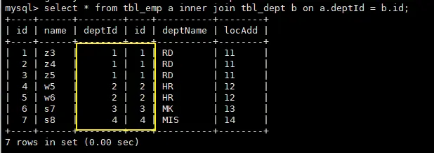
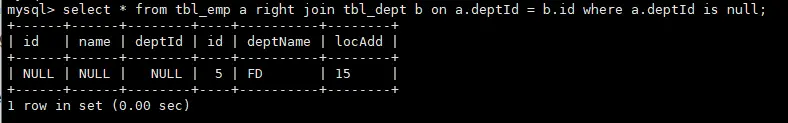

## JOIN 使用


### sql

```
create table `tbl_dept`(
 `id` int(11) not null auto_increment,
`deptName` varchar(30) default null,
`locAdd` varchar(40) default null,
primary key(`id`)
) engine=innodb auto_increment=1 default charset=utf8;

create table `tbl_emp`(
 `id` int(11) not null auto_increment,
`name` varchar(20) default null,
`deptId` int(11) default null,
primary key(`id`),
key `fk_dept_id`(deptId)
#constraint `fk_dept_id` foregin key(`deptId`) references `tbl_dept`(id)
) engine=innodb auto_increment=1 default charset=utf8;

insert into tbl_dept(deptName,locAdd) values('RD',11);
insert into tbl_dept(deptName,locAdd) values('HR',12);
insert into tbl_dept(deptName,locAdd) values('MK',13);
insert into tbl_dept(deptName,locAdd) values('MIS',14);
insert into tbl_dept(deptName,locAdd) values('FD',15);


insert into tbl_emp(Name,deptId) values('z3',1);
insert into tbl_emp(Name,deptId) values('z4',1);
insert into tbl_emp(Name,deptId) values('z5',1);

insert into tbl_emp(Name,deptId) values('w5',2);
insert into tbl_emp(Name,deptId) values('w6',2);


insert into tbl_emp(Name,deptId) values('s7',3);
insert into tbl_emp(Name,deptId) values('s8',4);
insert into tbl_emp(Name,deptId) values('s9',51);

```

##### inner join



##### left join


##### right join


##### left join b on a.id = b.id where b.id is null


##### right join b on a.id = b.id where a.id is null



##### full outer join union


##### inner join


