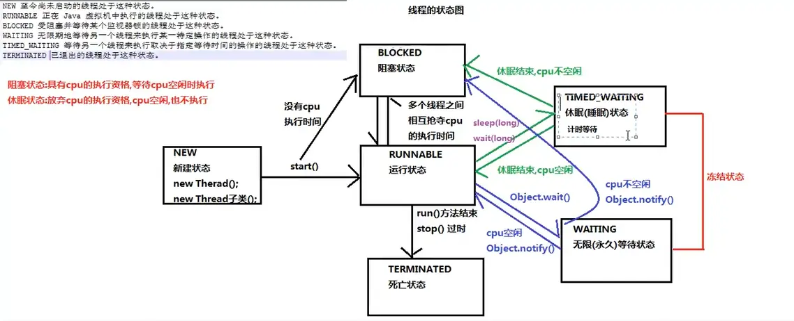

### 线程

> 主线程：执行主（main)方法的线程
> 单线程程序：java 程序中只有一个线程
> 执行从 main 方法开始，从上到下依次执行
> JVN 执行 main 方法，main 方法会进入到栈内存
> JVM 会找操作系统开群一条 main 方法通向 cpu 的执行路径
> cpu 就可以通过这个路径来执行 main 方法
> 而这个路径有一个名字，叫 main(主）线程

#### 实现 Runnable 接口创建多线程程序的好处：

1.避免了单继承的局限性

一个类只能继承一个类（一个人只能有一个亲参）,类继承了 Thread 类就不能继承其他的类实现了 Runnable 接口，还可以继承其他的类，实现其他的接口

2.增强了程序的扩展性，降低了程序的耦合性（解耦）
实现 Runnable 接口的方式，把设置线程任务和开启新线程进行了分离（解耦）
实现类中，重写了 run 方法：用来设置线程任务
创建 Thread 类对象，调用 start 方法：用来开启新线程

**定义同步代码块**

```
Object obj = new Object();

       synchronized (obj ){
        if (ticket > 0){
            try {
                Thread.sleep(100);
            } catch (InterruptedException e) {
                e.printStackTrace();
            }
            System.out.println(Thread.currentThread().getName()+"=====》"+ticket+"票数");
            ticket--;
        }}
```

**定义一个同步方法**

> 同步方法也会把方法内部的代码锁住
> 只让一个线程执行
> 同步方法的锁对象是谁？
> 就是实现类对象 new RunnableImpl()
> 也是就是 this

```
    public /*synchronized*/ void payTicket(){
        synchronized (this){
        if (ticket > 0){
            try {
                Thread.sleep(100);
            } catch (InterruptedException e) {
                e.printStackTrace();
            }
            System.out.println(Thread.currentThread().getName()+"=====》"+ticket+"票数");
            ticket--;
        }}
    }
```

**静态的同步方法**

> 锁对象是谁？
> 不能是 this
> this 是创建对象之后产生的，静态方法优先于对象
> 静态方法的锁对象是本类的 cLass 属性---cLass 文件对象（反射）

```
    public static /*synchronized*/ void payTicketStatic(){
        synchronized (RunnableImpl.class){
        if (ticket > 0){
            try {
                Thread.sleep(100);
            } catch (InterruptedException e) {
                e.printStackTrace();
            }
            System.out.println(Thread.currentThread().getName()+"=====》"+ticket+"票数");
            ticket--;
        }}
    }
```



**wait notify**

> 等待唤醒案例：线程之间的通信
> 创建一个顾客线程（消费者）:告知老板要的包子的种类和数量，调用 wait 方法，放弃 cpu 的执行，进入到 WAITING 状态（无限等待）
> 创建一个老板线程（生产者）:花了 5 秒做包子，做好包子之后，调用 notify 方法，唤醒顾客吃包子
> 注意：
> 顾客和老板线程必须使用同步代码块包裹起来，保证等待和唤醒只能有一个在执行
> 同步使用的锁对象必须保证唯一
> 只有锁对象才能调用 wait 和 notify 方法
> Obejct 类中的方法
> void wait(
> 在其他线程调用此对象的 notify()方法或 notifyAL()方法前，导致当前线程等待。
> void notify()
> 唤醒在此对象监视器上等待的单个线程。
> 会继续执行 wait 方法之后的代码

```
public static void main(String[] args) {
        Object obj = new Object();

        new Thread(){
            @Override
            public void run() {
                while (true){
                    synchronized (obj){
                        System.out.println("告知老板要的包子的种类和数量");
//                    调用wait方法，放弃cpu执行，进入到WAITING状态（无限等待）
                        try {
                            obj.wait();
                        } catch (InterruptedException e) {
                            e.printStackTrace();
                        }
                        System.out.println("开吃！！");
                        System.out.println("=====================================");
                    }
                }
            }
        }.start();

        new Thread(){
            @Override
            public void run() {
             while (true){

                   try {
                       Thread.sleep(5000);
                   } catch (InterruptedException e) {
                       e.printStackTrace();
                   }
                 synchronized (obj){
                   System.out.println("老板包子做好，告知顾客，可以吃包子了");
                   obj.notify();
               }
           }
            }
        }.start();
    }
```
