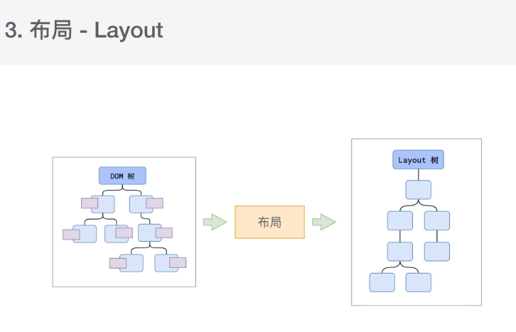

来源于 渡一 大师课
# 浏览器事件循环（消息循环）
要处理这么多的任务，主线程遇到了⼀个前所未有的难题：如何调度任
务？
⽐如：
我正在执⾏⼀个 JS 函数，执⾏到⼀半的时候⽤户点击了按钮，我该⽴即
去执⾏点击事件的处理函数吗？
我正在执⾏⼀个 JS 函数，执⾏到⼀半的时候某个计时器到达了时间，我
该⽴即去执⾏它的回调吗？
浏览器进程通知我“⽤户点击了按钮”，与此同时，某个计时器也到达了时
间，我应该处理哪⼀个呢？
......
渲染主线程想出了⼀个绝妙的主意来处理这个问题：排队


1. 在最开始的时候，渲染主线程会进⼊⼀个⽆限循环
2. 每⼀次循环会检查消息队列中是否有任务存在。如果有，就取出第⼀个任务
执⾏，执⾏完⼀个后进⼊下⼀次循环；如果没有，则进⼊休眠状态。
3. 其他所有线程（包括其他进程的线程）可以随时向消息队列添加任务。新任
务会加到消息队列的末尾。在添加新任务时，如果主线程是休眠状态，则会
将其唤醒以继续循环拿取任务
这样⼀来，就可以让每个任务有条不紊的、持续的进⾏下去了。
整个过程，被称之为事件循环（消息循环）

### 何为异步
代码在执⾏过程中，会遇到⼀些⽆法⽴即处理的任务，⽐如：
计时完成后需要执⾏的任务 —— setTimeout 、 setInterval
⽹络通信完成后需要执⾏的任务 -- XHR 、 Fetch
⽤户操作后需要执⾏的任务 -- addEventListener
如果让渲染主线程等待这些任务的时机达到，就会导致主线程⻓期处于
「阻塞」的状态，从⽽导致浏览器「卡死


#### 渲染主线程承担着极其重要的⼯作，⽆论如何都不能阻塞！
因此，浏览器选择异步来解决这个问题


任务有优先级吗？
任务没有优先级，在消息队列中先进先出
但消息队列是有优先级的
根据 W3C 的最新解释:
每个任务都有⼀个任务类型，同⼀个类型的任务必须在⼀个队列，不同类型
的任务可以分属于不同的队列。
在⼀次事件循环中，浏览器可以根据实际情况从不同的队列中取出任务执
⾏。
浏览器必须准备好⼀个微队列，微队列中的任务优先所有其他任务执⾏
https://html.spec.whatwg.org/multipage/webappapis.html#p
erform-a-microtask-checkpoint

#### 渲染主线程是如何⼯作的？
渲染主线程是浏览器中最繁忙的线程，需要它处理的任务包括但不限于：
解析 HTML
解析 CSS
计算样式
布局
处理图层
每秒把⻚⾯画 60 次
执⾏全局 JS 代码
执⾏事件处理函数
执⾏计时器的回调函数

**可以在浏览器的任务管理器中查看当前的所有进程 其中，最主要的进程有**

1. 浏览器进程
    主要负责界面显示、用户交互、子进程管理等。浏览器进程内部会启动多个线程处理不同的任务。
2. 网络进程
    负责加载网络资源。网络进程内部会启动多个线程来处理不同的网络任务。
3. 渲染进程（本节课重点讲解的进程）
    渲染进程启动后，会开启一个渲染主线程，主线程负责执行HTML、CSS、JS代码。

    默认情况下，浏览器会为每个标签页开启一个新的渲染进程，以保证不同的标签页之间不相互影响。


**渲染主线程**
**js 是单线程的， 是在渲染主线程中**

- 以前队列 分为宏队列和微队列

- 现在队列有好多种，没有了宏队列
1. 延时队列 优先级 低
2. 交互队列 优先级 中
3. 微队列   优先级 高
   1.  包含 Promise  MutationObserver

延时队列：⽤于存放计时器到达后的回调任务，优先级「中」
交互队列：⽤于存放⽤户操作后产⽣的事件处理任务，优先级「⾼」
微队列：⽤户存放需要最快执⾏的任务，优先级「最⾼」


#### 先执行全局js 在执行队列，根据队列优先级按顺序执行

```js
function a(){
    console.log(1);
    Promise.resolve().then(function ()
        console.log(2); 
    })
}

setTimeout(function ()
    console.log(3);
    Promise.resolve().then(a);
},8):

Promise.resolve().then(function ()
    console.log(4);
}):

console.log(5);

结果 5 4 3 1 2
```

### 阐述一下JS的事件循环
> 参考答案：
事件循环又叫做消息循环，是浏览器渲染主线程的工作方式。
在Ch「ome的源码中，它开启一个不会结束的for循环，每次循环从消息队列中取出第一个任务执行，而其
他线程只需要在合适的时候将任务加入到队列末尾即可。
过去把消息队列简单分为宏队列和微队列，这种说法目前已无法满足复杂的浏览器环境，取而代之的是一种更
加灵活多变的处理方式。
根据W3C官方的解释，每个任务有不同的类型，同类型的任务必须在同一个队列，不同的任务可以属于不同的
队列。不同任务队列有不同的优先级，在一次事件循环中，由浏览器自行决定取哪一个队列的任务。但浏览器
必须有一个微队列，微队列的任务一定具有最高的优先级，必须优先调度执行。

### JS中的计时器能做到精确计时吗？为什么？
不行，因为
   1. 计算机硬件没有原子钟，无法做到精确计时
   2. 操作系统的计时函数本身就有少量偏差，由于JS的计时器最终调用的是操作系统的函数，也就携带了这
       些偏差
   3. 按照W3C的标准，浏览器实现计时器时，如果嵌套层级超过5层，则会带有4毫秒的最少时间，这样
       在计时时间少于4毫秒时又带来了偏差
   4. 受事件循环的影响，计时器的回调函数只能在主线程空闲时运行，因此又带来了偏差


# 浏览器渲染原理
浏览器是如何渲染页面的？
> 当浏览器的网络线程收到HTML文档后，会产生一个渲染任务，并将其传递给渲染主线程的消息队列。
在事件循环机制的作用下，渲染主线程取出消息队列中的渲染任务，开启渲染流程。
整个渲染流程分为多个阶段，分别是：HTML解析、样式计算、布局、分层、绘制、分块、光栅化、画
每个阶段都有明确的输入输出，上一个阶段的输出会成为下一个阶段的输入。
这样，整个渲染流程就形成了一套组织严密的生产流水线。


**渲染的第一步是解析HTML。**
> 解析过程中遇到CSS解析CSS,遇到JS执行JS。为了提高解析效率，浏览器在开始解析前，会启动一个
预解析的线程，率先下载HTML中的外部CSS文件和外部的JS文件。

如果主线程解析到L1k位置，此时外部的CSS文件还没有下载解析好，主线程不会等待，继续解析后续的
HTML。这是因为下载和解析CSS的工作是在预解析线程中进行的。这就是CSS不会阻塞HTML解析的根本
原因。


如果主线程解析到Sc下1pt位置，会停止解析HTML,转而等待JS文件下载好，并将全局代码解析执行完成
后，才能继续解析HTML。这是因为JS代码的执行过程可能会修改当前的D0M树，所以D0M树的生成必
须暂停。这就是JS会阻塞HTML解析的根本原因。

**第一步完成后，会得到D0M树和CSS0M树，**
> 浏览器的默认样式、内部样式、外部样式、行内样式均会包含
在CSS0M树中。


**渲染的下一步是样式计算。**
> 主线程会遍历得到的D0M树，依次为树中的每个节点计算出它最终的样式，称之为Computed Style。
在这一过程中，很多预设值会变成绝对值，比如rd会变成rgb(255,0,0)；相对单位会变成绝对单位，比
如em会变成px
这一步完成后，会得到一棵带有样式的D0M树。

**接下来是布局，布局完成后会得到布局树。**
> 布局阶段会依次遍历D0州树的每一个节点，计算每个节点的几何信息。例如节点的宽高、相对包含块的位
置。
大部分时候，D0M树和布局树并非一一对应。
比如display:none的节点没有几何信息，因此不会生成到布局树；又比如使用了伪元素选择器，虽然D0M
树中不存在这些伪元素节点，但它们拥有几何信息，所以会生成到布局树中。还有匿名行盒、匿名块盒等等都
会导致D0M树和布局树无法一一对应。


**下一步是分层**
> 主线程会使用一套复杂的策略对整个布局树中进行分层。
分层的好处在于，将来某一个层改变后，仅会对该层进行后续处理，从而提升效率。
滚动条、堆叠上下文、transform、opacity等样式都会或多或少的影响分层结果，也可以通过wlL-
change属性更大程度的影响分层结果。


**再下一步是绘制**
> 主线程会为每个层单独产生绘制指令集，用于描述这一层的内容该如何画出来。
完成绘制后，主线程将每个图层的绘制信息提交给合成线程，剩余工作将由合成线程完成。
合成线程首先对每个图层进行分块，将其划分为更多的小区域。
它会从线程池中拿取多个线程来完成分块工作。


**分块完成后，进入光栅化阶段。**
> 合成线程会将块信息交给GPU进程，以极高的速度完成光栅化。
GPU进程会开启多个线程来完成光栅化，并且优先处理靠近视口区域的块。
光栅化的结果，就是一块一块的位图


**最后一个阶段就是画了**
> 合成线程拿到每个层、每个块的位图后，生成一个个「指引(quad)」信息。
指引会标识出每个位图应该画到屏幕的哪个位置，以及会考虑到旋转、缩放等变形。
变形发生在合成线程，与渲染主线程无关，这就是transform效率高的本质原因。
合成线程会把quad提交给GPU进程，由GPU进程产生系统调用，提交给GPU硬件，完成最终的屏幕成
像。


**什么是ref1ow?**
> ref1ow的本质就是重新计算layout树。
当进行了会影响布局树的操作后，需要重新计算布局树，会引发1yout。
为了避免连续的多次操作导致布局树反复计算，浏览器会合并这些操作，当JS代码全部完成后再进行统一计
算。所以，改动属性造成的reflow是异步完成的。
也同样因为如此，当JS获取布局属性时，就可能造成无法获取到最新的布局信息。
浏览器在反复权衡下，最终决定获取属性立即ref1ow。

**什么是repaint?**
> repaint的本质就是重新根据分层信息计算了绘制指令。
当改动了可见样式后，就需要重新计算，会引发
repaint。
由于元素的布局信息也属于可见样式，所以reflow一定会引起repaint.。

**为什么transform的效率高？**
> 因为transform既不会影响布局也不会影响绘制指令，它影响的只是渲染流程的最后一个「draw」阶段
由于draw阶段在合成线程中，所以transform的变化几乎不会影响渲染主线程。反之，渲染主线程无论
如何忙碌，也不会影响transform的变化