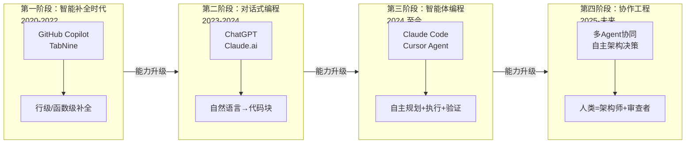
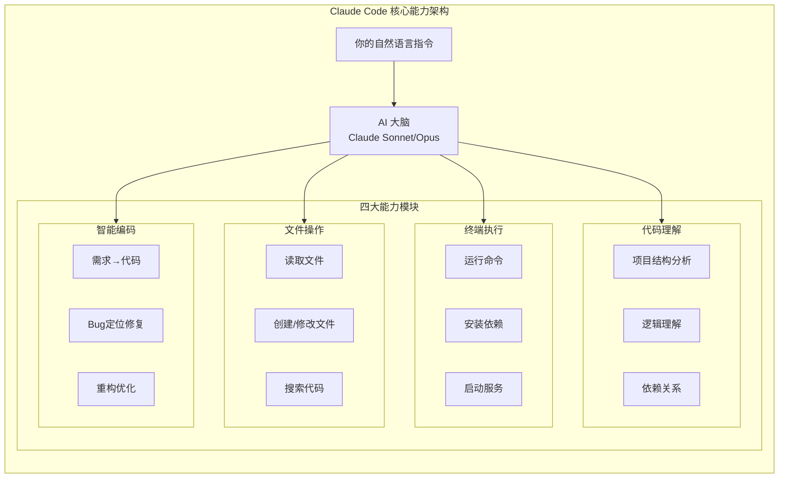
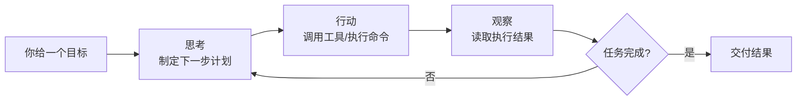
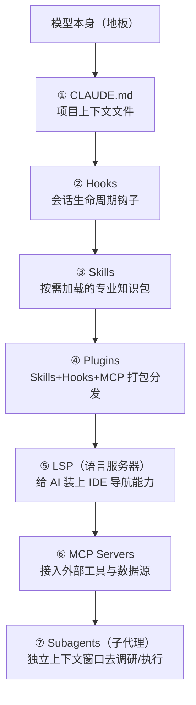
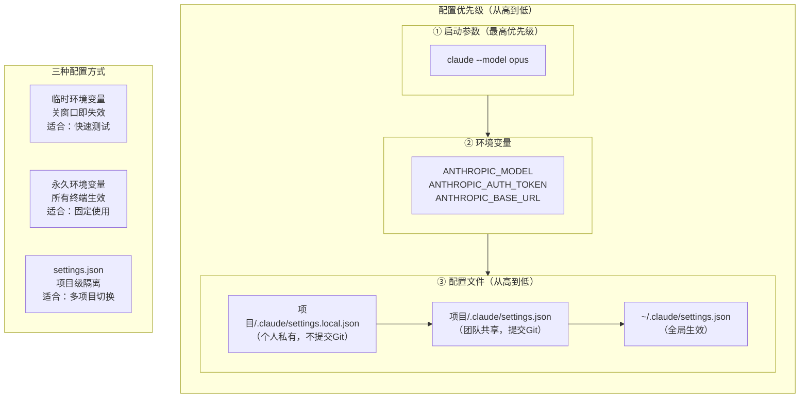
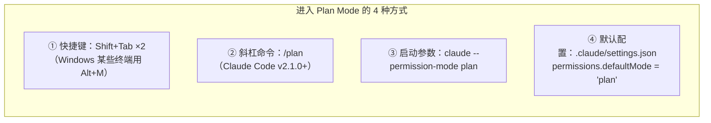
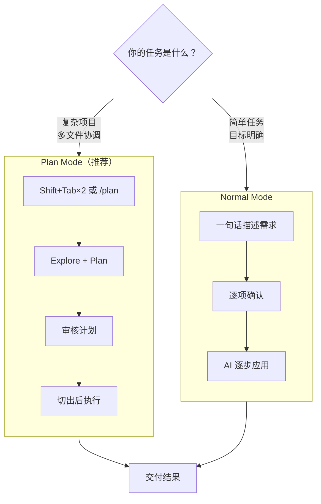

# AI Coding 零基础实战教程

> 从零开始，用自然语言指挥AI构建真实软件项目
>
> 基于 Claude Code 深度实践 | 多模型配置全覆盖 | 国内用户友好

---

## 目录

- [前言：一个不会写代码的人，如何用AI构建软件](#前言一个不会写代码的人如何用ai构建软件)
- [第零部分：环境准备与工具安装](#第零部分环境准备与工具安装)
- [第一部分：AI编程基础理论](#第一部分ai编程基础理论)
- [第二部分：AI编程工具生态与模型选择](#第二部分ai编程工具生态)
- [第三部分：Claude Code 深度使用与进阶技巧](#第三部分claude-code-深度使用与进阶技巧)
- [第四部分：AI技能系统（Skills）深度实践](#第四部分ai技能系统skills深度实践)
- [第五部分：完整项目案例实操](#第五部分完整项目案例实操)
- [第六部分：项目实战（独立完成）](#第六部分项目实战独立完成)
- [第七部分：Codex Desktop 安装和使用教程](#第七部分codex-desktop-安装和使用教程)
- [附录](#附录)

---

## 阅读约定

在正式开始之前，先了解本教程中使用的标记约定：

> **提示**：这是一个帮助你更好理解概念的提示信息。

> **注意**：这是一个需要特别留意的事项，忽略可能导致问题。

>  **避坑**：这是其他学习者踩过的坑，提前了解可以少走弯路。

>  **验证**：这是一个检查点，执行后应该看到预期结果，确认你走在正确的路上。

- 所有终端命令前会标注适用的操作系统（Windows / macOS / 通用）
- 代码注释全部使用中文，方便理解
- 模型、价格、安装命令和第三方工具信息变化很快；本文中相关信息已在 **2026-05-18** 按官方文档做过一次核对，正式使用前仍应以官网当前页面为准
- `$` 符号表示终端命令提示符，输入命令时不需要输入 `$`
- 尖括号 `<xxx>` 表示需要替换为你自己的实际内容

---

## 前言：一个不会写代码的人，如何用AI构建软件

### 一个真实的故事

想象这样一个场景：产品经理小王完全不会写代码，但他用自然语言向AI描述了自己想要的功能 —— "帮我做一个团队内部的书签收藏工具，支持按标签分类和搜索"。三天后，一个功能完整、界面美观的Web应用上线了。

这不是科幻，这是2026年正在发生的事情。

传统的编程学习路径是这样的：花几个月学语法 → 花几个月做练习 → 花几个月做项目 → 终于能写出可用的软件。而AI编程的路径完全不同：**你只需要学会"如何清晰地表达你想要什么"，AI来负责把它变成代码**。

这就像你不需要学会砌墙、接水管、布电路，你只需要能清楚地告诉装修队"我想要一个什么样的家"，专业的团队会帮你实现。AI编程工具就是你的"装修队"，而你要学的，是如何当好这个"业主"。

### 这本教程是写给谁的

本教程面向**完全没有编程经验的初学者**。你不需要具备以下任何知识：

-  不需要会任何编程语言（Python、JavaScript、Java……统统不需要）
-  不需要数学基础
-  不需要计算机科学学位
-  不需要之前用过任何开发工具

你只需要具备：

-  基本的电脑操作能力（会上网、会装软件、会管理文件夹）
-  一定的英语阅读能力（能借助翻译工具看懂简单的英文界面即可）
-  清晰的逻辑思维（能描述清楚"我想要什么"）
-  一颗愿意尝试的心

### 你将学到什么

完成本教程后，你将能够：

| 能力 | 具体表现 |
|------|---------|
| 理解AI编程 | 能向他人解释什么是Vibe Coding、Agentic Engineering、SDD |
| 掌握核心工具 | 能熟练使用Claude Code完成完整的软件开发 |
| 灵活选模型 | 能根据任务需求选择最合适的AI模型（Claude/DeepSeek/千问等） |
| 构建Skill | 能创建自定义的AI技能模块，提升开发效率 |
| 独立做项目 | 能独立使用AI工具从零构建并部署一个完整的Web应用 |

### 学习路径总览

```
第零部分：环境准备 ──→ 打好地基，安装必要工具
   ↓
第一部分：基础理论 ──→ 建立认知，理解AI编程的核心概念
   ↓
第二部分：工具生态 ──→ 了解主流工具与模型，完成安装与选型
   ↓
第三部分：Claude Code 深度使用 ──→ 掌握武器，深入学习Claude Code的全部能力 核心
   ↓
第四部分：技能系统 ──→ 效率倍增，构建可复用的AI技能
   ↓
第五部分：项目实操 ──→ 学以致用，从零到一完成完整项目 重点
   ↓
第六部分：独立实战 ──→ 独当一面，自主完成项目开发
   ↓
第七部分：Codex Desktop ──→ 拓展视野，掌握另一个主流AI编程工具
```

### 学习建议

1. **动手大于阅读** —— 每学一个概念，立刻打开终端实践
2. **项目驱动学习** —— 带着"我要做出一个产品"的目标去学
3. **拥抱错误** —— AI会犯错，你也会犯错，这都是学习过程
4. **持续迭代** —— 没有一步到位的完美，先能跑再说
5. **记录与分享** —— 把踩的坑记下来，分享出去，加深理解

---

## 第零部分：环境准备与工具安装

> **学习目标**：搭建完整的开发环境，确保后续学习零障碍
>
> **完成标志**：能在终端执行基本命令，至少一个AI编程工具可正常运行

工欲善其事，必先利其器。在正式进入AI编程世界之前，我们需要先把"工作台"搭好。这就像做菜之前先把厨房收拾好、食材买齐 —— 虽然不是最激动人心的环节，但跳过它后面会处处碰壁。

### 0.1 终端/命令行入门：你的AI编程控制台

#### 0.1.1 什么是终端

你平时用电脑，是通过鼠标点击图标、菜单来操作的，这叫**图形界面（GUI）**。而**终端（Terminal）**是另一种操作电脑的方式 —— 通过输入文字命令来告诉电脑做什么。

打个比方：图形界面就像在餐厅看着菜单点菜（点什么有什么），终端就像直接跟厨师说你想吃什么（更灵活，但需要知道怎么"说"）。

AI编程工具（如Claude Code）几乎全部运行在终端中，所以掌握基本的终端操作是第一步。

#### 0.1.2 如何打开终端

**Windows 用户：**

1. 按下键盘上的 `Win + R` 键（Win 是键盘左下角带 Windows 标志的键）
2. 在弹出的"运行"对话框中输入 `powershell`
3. 按回车键

或者更简单的方式：
1. 在桌面底部的搜索栏中搜索"PowerShell"
2. 点击"Windows PowerShell"打开

**macOS 用户：**

1. 按下 `Command + 空格` 打开 Spotlight 搜索
2. 输入 `Terminal` 或"终端"
3. 按回车键打开

> **提示**：打开终端后你会看到一个黑色（或白色）的窗口，里面有一个闪烁的光标等待你输入命令。不要怕，它不会因为你输错命令就爆炸 —— 最多给你一个报错信息而已。

#### 0.1.3 5个必会终端命令

以下是你需要掌握的最基本的终端命令。打开终端，跟着一起敲：

**1. `pwd` —— 查看当前位置（我在哪？）**

```bash
# 通用命令（macOS/Linux直接输入，Windows PowerShell也支持）
$ pwd
```

预期输出：
```
# Windows 输出类似：
C:\Users\你的用户名

# macOS 输出类似：
/Users/你的用户名
```

这就像你在商场里，看一下脚下的地图上"您在此处"的标记。

**2. `ls`（macOS/Linux）或 `dir`（Windows）—— 查看当前目录有什么**

```bash
# macOS / Linux
$ ls

# Windows PowerShell（ls也可以用，但dir是经典命令）
$ dir
```

预期输出：
```
Desktop    Documents   Downloads   Pictures   Videos
桌面       文档       下载       图片      视频
```

就像打开一个文件夹，看看里面有什么东西。

**3. `cd` —— 进入某个目录（走到某个位置）**

```bash
# 进入"桌面"文件夹
$ cd Desktop

# 返回上一级目录
$ cd ..

# 直接回到用户主目录
$ cd ~
```

`cd` 是 "change directory" 的缩写，就是"换个地方"的意思。

**4. `mkdir` —— 创建新文件夹**

```bash
# 创建一个名为 my-project 的文件夹
$ mkdir my-project

# 验证：查看是否创建成功
$ ls
```

预期输出中应该能看到 `my-project` 文件夹。

**5. `clear` —— 清屏（屏幕太乱了，清理一下）**

```bash
$ clear
```

>  **验证**：在终端中依次执行以下命令，确认你能正常操作：
>
>  ```bash
>  $ pwd
>  $ mkdir ai-coding-test
>  $ cd ai-coding-test
>  $ pwd
>  $ cd ..
>  ```
>  如果每条命令都能正常执行且没有报错，恭喜你，终端入门完成！

#### 0.1.4 常见问题

| 问题 | 原因 | 解决方案 |
|------|------|---------|
| 命令输入后提示"不是内部或外部命令" | 命令拼写错误或该命令不存在 | 检查拼写，注意大小写 |
| 中文路径导致命令失败 | 某些工具不支持中文路径 | 使用全英文路径名，如 `D:\projects` |
| PowerShell 窗口闪退 | 可能被系统策略限制 | 右键以管理员身份运行 |

> **注意**：在整个教程中，请尽量使用**全英文**的文件夹名和文件名。中文路径在很多开发工具中会引发奇怪的错误，这是一个经典的坑。

---

### 0.2 开发环境安装

#### 0.2.1 Node.js 安装

Node.js 是一个让 JavaScript 能在电脑上运行的环境。它是前端开发、npm 包管理、Next.js/Vite 项目的基础工具，也是 Claude Code 官方安装前置条件之一。

你可以把 Node.js 理解为 AI 编程项目的“基础运行环境”：很多脚手架、依赖安装、构建命令都离不开它。

**下载安装：**

1. 打开浏览器，访问 Node.js 官网：https://nodejs.org/
2. 你会看到两个版本按钮，选择左边的 **LTS（长期支持版）**，这是最稳定的版本
3. 下载完成后，双击安装包
4. 安装过程中一路点 **"Next"**（下一步），保持默认选项即可
5. 最后点 **"Install"** 完成安装


> **注意**：安装时请确保勾选了"Add to PATH"选项（默认是勾选的），这样才能在终端中直接使用 `node` 和 `npm` 命令。

**验证安装：**

安装完成后，**关闭并重新打开终端**（这一步很重要，否则新安装的命令可能找不到），然后输入：

```bash
# 检查 Node.js 版本
$ node -v
```

预期输出：
```
v24.15.0
```
（版本号可能不完全一致。建议安装官网当前 LTS 版本；如果用 npm 安装 Claude Code，需要 Node.js `v18` 或更高版本。）

```bash
# 检查 npm 版本（npm 是 Node.js 自带的包管理器）
$ npm -v
```

预期输出：
```
11.12.1
```

>  **验证**：如果两条命令都能输出版本号，恭喜，Node.js 安装成功！

**常见问题：**

| 问题 | 原因 | 解决方案 |
|------|------|---------|
| `node: command not found` 或 "不是内部命令" | Node.js 未添加到系统 PATH | 重新安装并确保勾选 "Add to PATH"；或手动将 Node.js 安装目录添加到系统环境变量 |
| 版本低于 v18 | 下载了旧版本 | 重新到官网下载最新的 LTS 版本 |
| 安装过程报错（Windows） | 权限不足 | 右键安装包 → "以管理员身份运行" |
| macOS 提示"无法验证开发者" | macOS 安全限制 | 系统偏好设置 → 安全性与隐私 → 仍要打开 |

> **提示**：如果你是 macOS 用户，推荐使用 `nvm`（Node Version Manager）来管理 Node.js 版本，方便将来切换不同版本。安装命令：
>
> ```bash
> $ curl -o- https://raw.githubusercontent.com/nvm-sh/nvm/v0.39.0/install.sh | bash
> ```
> 安装完成后重启终端，然后使用 `nvm install --lts` 安装最新 LTS 版本。

#### 0.2.2 Git 安装与配置

Git 是一个"版本控制"工具。什么是版本控制？想象你在写一篇文章，每写一个版本你都存一份副本：`论文_v1.doc`、`论文_v2.doc`、`论文_最终版.doc`、`论文_最终最终版.doc`…… Git 就是帮你优雅地管理这些版本的工具。

在AI编程中，Git 尤其重要 —— 因为**AI有时候会改错代码**。有了 Git，你可以随时"时光倒流"回到之前正确的版本。这是你的"后悔药"。

**下载安装：**

**Windows 用户：**

1. 访问 https://git-scm.com/download/win
2. 下载 64-bit 版本的安装包
3. 双击安装，安装过程中保持所有默认选项即可（会有很多页配置，不用改，一直点 Next）
4. 安装完成

**macOS 用户：**

macOS 通常自带 Git。打开终端输入 `git --version`，如果有输出就不需要安装。如果没有，执行：

```bash
# macOS 安装 Git（通过 Xcode 命令行工具）
$ xcode-select --install
```

弹出的对话框中点击"安装"即可。

**验证安装：**

```bash
$ git --version
```

预期输出：
```
git version 2.43.0
```

**首次配置（必须）：**

安装完成后，需要告诉 Git 你是谁（这些信息会记录在每次代码提交中）：

```bash
# 设置你的名字（用英文，可以是昵称）
$ git config --global user.name "Your Name"

# 设置你的邮箱
$ git config --global user.email "your.email@example.com"
```

> **提示**：这里的名字和邮箱不需要是真实的，但建议和你将来注册 GitHub 的邮箱保持一致。

**Git 最小生存技能（6条命令走天下）：**

你现在不需要精通 Git，只要记住这6条命令就够了（后面遇到会详细解释）：

```bash
# 1. 在项目文件夹中初始化 Git 仓库（只需要做一次）
$ git init

# 2. 查看当前文件状态（哪些文件被修改了）
$ git status

# 3. 把修改的文件添加到"暂存区"（准备提交）
$ git add .

# 4. 提交一个版本（附带说明信息）
$ git commit -m "描述这次修改做了什么"

# 5. 将代码推送到远程仓库（如GitHub）
$ git push

# 6. 从远程仓库拉取最新代码
$ git pull
```

>  **避坑**：使用AI编程工具时，养成一个好习惯 —— **在让AI做大的修改之前，先 `git add . && git commit -m "保存当前进度"`**。这样即使AI改坏了，你也能用 `git checkout .` 恢复到之前的状态。这是无数开发者总结出的血泪经验。

#### 0.2.3 Python 安装（可选）

Python 在本教程的第六部分（AI知识库项目）中会用到。如果你暂时只想学前端项目，可以先跳过。

**下载安装：**

1. 访问 https://www.python.org/downloads/
2. 下载最新版本（建议 Python 3.11 或 3.12）
3. **Windows 用户特别注意**：安装时务必勾选 **"Add Python to PATH"** 选项！

**验证安装：**

```bash
# Windows
$ python --version

# macOS / Linux（可能需要用 python3）
$ python3 --version
```

预期输出：
```
Python 3.12.4
```

```bash
# 验证 pip（Python 包管理器）
$ pip --version
```

预期输出：
```
pip 24.0 from ... (python 3.12)
```

---

### 0.3 环境验证：确认一切就绪

完成上面的安装后，让我们做一次全面的环境检查，确保所有工具都正常工作。

**环境检查清单：**

打开终端，依次执行以下命令：

```bash
# 1. 检查 Node.js
$ node -v
# 预期输出: v18.x.x 或更高版本

# 2. 检查 npm
$ npm -v
# 预期输出: 9.x.x 或 10.x.x 或更高版本

# 3. 检查 Git
$ git --version
# 预期输出: git version 2.x.x

# 4. 检查 Python（可选）
$ python --version
# 预期输出: Python 3.11.x 或 3.12.x
```

**创建你的第一个项目文件夹：**

```bash
# 在你喜欢的位置创建一个总的工作目录
# Windows 建议：
$ mkdir D:\ai-coding-projects

# macOS 建议：
$ mkdir ~/ai-coding-projects

# 进入这个目录
$ cd D:\ai-coding-projects  # Windows
$ cd ~/ai-coding-projects   # macOS

# 初始化 Git
$ git init
```

预期输出：
```
Initialized empty Git repository in .../ai-coding-projects/.git/
```

>  **验证**：如果以上所有命令都能正常执行，恭喜你！环境准备工作全部完成。你现在拥有了进入AI编程世界的全部工具。

**环境准备完成度检查表：**

- [ ] Node.js 已安装，版本 >= 18
- [ ] npm 已安装
- [ ] Git 已安装并完成基本配置（user.name 和 user.email）
- [ ] 已创建工作目录并初始化 Git

如果有某一项未完成，请回到对应章节重新操作。**不要跳过这些步骤** —— 后续每一步都依赖这些基础环境。

---

## 第一部分：AI编程基础理论

> **学习目标**：建立对AI辅助编程的系统认知，理解核心概念与方法论
>
> **完成标志**：能向他人清晰解释什么是 Vibe Coding、Agentic Engineering 和 SDD

在正式上手工具之前，我们需要先建立"认知地图"。这就像学开车之前要先了解交通规则一样 —— 你不需要成为交通工程师，但至少要知道红灯停绿灯行、靠右行驶这些基本概念。

### 1.1 AI辅助编程全景认知

#### 1.1.1 什么是AI辅助编程

**传统编程**是你一行一行地"手写"代码，告诉计算机每一步该怎么做。你需要掌握编程语言的语法、理解算法、记住各种API —— 学习曲线陡峭且耗时漫长。

**AI辅助编程**则完全不同。你用自然语言（中文或英文都行）描述"你想要什么"，AI帮你把它变成可运行的代码。你的角色从"打字员"变成了"指挥官"。

| 维度 | 传统编程 | AI辅助编程 |
|------|---------|-----------|
| 核心技能 | 编程语言语法、算法 | 需求描述、意图表达、结果验证 |
| 人的角色 | 代码编写者 | 需求定义者 + 结果审查者 |
| 关注点 | "怎么做"（How） | "做什么"和"为什么"（What & Why） |
| 学习周期 | 数月到数年 | 数天到数周 |
| 出错时 | 自己调试代码 | 用自然语言告诉AI去修复 |

打个比方：传统编程就像你自己从头学做一道红烧肉 —— 要学买菜、备料、掌握火候；AI编程就像你请了一个专业厨师 —— 你只需要说"我想吃红烧肉，少放糖，多放一点八角"，厨师帮你做出来，你尝一口觉得太咸了，再说"减少一些盐"就行。

> **提示**：AI编程不是"不需要懂任何技术"，而是大幅降低了入门门槛。随着你的使用越来越深入，你会自然而然地积累技术知识。这个过程是"边用边学"，而非传统的"先学后用"。

#### 1.1.2 AI编程的发展历程

AI编程并不是突然出现的，它经历了一个清晰的演进过程：

**第一阶段：智能补全时代（2020-2022）**

代表产品：GitHub Copilot、TabNine

就像手机输入法的联想功能 —— 你打了几个字，它猜你接下来要打什么。这个阶段的AI只能帮你补全一行或几行代码，依然需要你自己动手写大部分代码。

**第二阶段：对话式编程时代（2023-2024）**

代表产品：ChatGPT、Claude.ai

AI进化成了一个"编程顾问"。你可以用自然语言问它"怎么写一个排序算法"，它会给你一段完整的代码。但问题是：你需要自己把代码复制到项目中、自己处理各种细节，AI并不了解你的项目全貌。

**第三阶段：智能体编程时代（2024 至今）** ← 我们现在就在这里

代表产品：Claude Code、Cursor Agent、Qoder、Codex

这是一个质的飞跃！AI从"回答问题"进化到了"完成任务"。你告诉它"给我的项目添加一个用户登录功能"，它会**自己**去读你的项目代码，**自己**创建需要的文件，**自己**写代码，**自己**运行测试 —— 全程自主完成。

这就像从"问路人"（对话式）变成了"请了一个代驾"（智能体）—— 你只需要说目的地，它自己开车到。

**第四阶段：协作工程时代（正在形成）**

多个AI智能体组成"团队"，各司其职 —— 一个负责设计架构、一个负责写代码、一个负责测试、一个负责审查代码质量。人类的角色进一步上升为"项目总监"。

```
第一阶段       第二阶段        第三阶段         第四阶段
AI帮你打字  →  AI帮你想方案  →  AI帮你做任务  →  AI团队帮你做项目
（补全）      （对话）        （智能体）       （多智能体协作）
```


*图：AI编程四个发展阶段演进示意图*

#### 1.1.3 AI是如何"理解"和"生成"代码的

你不需要成为AI专家，但理解以下几个核心概念会帮你更好地使用AI工具：

**Token化：AI怎么"阅读"代码**

AI不是像人一样一个字一个字地读代码，它把文本切成一个个小块，叫做 **Token**。

例如，`Hello World` 会被切成 `Hello` 和 ` World` 两个 Token。中文的 `你好世界` 可能被切成 `你好` 和 `世界` 两个 Token，也可能被切成更多个。

为什么这个概念重要？因为**AI的计费和能力限制都以 Token 为单位**。你发送的内容越长，消耗的 Token 越多，费用越高。

> **提示**：简单记住这个换算关系 —— 1 个 Token ≈ 4 个英文字符 ≈ 1-2 个中文字符。一篇 1000 字的中文文章大约是 500-1000 个 Token。

**上下文窗口：AI的"工作记忆"**

上下文窗口是AI一次能"记住"的内容量。这就像你的办公桌大小 —— 桌子越大，能同时摊开的文件越多。

| 模型 | 上下文窗口 | 相当于 |
|------|-----------|--------|
| 早期模型 | 4K Token | 一篇短文 |
| GPT-5.x / GPT-4o 系列 | 128K+ Token | 一本小说到一套资料 |
| Claude Sonnet / Opus | 200K-1M Token | 一本厚书到一套资料 |
| Gemini Pro 系列 | 1M Token 级别 | 一个小型图书馆 |

对于AI编程来说，上下文窗口越大越好 —— 因为AI需要同时"看到"更多项目代码才能做出合理的修改。Claude、Gemini、GPT 等主流模型都在持续扩大上下文窗口。

**概率生成：为什么AI有时会"胡说八道"**

AI生成内容的本质是**预测概率最高的下一个词**。大多数时候它预测得很准，但有时候它会"一本正经地胡说八道" —— 这被称为**"幻觉"（Hallucination）**。

例如，AI可能信心满满地告诉你某个函数的用法，但这个函数根本不存在。这就像一个知识渊博但偶尔会编故事的朋友 —— 大部分时候值得信赖，但关键信息你需要自己验证。

>  **避坑**：永远不要100%信任AI生成的代码。尤其是涉及数据库操作、用户认证、支付逻辑等关键代码时，一定要仔细检查。"信任但验证"是AI编程的黄金法则。

#### 1.1.4 Vibe Coding：感觉驱动的编程新范式

**Vibe Coding** 是 AI 大牛 Andrej Karpathy（前OpenAI/Tesla AI主管）在2025年初提出的概念。他的原话是：

> "完全沉浸在氛围中，拥抱指数级增长，忘记代码的存在。"

翻译成大白话就是：**不要纠结代码的每一个细节，跟着感觉走，让AI帮你实现想法**。

Vibe Coding 的核心原则：

1. **意图优先**：先描述你想要什么效果，而不是告诉AI怎么写代码
2. **快速迭代**：不追求一次完美，拥抱"生成 → 测试 → 修正"的循环
3. **信任但验证**：相信AI的能力，但始终检查关键逻辑
4. **上下文经营**：持续维护和优化提供给AI的背景信息

**Vibe Coding 适用场景：**

-  原型开发、概念验证（快速把想法变成可运行的东西）
-  个人项目、学习项目（试错成本低）
-  探索性编程（不确定最终效果，边做边看）
-  UI/前端开发（可视化反馈快，容易判断好不好）

**Vibe Coding 需谨慎的场景：**
- 注意： 生产环境的核心系统（银行、医疗等）
- 注意： 安全敏感代码（认证、加密等）
- 注意： 性能极致要求的场景

> **提示**：Vibe Coding 不等于"乱来"。它的精髓在于**改变你的关注点** —— 从关注"代码怎么写"转向关注"产品好不好用"。

---

### 1.2 Agentic Engineering：工程化升级范式

#### 1.2.1 为什么纯 Vibe Coding 在大项目中不够用

Vibe Coding 对于做小项目、快速原型非常好用，但当项目变大变复杂时，纯粹的"跟着感觉走"会遇到麻烦：

- **代码质量不可控**：AI可能写出能跑但很乱的代码，积累成"技术债务"
- **前后矛盾**：AI在不同对话中可能给出相互冲突的实现方式
- **缺乏全局视角**：AI可能只关注当前的小任务，忽略对整体架构的影响
- **难以协作**：没有统一规范时，多个人（或多次会话）的代码风格各异

这就像建房子 —— 自己搭一个小木屋可以随意发挥（Vibe Coding），但要建一栋大楼就必须有图纸、有规范、有质检（Agentic Engineering）。

#### 1.2.2 什么是智能体（Agent）

在AI编程的语境中，**智能体（Agent）**是一个能够**自主完成任务**的AI系统。它和普通的AI聊天有什么区别？

| 维度 | 普通AI聊天 | 智能体（Agent） |
|------|-----------|----------------|
| 行为 | 你问一句，它答一句 | 你说一个目标，它自己规划并执行多个步骤 |
| 能力 | 只能生成文字 | 能读写文件、运行命令、搜索代码、调用工具 |
| 主动性 | 被动回答 | 主动规划、主动发现问题 |
| 记忆 | 仅限当前对话 | 可以有长期记忆 |
| 比喻 | 百科全书 | 实习生程序员 |

一个智能体的工作循环是 **感知 → 推理 → 行动 → 反馈**：

```
   ┌─────────────────────────────────┐
   │                         │
   ▼                         │
  感知（读取项目代码、理解需求）      │
   │                         │
   ▼                         │
  推理（分析问题、制定计划）         │
   │                         │
   ▼                         │
  行动（修改文件、运行命令、安装依赖）   │
   │                         │
   ▼                         │
  反馈（检查结果、发现新问题）──────────┘
```

Claude Code 就是一个典型的编程智能体 —— 你告诉它"帮我添加一个用户注册功能"，它会自己读懂项目代码，自己创建文件，自己写代码并运行测试。

#### 1.2.3 智能体协作模式

当一个智能体不够用时（比如项目特别复杂），可以让多个智能体协作，各司其职。就像一个公司不是一个人干所有事 —— 有产品经理、有程序员、有测试员、有设计师。

**领导者-执行者模式（Leader-Worker）**

一个"老板"Agent负责拆分任务和协调，多个"员工"Agent负责执行具体任务。

```
               ┌──────────┐
               │ 领导Agent │ ← 你的需求
               │（规划分配）│
               └──┬───┬───┘
                  │   │
           ┌────────┘   └────────┐
           ▼                ▼
      ┌──────────┐        ┌──────────┐
      │编码Agent  │        │测试Agent  │
      │（写代码）  │        │（写测试）  │
      └──────────┘        └──────────┘
```

Qoder 就是这种模式的典型代表 —— 有 Leader（指挥官）、Coding（开发者）、Research（研究员）、Verify（测试员）等多个 Agent 角色。

**管道式协作（Pipeline）**

Agent按顺序接力，就像工厂流水线：

```
需求分析Agent → 架构设计Agent → 代码实现Agent → 测试Agent → 部署Agent
```

**对等协作（Peer-to-Peer）**

多个Agent平等地互相审查，就像同事之间互相Code Review。

> **提示**：对于初学者来说，你暂时只需要了解这些概念。在实际使用中，Claude Code 是一个单智能体工具（一个Agent帮你做所有事），已经能完成大多数项目。当项目足够复杂时，再考虑 Qoder 等多智能体方案。

#### 1.2.4 自主决策与任务分解

优秀的AI编程智能体不会一股脑地把所有代码写出来，它会像一个经验丰富的程序员一样，先思考再行动：

**Plan-Act-Observe-Reflect 循环：**

```
1. Plan（规划）：   "要完成登录功能，我需要做这些事......"
2. Act（行动）：   "先创建数据库用户表......"
3. Observe（观察）："创建成功了，但发现少了一个字段......"
4. Reflect（反思）："我需要修改表结构，加上邮箱字段......"
5. 回到 Plan：     "好的，现在继续下一步......"
```

**任务分解原则 —— MECE：**

MECE（Mutually Exclusive, Collectively Exhaustive）是一个管理咨询中常用的概念，意思是"相互独立，完全穷尽"。

举个例子，把"构建一个博客系统"分解为：

```
构建博客系统
├── 1. 用户系统（注册、登录、个人资料）
├── 2. 文章系统（创建、编辑、删除、列表）
├── 3. 评论系统（发表、删除、回复）
├── 4. 分类标签（创建分类、打标签、按分类筛选）
└── 5. 部署上线（打包、配置服务器、域名）
```

这5个子任务之间互不重叠（相互独立），合在一起覆盖了博客系统的全部功能（完全穷尽）。

> **提示**：在使用 Claude Code 时，最佳实践是**先让AI制定计划，你确认后再执行**。而不是一上来就让它开始写代码。这个习惯会大幅减少返工。

---

### 1.3 规范驱动开发 SDD（Specification-Driven Development）

#### 1.3.1 为什么AI编程需要"规范"

你有没有过这种经历：在淘宝买衣服时，你描述"我要一件好看的衣服"，结果收到的和你想的完全不一样？这就是**沟通不精准**导致的。

AI编程也是一样。如果你告诉AI"帮我做一个网站"，它可能做出一个和你期望完全不同的东西。"垃圾进，垃圾出" —— 模糊的需求必然导致不准确的结果。

**规范（Specification）就是你和AI之间的"合同"**，它明确地写清楚：

- 要做什么（功能需求） 
- 怎么做（技术方案）
- 做到什么程度（质量标准）

有了这份"合同"，AI才能精准地理解你的意图。

#### 1.3.2 需求规范：PRD文档

**PRD（Product Requirements Document，产品需求文档）**描述的是"要做什么"。

**用户故事（User Story）格式：**

```
作为一个 [角色]，
我希望 [功能]，
以便 [价值/目的]。
```

例如：
```
作为一个博客读者，
我希望能按标签筛选文章，
以便快速找到我感兴趣的内容。
```

**验收标准（Acceptance Criteria）格式：**

```
Given（前提条件）：系统中有20篇文章，其中5篇标记了"Python"标签
When（操作）：用户点击"Python"标签
Then（预期结果）：页面只显示这5篇标记了"Python"标签的文章
```

**用AI辅助生成PRD的Prompt：**

这是一个非常实用的技巧 —— 你可以让AI帮你把模糊的想法变成结构化的需求文档：

```
我想做一个个人书签管理工具。

请帮我生成一份完整的PRD文档，包含：
1. 项目概述（一句话描述）
2. 目标用户
3. 核心功能列表（按优先级排列：Must Have / Should Have / Nice to Have）
4. 每个功能的用户故事和验收标准
5. 非功能需求（性能、安全、兼容性）

请用Markdown格式输出。
```

> **提示**：在第五部分的项目实操中，我们会完整演示如何用这个方法生成PRD文档。

#### 1.3.3 技术规范：SPEC文档

**SPEC（Technical Specification，技术规范文档）**描述的是"怎么做"。

一个完整的SPEC文档包含：

| 模块 | 内容 | 说明 |
|------|------|------|
| 系统架构 | 整体架构设计图 | 前后端如何交互 |
| 技术选型 | 使用什么技术和框架 | 比如 Next.js + Prisma + SQLite |
| 数据模型 | 数据库表结构设计 | 有哪些表、每个表有哪些字段 |
| API接口 | 接口定义 | 每个API的URL、请求参数、返回格式 |
| 目录结构 | 项目文件组织 | 代码放在哪个文件夹 |

**让AI从PRD自动生成SPEC的Prompt：**

```
基于以下PRD文档，请生成对应的技术规范文档（SPEC）：

[粘贴你的PRD内容]

要求：
1. 推荐技术选型并说明理由
2. 设计完整的数据模型（包含字段类型和关系）
3. 列出所有API接口（RESTful风格）
4. 给出建议的项目目录结构
```

#### 1.3.4 质量规范

质量规范定义了"做到什么程度算合格"：

- **编码规范**：代码风格统一、命名规则、注释要求
- **测试规范**：需要覆盖哪些测试场景
- **安全规范**：输入验证、认证授权、数据保护

> **提示**：对于初学者来说，不需要一开始就写完美的规范文档。从简单的PRD开始，随着项目变复杂再逐步完善。规范的核心价值在于 —— **让你和AI的沟通更精准**。

#### 1.3.5 规范文件的组织与管理

建议在项目根目录下创建一个 `specs/` 文件夹，统一管理规范文件：

```
my-project/
├── specs/
│   ├── PRD.md         # 产品需求文档
│   ├── SPEC.md         # 技术规范
│   ├── ARCHITECTURE.md   # 架构设计
│   └── API.md         # API 接口文档
├── src/              # 源代码
├── CLAUDE.md          # 给Claude Code的项目说明（详见第二部分）
└── package.json
```

规范文件最大的价值之一是 —— **可以直接作为AI工具的上下文输入**。当你把 SPEC.md 的内容提供给 Claude Code 时，它就能精准地按照你的技术方案来写代码。

---

### 1.4 主流模型系列介绍

#### 1.4.1 大语言模型基础知识

**参数量：模型的"大脑"大小**

你可能听说过"7B模型"、"70B模型"这样的说法。这里的 B 是 Billion（十亿）的缩写，指的是模型的参数数量。简单理解：参数越多，模型越"聪明"，但也越慢、越贵。

| 参数量级 | 能力                 | 类比   |
| -------- | -------------------- | ------ |
| 1-7B     | 基础对话、简单代码   | 小学生 |
| 7-30B    | 较好的编程、推理能力 | 中学生 |
| 30-70B   | 优秀的编程、复杂推理 | 大学生 |
| 70B+     | 顶级的编程、深度推理 | 研究生 |

> **提示**：参数量不是唯一标准。训练数据的质量、训练方法的优化同样重要。有些小参数模型经过精细调优后，在特定任务上可以媲美大模型。

**上下文窗口：再次强调的核心概念**

对AI编程来说，上下文窗口直接决定了AI能"看到"你项目中多少代码。窗口越大，AI对项目的理解越全面，生成的代码越准确。

```
4K Token   ≈ 一个文件      → 只能看到当前文件
32K Token  ≈ 几个文件      → 能看到相关的几个文件
128K Token ≈ 一个小项目    → 能理解整个小项目
200K Token ≈ 一个中型项目   → 许多主力模型的长上下文起点
1M Token   ≈ 一个大型项目   → Claude / Gemini / GPT 等旗舰模型的超长上下文级别
```

**Token 计费：你的"油费"**

使用AI模型就像开车需要加油 —— Token 就是你的"油"，用多少付多少。

```
费用 = 输入Token数 × 输入单价 + 输出Token数 × 输出单价
```

**Temperature：AI的"创造性开关"**

Temperature 是一个 0-1 之间的参数，控制AI回复的"随机性"：

- **Temperature = 0**：每次给出几乎相同的答案（最确定性）→ 适合代码生成
- **Temperature = 1**：每次答案都不同（最随机）→ 适合创意写作

> **提示**：编写代码时，通常不需要手动调整 Temperature。Claude Code 默认使用适合编程的低 Temperature 值。

#### 1.4.2 Claude 系列（Anthropic）

Claude 是本教程推荐的主力模型，由 Anthropic 公司开发。

| 模型          | 上下文 | 速度 | 代码能力 | 推理能力 | 费用档位 | 关键特点                 |
| ------------- | ------ | ---- | -------- | -------- | -------- | ------------------------ |
| Claude Haiku 4.5  | 200K   | 极快 | 良好     | 中等     | $        | 轻量任务、批处理、低成本 |
| Claude Sonnet 4.6 | 1M | 快 | 优秀 | 强 | $$ | **日常开发主力，性价比高** |
| Claude Opus 4.7   | 1M   | 中等 | 顶级     | 极强     | $$$     | 复杂规划、架构和疑难问题 |

**核心优势：**

- 超长上下文（200K 到 1M，随模型不同而变化），项目级代码理解能力强
- 代码生成质量在业界领先
- 指令遵循能力精确（你说什么，它就做什么）
- 安全对齐好（不容易生成危险代码）

#### 1.4.3 GPT 系列（OpenAI）

| 模型         | 定位   | 特点         | 适用场景            |
| ------------ | -------- | ------------ | ------------------- |
| GPT-5.5      | 最新旗舰 | 推理、编程、多模态综合能力最强 | 复杂开发、架构设计、疑难调试 |
| GPT-5.x mini / nano | 轻量模型 | 速度快、成本低 | 简单任务、批量处理 |
| o 系列推理模型 | 深度推理 | 强化数学、算法、复杂推理 | 算法题、复杂约束问题 |

**核心优势**：多模态能力强、工具调用生态成熟，和 Codex / ChatGPT / OpenAI API 的集成最完整。

**适合场景**：将UI截图转换为代码、需要视觉理解的任务。

#### 1.4.4 GLM 系列（智谱AI）

智谱AI的GLM系列（配套 CodeGeex 代码助手），中文能力和代码能力均衡，国内可用。

| 模型            | 特点                                 | 在 cc 中的角色                                    |
| --------------- | ------------------------------------ | ------------------------------------------------- |
| **GLM-4.7**     | 智谱当前默认主力模型，代码与推理均衡 | 默认占用 Opus / Sonnet 槽位                       |
| **GLM-4.5-Air** | 轻量、高速                           | 默认占用 Haiku 槽位                               |
| **GLM-5.1**     | 高阶推理模型，能力更强               | **需手动覆盖**三个槽位才会启用，高峰期算 3 倍消耗 |

#### 1.4.5 DeepSeek 系列 国内推荐

| 模型                  | 特点                                    | 适用场景                           |
| --------------------- | --------------------------------------- | ---------------------------------- |
| **deepseek-v4-pro[1m]** | DeepSeek 官方 Claude Code 接入示例使用的主力模型 | 通过 Anthropic 兼容端点接入 Claude Code |
| **deepseek-v4-flash**   | 轻量高速模型 | 适合 Haiku / Subagent 等轻量槽位 |

> 注意： 模型名与后续变化请以 [DeepSeek 官方文档](https://api-docs.deepseek.com/zh-cn/quick_start/agent_integrations/claude_code) 为准。

**核心优势**：

- **极致性价比**：价格远低于官方 Claude
- 代码能力强，接近 Claude Sonnet 水平
- 国内直连，注册简单
- 官方为 Claude Code 提供了专用的 **Anthropic 兼容端点**，适配度高

#### 1.4.6 通义千问系列（阿里云）

| 模型       | 特点               | 适用场景           |
| ---------- | ------------------ | ------------------ |
| Qwen-Plus / Qwen-Max | 均衡性能、中文优化 | 中文项目的日常开发 |
| Qwen3-Coder / Qwen-Coder 系列 | 代码专精 | 纯编程任务、代码生成 |

**核心优势**：中文理解能力出色、国内直连、阿里云生态集成。

#### 1.4.7 其他值得关注的模型

| 模型       | 开发者     | 特点                      | 场景              |
| ---------- | ---------- | ------------------------- | ----------------- |
| Gemini Pro 系列 | Google     | 超大上下文、多模态   | 超长代码库分析    |
| Kimi / Moonshot 系列 | 月之暗面   | 长上下文、中文好 | 中文长文档处理    |
| Llama 系列    | Meta       | 开源旗舰、可本地部署      | 离线/隐私敏感场景 |
| Mistral 系列  | Mistral AI | 欧洲开源、代码能力强      | 本地部署替代方案  |

---

#### 1.4.8 模型选型实战指南

##### 1.4.8.1 选型决策树

面对一个编程任务时，按以下流程选择模型：

```
你的任务是什么？
│
├── 简单任务（代码补全、格式化、小修改）
│   ├── 追求最快速度 → Claude Haiku / GLM-4.5-Air / 本地 Qwen
│   ├── 追求最低成本 → DeepSeek API / 本地 Ollama
│   └── 完全免费 → 本地 Ollama 模型
│
├── 日常开发（功能实现、Bug修复、代码生成）
│   ├── 英文项目 → Claude Sonnet （首选）
│   ├── 中文项目 → Claude Sonnet 或 通义千问 / GLM-4.7
│   └── 预算紧张 → DeepSeek V4 / GLM / Kimi
│
├── 复杂任务（架构设计、算法难题、疑难Bug）
│   ├── 深度推理 → Claude Opus / GPT-5.5 / DeepSeek V4 Pro
│   └── 超长代码库 → Gemini Pro (1M上下文)
│
└── 特殊场景
   ├── 离线/隐私要求 → 本地 Ollama + Llama/Qwen
   ├── 截图→代码 → GPT-5.5 / GPT-4o 系列（多模态）
   └── 国内直连要求 → DeepSeek / 千问 / GLM
```

##### 1.4.8.2 成本优化策略

**策略一：分层使用**

```
简单任务 ──→ Haiku / GLM-4.5-Air / 本地 Qwen（成本：$）
日常任务 ──→ Sonnet / DeepSeek V4 Pro      （成本：$$）
复杂任务 ──→ Opus / GLM-5.1              （成本：$$$$）
```

不要所有任务都用最贵的模型，就像不是每次出门都需要打专车。

**策略二：Prompt Cache（缓存利用）**

Claude 和 GPT 都支持 Prompt Cache —— 如果你发送的上下文中有大量重复内容（如每次都发送同一个 CLAUDE.md），后续请求可以复用缓存，显著降低重复上下文的输入成本。

**策略三：本地模型补充**

对于简单的代码格式化、注释生成等任务，可以使用 Ollama 部署的本地模型，完全免费。

**一个月的费用预估：**

| 使用强度            | 推荐模型                         | 月费用估算             |
| ------------------- | -------------------------------- | ---------------------- |
| 轻度（每天1-2小时） | DeepSeek API / GLM / Kimi        | ¥5-30（视模型与套餐）  |
| 轻度                | Claude Sonnet                    | $10-30（约¥70-210）    |
| 中度（每天3-5小时） | Claude Sonnet                    | $30-80（约¥210-560）   |
| 重度（全天使用）    | Claude Sonnet + Haiku            | $80-200（约¥560-1400） |

#### 1.4.9 安全与隐私考量

| 方案                    | 数据隐私             | 适用场景                 |
| ----------------------- | -------------------- | ------------------------ |
| 云端API（Claude/GPT等） | 数据经过服务商服务器 | 一般项目、学习项目       |
| 本地部署（Ollama）      | 数据不出本机         | 企业敏感代码、隐私要求高 |

> **注意**：使用云端AI服务时，你发送的代码会经过服务商的服务器。虽然主流服务商（Anthropic、OpenAI）承诺不会用用户数据训练模型，但如果你在处理高度敏感的代码（如核心算法、密钥等），建议使用本地部署方案。

### 1.5 本部分小结

**核心概念回顾：**

| 概念 | 一句话解释 |
|------|-----------|
| AI辅助编程 | 用自然语言指挥AI写代码，人类从"写代码"变成"指挥AI写代码" |
| Vibe Coding | 跟着感觉走的编程方式，适合快速原型和小项目 |
| Agentic Engineering | 系统化的AI驱动开发方法，适合大型项目 |
| Agent（智能体） | 能自主规划、执行、验证任务的AI系统 |
| SDD（规范驱动开发） | 先写规范（PRD/SPEC），再让AI按规范执行 |
| PRD | 产品需求文档，描述"做什么" |
| SPEC | 技术规范文档，描述"怎么做" |

**三者的关系：**

```
Vibe Coding（感觉驱动）
   ↓ 项目变大、需要更多控制
Agentic Engineering（系统化方法）
   ↓ 需要精准的沟通"合同"
SDD（规范驱动开发）
```

## 第二部分：AI编程工具生态

> **学习目标**：深入掌握主流AI编程工具，重点精通Claude Code的使用
>
> **完成标志**：能熟练使用Claude Code完成完整的编程任务，能根据场景选择合适工具

这是本教程最核心的一部分。如果说前面是"认知准备"，这里就是"真刀真枪"。我们将深入学习 Claude Code 的每一个细节，让你从安装配置到日常使用都游刃有余。

### 2.1 AI编程工具全景图

在深入 Claude Code 之前，先整体了解一下当前AI编程工具的格局，这样你才能理解每个工具的定位和适用场景。

#### 2.1.1 按交互模式分类

| 类型 | 代表工具 | 特点 | 适合场景 | 比喻 |
|------|---------|------|---------|------|
| Agent 工具（终端/桌面/IDE） | Claude Code、Codex | 能读写文件、运行命令、自主推进任务 | 后端开发、全栈项目、自动化 | 随叫随到的远程程序员 |
| IDE 集成型 | Cursor、Windsurf、GitHub Copilot、cline | 嵌入编辑器中，实时辅助 | 日常编码、代码补全 | 坐在你旁边的搭档 |
| 平台型 Agent | Qoder、Devin、Bolt.new | Web/桌面平台，多Agent协同 | 复杂项目管理 | 一个AI开发团队 |
| 对话式 | ChatGPT、Claude.ai | 对话界面，问答式编程 | 学习、问题解答 | 编程百科全书 |

#### 2.1.2 按能力层级分类

```
L5 自主工程 ─── 端到端自主完成项目（探索中）
   ↑
L4 项目管理 ─── 多Agent协同、任务分解（Qoder）
   ↑
L3 任务执行 ─── 自主修改文件、运行命令（Claude Code、Cursor Agent）我们重点学这个
   ↑
L2 代码生成 ─── 生成完整代码块（ChatGPT、Claude.ai）
   ↑
L1 代码补全 ─── 行级/函数级补全（Copilot、TabNine）
```

本教程的核心工具 Claude Code 处于 **L3 层级**，是目前日常开发中最实用、最强大的层级。

#### 2.1.3 如何评估一个AI编程工具

当你在选择AI编程工具时，可以从这8个维度来评估：

| 维度 | 说明 | 为什么重要 |
|------|------|-----------|
| 上下文能力 | 能理解多大范围的代码库 | 项目越大，需要理解的代码越多 |
| 工具使用 | 能否操作终端、文件系统 | 决定AI能不能真正"动手" |
| 自主性 | 能否自主规划和执行 | 越自主，你需要干预的越少 |
| 准确性 | 生成代码的正确率 | 直接影响你的工作效率 |
| 速度 | 响应和完成任务的速度 | 太慢会严重影响体验 |
| 成本 | 订阅费 + API费用 | 影响长期可持续性 |
| 扩展性 | 插件/技能/自定义能力 | 能否适应你的特殊需求 |
| 中文支持 | 中文理解和生成质量 | 对中文用户尤为重要 |

---

### 2.2 各AI编程工具概述

在深入了解具体工具之前，先快速认识一下目前最主流的几款AI编程工具——了解它们各自是什么、核心特点是什么，形成全局认知。

#### 2.2.1 Claude Code

> 本节是全教程的**核心重点**，将从安装到进阶全方位讲解 Claude Code 的使用。

Claude Code 是 Anthropic 公司推出的 **AI 编程智能体**。它最经典的入口是终端 CLI，现在也提供 IDE、Desktop、Web 等形态。它能够读取项目代码、修改文件、运行命令、安装依赖 —— 就像你雇了一个 24 小时在线的远程程序员，你用自然语言告诉它做什么，它自己动手干活。


*图：Claude Code 核心能力架构 —— AI大脑接收你的指令，通过四大能力模块操控项目*

**Claude Code 是什么？**

如果把AI编程工具比作不同的交通工具：
- ChatGPT/Claude.ai 就像**公交车** —— 你问路，它告诉你怎么走，但你得自己走
- Cursor 就像**共享单车** —— 你骑着它走，它帮你指路和加速
- Claude Code 就像**出租车** —— 你说目的地，它自己开到

Claude Code 的核心特点：

| 特点 | 说明 |
|------|------|
| 多入口使用 | 支持终端、IDE、Desktop / Web 等入口，终端仍是开发者最常用形态 |
| 全自主执行 | 能自己读文件、写文件、运行命令 |
| 项目级理解 | 能理解整个项目的代码结构和逻辑 |
| 200K-1M 上下文 | 一次能"记住"大量项目背景，具体上限取决于模型 |
| 权限确认 | 执行危险操作前会先征求你同意 |

**Claude Code vs Claude.ai 的核心区别：**

| 维度 | Claude.ai（网页版） | Claude Code（命令行版） |
|------|-------------------|---------------------|
| 界面 | 浏览器对话框 | 终端 / IDE / Desktop / Web 等入口 |
| 能力 | 只能给你文字回复 | 能直接操作你的电脑（读写文件、运行命令） |
| 项目理解 | 你需要手动粘贴代码 | 它自己读取整个项目 |
| 代码应用 | 你需要手动复制代码到项目中 | 它直接修改你的项目文件 |
| 适合场景 | 问编程问题、生成代码片段 | 开发完整项目、修改真实代码 |

> **提示**：Claude Code 和 Claude.ai 都使用 Claude 系列模型，核心区别在于“交互方式”和“工具权限”。Claude Code 给了 AI “手” —— 让它能在你授权后直接触碰项目文件和开发工具。

##### 2.2.1.1 LLM Loop：cc 凭什么是「Agent」而不是「聊天框」

要理解 Claude Code 与你以前用过的 ChatGPT、Claude.ai 的本质差别，必须先弄懂一个机制 —— **LLM Loop（大模型循环）**。

**对话式 AI（ChatGPT/Claude.ai）的工作方式**：你问一句 → 它答一句 → 结束。如果答案不满意，你再问一次。**主动权一直在你手里**，AI 只是个"高级回答机器"。

**Claude Code 的工作方式**：你下达一个目标 → cc 自己拆解步骤 → 自己调用工具 → 看结果 → 决定下一步 → 再调用工具 → ……一直循环到任务完成。**主动权交给了 AI**。这个不断"思考-行动-观察-再思考"的循环，就叫 **LLM Loop**。


*图：LLM Loop —— Claude Code 的自主循环机制*

这就是为什么我们把 cc 称为 **Agent（智能体）** 而不是 Chatbot（聊天机器人）。也正因为如此：

-  你可以给 cc 一个**模糊的高层目标**（如"帮我做一个番茄钟"），它会自己一步步推进
-  cc 在执行过程中**会自我纠错**——某条命令报错了，它会读错误信息，调整方案再试
- 注意： cc **不一定每一步都问你**，所以在它"撒丫子跑"之前，你要给好上下文（CLAUDE.md、Skills、计划等）

>  **关键认知**：cc 是一整套"程序+模型"的组合，**底层的大模型其实可以替换**——这也是为什么后面我们能用 DeepSeek、千问、GLM 等国产模型来驱动 cc。是这套 Loop 机制 + Harness 工程，让 cc 比单纯的对话式 AI 强大得多。

##### 2.2.1.2 Claude Code 是如何“读懂”你的代码库的（Agentic Search）

很多人对 Claude Code 有个误解：以为它会像其他 AI 工具一样，需要先把项目代码上传到服务器建立“索引”。**事实上，Claude Code 不需要任何预先的代码库索引。**

官方把这种机制叫做 **Agentic Search（智能体式检索）**，它的工作方式和**一个人类工程师冷启动一个项目完全一样**：


*图：Agentic Search——像人一样按需读取代码库*

**与传统 RAG/向量检索的本质区别：**

| 维度 | 传统 RAG 检索 | Claude Code 的 Agentic Search |
|------|--------------|-------------------------------|
| 工作方式 | 预先嵌入整个代码库为向量，查询时按相似度拼凑 | 现场读文件、grep、追引用 |
| 需要服务器索引 | 需要，且需持续维护 | 不需要 |
| 代码变动处理 | 索引过期，可能返回已删除或重命名的代码 | 始终读取实时代码 |
| 代码上传 | 通常需要预先上传或建立索引 | 不需要预先上传/索引整个代码库；但被读取进上下文的片段仍会发送给模型服务 |
| 适合场景 | 老项目、不变代码库 | **活跃开发中的项目、百万行 monorepo** |

>  **关键意义**：这意味着 Claude Code **天生适合活跃代码库**——它不依赖一份可能过期的预建索引，也不需要 IT 部门部署向量数据库。但它读取到的相关文件内容仍会作为上下文发送给模型服务，所以处理敏感代码时依然要遵守公司安全规范。

##### 2.2.1.3 “脚手架”比“模型”更重要：Harness 体系

官方反复强调一个观点：**决定 Claude Code 表现的，不只是背后的模型，还有围绕模型搭建的“脚手架 Harness”。**

>  **理解方式**：模型能力决定下限，项目上下文、工具权限、规则文件和工作流决定上限。实际生产中，围绕模型搭建的工具生态会显著影响最终表现。

本教程把 Claude Code 的工程化能力抽象成 **7 个扩展点**，建议按“从底到顶”的顺序理解——先打好上下文和规则基础，再接入更复杂的外部工具：


*图：Harness 的 7 层扩展点——下三层是“纪律”（项目上下文、钩子、知识），上四层是“武器”（包分发、IDE、外部、子代理）*

| 层 | 组件 | 作用 | 加载时机 |
|----|------|------|---------|
| ① | **CLAUDE.md** | 项目上下文文件（项目背景、约定、禁区） | 每次会话自动加载 |
| ② | **Hooks** | 会话生命周期钩子（启动/结束/文件写入等事件） | 事件触发 |
| ③ | **Skills** | 可复用的任务方法论（如“代码审查”“部署”） | 按需加载 |
| ④ | **Plugins** | 打包一整套 Skills + Hooks + MCP 配置 | 装上后始终生效 |
| ⑤ | **LSP**（语言服务器） | 给 AI 装上“跳到定义/查找引用”等 IDE 级导航 | 始终生效 |
| ⑥ | **MCP 服务器** | 打通 Claude 与外部工具（数据库、文档、票务系统） | 始终生效 |
| ⑦ | **Subagents**（子代理） | 独立上下文窗口的 Claude 实例，只返回结论 | 任务发出时创建 |

> 注意： **顺序重要！** 初学者不要在基础还没搭好时就急着上 MCP 或 Subagents。先把 CLAUDE.md、Hooks、Skills 这三层基本功做扎实再说。

---

#### 2.2.2 OpenAI Codex

Codex 是 OpenAI 推出的 AI 编程 Agent，是 Claude Code 最主要的竞争对手之一。其中 **Codex CLI 是开源项目**，Codex App / Desktop / IDE 插件则更偏产品化入口。它目前常见的使用形态包括：

| 形态 | 说明 | 适合人群 |
|------|------|---------|
| **Codex Desktop** | 图形界面桌面客户端，体验最好 | 新手、喜欢 GUI |
| **Codex CLI** | 命令行终端，灵活轻量 | 终端爱好者 |
| **VSCode 插件** | 在 VSCode 侧边栏直接使用 | VSCode 用户 |

CLI 会使用本地 `~/.codex/` 配置目录；桌面端和 IDE 插件也会共享 OpenAI 账号体系，但具体配置项、插件能力和界面入口会随版本变化，以当前客户端显示为准。

**核心亮点：**

- **CLI 开源透明**（Apache 2.0）：可以阅读源码理解工具原理
- **沙箱与审批机制**：通过 sandbox / approval mode 控制文件修改和命令执行风险
- **AGENTS.md 项目说明**：用于记录项目规则、上下文和工作约定，便于 Agent 在新会话中快速接手
- **多模型提供商**：原生支持 GPT 系列，也可接入 DeepSeek、Ollama、Mistral 等任何兼容 OpenAI API 的服务
- **三档自主级别**：`suggest`（每次确认）→ `auto-edit`（自动编辑，命令需确认）→ `full-auto`（完全自主），灵活控制
- **推理强度可控**：low / medium / high 三档，根据任务复杂度平衡速度与质量

**Codex 与 Claude Code 核心对比：**

| 维度 | Codex | Claude Code |
|------|-------|-------------|
| 开源 | CLI 开源（Apache 2.0） | 否（闭源） |
| 安全模型 | sandbox + approval mode | 权限规则与模式配置 |
| 指令文件 | `AGENTS.md`（开放标准） | `CLAUDE.md`（专用） |
| 配置文件格式 | TOML | JSON |
| 模型生态 | GPT 系列 + 任意 OpenAI 兼容 | Claude 系列 + Anthropic 兼容接口 |
| 国内 Coding Plan | 需自行配中转 | 国内厂商原生支持 |

**何时选择 Codex：**

- 已有 ChatGPT 账号或 OpenAI API → 零配置开箱即用
- 看重开源透明、想阅读源码 → Codex CLI 可审计
- 需要明确控制命令和文件修改风险 → 关注 Codex 的 sandbox / approval 设置
- 想用 GPT 系列的代码能力 → Codex 是 GPT 的原生入口
- 需要跨工具统一规范 → AGENTS.md 是开放标准

> **一句话总结**：Codex 适合看重开源、安全沙箱和 GPT 生态的用户；Claude Code 适合追求国内模型生态成熟度和 Coding Plan 省心体验的用户。两者可在同一项目中共存，`AGENTS.md` 和 `CLAUDE.md` 互不干扰。

---


#### 2.2.3 Cursor

如果说 Claude Code 是命令行中的"远程程序员"，那 Cursor 就是坐在你旁边、和你共用一个屏幕的"编程搭档"。

##### 2.2.3.1 Cursor 概述与定位

Cursor 是一个基于 VS Code 改造的 **AI 原生 IDE（集成开发环境）**。它把AI能力直接嵌入到了代码编辑器中，让你在写代码的同时随时获得AI辅助。

| 维度 | Claude Code | Cursor |
|------|------------|--------|
| 界面 | 终端命令行 | 图形化编辑器 |
| 交互方式 | 纯文字对话 | 鼠标+键盘+对话 |
| 核心优势 | 全自主执行、项目级理解 | 实时补全、可视化编辑 |
| 适合场景 | 后端开发、全栈架构 | 前端开发、日常编码 |
| 学习曲线 | 需要熟悉终端 | 和 VS Code 几乎一样 |

> **提示**：Claude Code 和 Cursor 不是竞争关系，而是互补关系。很多开发者的工作流是：用 Claude Code 搭建项目骨架和实现后端逻辑，用 Cursor 精调前端细节和日常编码。

---

#### 2.2.4 其他AI编程工具

除了三大主流工具之外，还有一些各具特色的AI编程工具值得了解。

##### 2.2.4.1 Qoder（阿里）

Qoder 是阿里推出的 AI 编程工具，主打更强的任务拆解、上下文检索和 Agent 化开发体验。由于这类工具迭代很快，具体功能入口和角色命名请以官网当前版本为准。

可以把它理解为更偏“项目团队协作感”的 AI IDE：

| 能力方向 | 说明 |
|-----------|------|
| 需求理解 | 把自然语言需求拆成可执行任务 |
| 代码检索 | 在项目中查找相关文件、调用关系和上下文 |
| 编码执行 | 自动修改文件、生成代码、处理错误 |
| 验证反馈 | 运行命令或测试，基于结果继续调整 |
| 代码审查 | 检查潜在问题并给出修复建议 |

基本使用流程

Qoder 的典型工作流：

```
你描述需求 → 工具理解并拆分任务
   → 检索现有代码
   → 制定实施计划
   → 执行编码
   → 运行验证
   → 汇报结果与后续建议
```

Qoder 特别适合**复杂项目**，因为它的多Agent协作可以同时处理代码编写、测试、审查等多个环节，减少返工。

---


##### 2.2.4.2 CodeBuddy（腾讯云AI代码助手）

腾讯推出的AI编程助手，以 IDE 插件形式提供。特点是中文优化好、国内直接可用、企业级功能完善。

适合在腾讯云生态中开发的团队。

##### 2.2.4.3 Trae（字节跳动）

字节跳动推出的AI IDE，类似 Cursor，但深度集成了豆包大模型。国内直接可用，中文支持好。


##### 2.2.4.4 在线快速原型工具

| 工具 | 特点 | 适合场景 |
|------|------|---------|
| Bolt.new | 在浏览器中一键生成全栈应用 | 快速验证想法 |
| Lovable | AI生成 + 可视化编辑 | 非技术人员做原型 |
| v0 (Vercel) | 专注UI组件生成 | 前端设计原型 |

这些工具不需要安装任何东西，直接在浏览器中描述你想要什么，它们会生成可运行的应用。适合快速验证想法，但对于学习AI编程技能来说，Claude Code 和 Cursor 能让你学到更多。

---

#### 2.2.5 工具对比与选型指南

##### 2.2.5.1 全维度对比矩阵

| 维度       | Claude Code | Codex CLI        | Cursor   | Qoder       | Copilot | Trae     |
| ---------- | ----------- | ---------------- | -------- | ----------- | ------- | -------- |
| 类型       | CLI Agent   | CLI Agent        | AI IDE   | 多Agent平台 | IDE插件 | AI IDE   |
| 开源       | 否          | 是（Apache 2.0） | 否       | 否          | 否      | 否       |
| 自主性     | 极高        | 高               | 中       | 极高        | 低      | 中       |
| 上下文窗口 | 200K~1M     | 取决于所选 GPT 模型 | 大       | 取决于版本    | 中      | 大       |
| 安全模型   | 权限规则    | sandbox + approval | IDE 内置 | 权限规则    | 受限    | IDE 内置 |
| 国内直连   | 需配置      | 需配置           | 需配置   | 需配置      | 需配置  | 可直连   |
| 免费额度   | 有限        | 有限             | 有限     | 有限        | 有限    | 有       |
| 学习曲线   | 中          | 中               | 低       | 中          | 低      | 低       |
| 中文支持   | 好          | 好               | 好       | 好          | 一般    | 好       |

##### 2.2.5.2 场景化选型建议

| 你的情况               | 推荐工具                  | 理由                              |
| ---------------------- | ------------------------- | --------------------------------- |
| 零基础，想快速上手     | Cursor 或 Trae            | 可视化强、上手快                  |
| 想深入学习AI编程       | Claude Code（本教程核心） | 对AI工作原理理解更深              |
| 个人全栈项目           | Claude Code + Cursor 组合 | Claude Code 做后端，Cursor 做前端 |
| 只想做个简单网页       | Bolt.new / v0             | 不用安装，浏览器里直接做          |
| 企业级复杂项目         | Qoder / Claude Code       | 多Agent协同、任务管理             |
| 国内用户、追求开箱即用 | Trae / CodeBuddy          | 无需翻墙、中文优化                |

##### 2.2.5.3 工具+模型组合推荐

选择AI编程方案时，**工具和模型要一起考虑**——就像买车不能只看车架不看发动机。以下是根据不同预算和需求，经过大量实战验证的最优组合：

| 组合方案     | 工具        | 模型                   | 月成本 | 适合人群                     |
| ------------ | ----------- | ---------------------- | ------ | ---------------------------- |
| **性能组**   | Claude Code | Claude Sonnet/Opus     | 按量/API 或订阅 | 追求极致体验、有国际支付能力 |
| **免费组**   | Codex CLI   | ChatGPT/Codex 账号额度 | 免费或订阅内 | 想低成本体验高质量 AI 编程 |
| **性价比组** | Claude Code | GLM Coding Plan        | 固定套餐（以官网为准） | 国内用户、追求省心           |
| **极客组**   | Claude Code | DeepSeek V4 Pro（API） | ¥0-30 | 动手能力强、追求性价比       |

**性能组：Claude Code + Claude 模型**

这是目前综合体验最好的组合。Claude Code 的 Agent 能力 + Claude 模型的代码理解能力，两者深度适配。缺点是需要国际支付方式，且按量付费需要留意用量。

适合：有国际信用卡的学生/开发者，对代码质量要求高。

**免费组：Codex CLI + ChatGPT/Codex 账号额度**

Codex CLI 可以通过 ChatGPT 账号或 API Key 使用，具体额度取决于你的账号套餐和官方策略。Codex CLI 开源透明，沙箱和审批机制清晰，适合低成本入门。缺点是不同地区、套餐和时间段的可用额度可能变化。

适合：想零成本入门 AI 编程的新手。

**性价比组：Claude Code + GLM Coding Plan**

智谱的 Anthropic 兼容接口做得比较完整，三个模型槽位（Opus/Sonnet/Haiku）可自动映射到 GLM 系列，免去手动配置的麻烦。套餐价格、额度和高峰期倍率会调整，正式购买前以智谱官网为准。

适合：国内大多数开发者，不想折腾配置、追求稳定省心。

**极客组：Claude Code + DeepSeek V4 Pro**

DeepSeek 官方提供了 Claude Code 的 Anthropic 兼容接入方式，当前文档示例使用 `deepseek-v4-pro[1m]`，并可把轻量任务映射到 `deepseek-v4-flash`。价格通常较低，但需要自己配置端点、Key 和环境变量，并按官方文档核对最新模型名。

适合：动手能力强、追求极致性价比的学生和个人开发者。

> **选型建议**：新手推荐从**性价比组**（GLM Coding Plan）或**免费组**（Codex CLI）开始，零风险体验。等熟悉了再升级到性能组。

##### 2.2.5.4 工具组合（进阶玩法）


上一节是按"预算"选方案，这一节是按"场景"搭工具组合——你可以同时用多个工具，发挥各自优势。

**双工具流（推荐）**：Claude Code（后端/架构/数据库）+ Cursor（前端/UI细节）

这是目前社区公认的最佳实践。Claude Code 擅长从零搭建项目骨架、写 Prisma Schema、设计 API；Cursor 擅长对着设计稿调像素、改 Tailwind 类名。两者互补，效率最高。

**轻量组合**：Cursor + Claude.ai 网页版辅助

不想学命令行的替代方案。主力用 Cursor 写代码，遇到复杂问题打开 Claude.ai 网页版直接问。

**国内友好组合**：Trae + DeepSeek API

全程无需代理，Trae 的 IDE 体验接近 Cursor，DeepSeek 提供高性价比的模型能力。

### 2.3 Claude Code 安装与配置

#### 2.3.1 安装

**前提条件：**

Claude Code 官方提供原生安装器和 npm 等安装方式。本教程已经在第零部分安装 Node.js，因此优先使用 npm 安装方式，和后续前端项目开发环境保持一致；如果你不想通过 npm 管理 Claude Code，也可以使用官方原生安装器。

**方式一：npm 安装（推荐本教程使用）**

```bash
npm install -g @anthropic-ai/claude-code
```

> **Windows 提醒**：Claude Code 对 Windows 的支持方式会随版本变化。若官方文档提示通过 WSL 使用，请在 WSL 的 Linux 终端里执行安装和环境变量配置；如果你的当前版本支持原生 Windows，再按官方 Windows 说明操作。

**方式二：原生安装器（可选）**

官方也提供原生安装器，用于不想通过 npm 管理 Claude Code 的用户。安装命令和支持系统可能变化，使用前请以 Claude Code 官方 setup 文档为准。

```bash
# macOS / Linux / WSL 示例
curl -fsSL https://claude.ai/install.sh | bash
```

**验证安装：**

```bash
$ claude --version
```

预期输出：
```
claude-code v1.x.x
```

>  **验证**：如果能看到版本号，说明安装成功！

**安装常见问题排查：**

| 问题 | 原因 | 解决方案 |
|------|------|---------|
| `curl` 下载失败 | 网络访问官方安装地址失败 | 检查网络，或改用 npm 安装方式 |
| `npm: command not found` | Node.js 未安装或 PATH 未生效 | 回到 0.2.1 安装 Node.js |
| `EACCES: permission denied` (macOS) | npm 全局安装权限不足 | 修复 npm 全局目录权限，或改用官方原生安装器 |
| 下载超时 / 网络错误 | npm 默认源在国外，速度慢 | npm 方式可设置国内镜像：`npm config set registry https://registry.npmmirror.com` |
| Windows PowerShell 执行策略限制 | 系统安全策略阻止脚本运行 | 以管理员身份打开 PowerShell，执行 `Set-ExecutionPolicy RemoteSigned`，然后重新安装 |
| `ERR! code EBADENGINE` | Node.js 版本太低 | 升级 Node.js 到 v18+ |

> 提示： **国内用户** 如果官方安装器网络不稳定，可以临时使用 npm 方式，并先配置 npm 镜像：
> ```bash
> npm config set registry https://registry.npmmirror.com
> npm install -g @anthropic-ai/claude-code
> ```

#### 2.3.2 API 配置

安装好 Claude Code 后，需要配置 API 密钥或登录方式才能使用。这一节提供三类配置方案，请根据你的情况选择。

**核心配置参数速查表：**

| 参数（环境变量） | 作用 | 何时使用 |
|---|---|---|
| `ANTHROPIC_API_KEY` | Anthropic 官方 API Key | 直接使用官方服务时 |
| `ANTHROPIC_AUTH_TOKEN` | 第三方平台的 API Key | 使用中转/第三方模型时 |
| `ANTHROPIC_BASE_URL` | API 端点地址（覆盖默认地址） | 使用中转/第三方服务时 |
| `ANTHROPIC_MODEL` | 默认使用的模型名称或别名 | 持久指定默认模型 |
| `ANTHROPIC_DEFAULT_OPUS_MODEL` | opus 槽位映射的具体模型 | 自定义三级槽位映射 |
| `ANTHROPIC_DEFAULT_SONNET_MODEL` | sonnet 槽位映射的具体模型 | 自定义三级槽位映射 |
| `ANTHROPIC_DEFAULT_HAIKU_MODEL` | haiku 槽位映射的具体模型 | 自定义三级槽位映射 |
| `API_TIMEOUT_MS` | API 请求超时时间（毫秒） | 网络慢或模型推理耗时长时 |

> 提示： **参数关系说明**：`ANTHROPIC_API_KEY` 用于官方直连，`ANTHROPIC_AUTH_TOKEN` 用于第三方服务。两者不要同时设置，否则会冲突。`ANTHROPIC_BASE_URL` 只在使用非官方端点时需要设置。

**三种配置方式对比：**

| 配置方式 | 持久性 | 作用范围 | 推荐场景 |
|---|---|---|---|
| **临时环境变量** | 关闭终端即失效 | 当前终端窗口 | 快速测试、临时切换 |
| **永久环境变量** | 永久生效 | 所有终端和项目 | 日常一台电脑固定使用 |
| **配置文件 `settings.json`** | 永久生效 | 全局或特定项目 | 多项目/多模型切换、团队共享 |

配置文件路径说明：
- **全局**：`~/.claude/settings.json`（Windows：`C:\Users\<用户名>\.claude\settings.json`）
- **项目级（团队共享）**：`项目根目录/.claude/settings.json`（可提交 Git）
- **项目级（个人私有）**：`项目根目录/.claude/settings.local.json`（加入 .gitignore）


*图：Claude Code 配置体系架构 —— 三种配置方式及其优先级层级*

```
方案选择指南：

你能直接访问 Anthropic 网站吗？
├── 能 → 方案一：使用 Anthropic 官方 API（推荐）
└── 不能 → 你在国内吗？
   ├── 想用原版 Claude 模型 → 方案二：使用第三方API中转服务 国内首选
   ├── 想用其他模型（DeepSeek/千问/GLM等） → 方案三：接入其他模型
   └── 想要包月套餐、省心不操心 → 在方案三中选择厂商 Coding Plan
```

##### 2.3.2.1 方案一：使用 Anthropic 官方 API（推荐海外用户）

这是最直接的配置方式，适合能稳定访问 Anthropic 服务、具备合规支付方式的用户。国内用户可能会遇到注册、支付、访问稳定性等问题，建议按自己的网络和合规条件谨慎选择。

**注册步骤（可直接访问国际网络的用户）：**

1. 访问 https://console.anthropic.com/
2. 点击 "Sign up" 注册账号
3. 使用邮箱注册并完成验证
4. 登录后，进入 API Keys 页面
5. 点击 "Create Key" 创建一个新的 API Key
6. 为这个 Key 起个名字（如 "claude-code"）
7. **立即复制并保存** —— API Key 只会显示一次！

>  **避坑**：API Key 就像你的银行卡密码，**绝对不要**分享给别人，也**不要**把它写在代码文件里提交到 GitHub。一旦泄露，别人可以用你的额度调用API，产生费用。

**计费说明：**

Anthropic API 采用**按量计费**模式（用多少付多少）：

| 模型          | 输入费用          | 输出费用          | 说明                 |
| ------------- | ----------------- | ----------------- | -------------------- |
| Claude Haiku 4.5  | $1 / 百万Token | $5 / 百万Token | 轻量、快速、低成本 |
| Claude Sonnet 4.6 | $3 / 百万Token | $15 / 百万Token | 日常开发主力 |
| Claude Opus 4.7   | $5 / 百万Token | $25 / 百万Token | 复杂规划与深度推理 |

> **提示**：一个 Token 大约等于 4 个英文字符或 1-2 个中文字符。一次普通的编程对话大约消耗 1000-5000 个 Token，具体费用取决于输入/输出比例和所选模型。新用户是否有免费额度，以 Anthropic 当前页面为准。

（价格信息按 Anthropic 官方价格页在 2026-05-18 核对，请以官网最新价格为准）

**Step 1：设置环境变量**

你需要将 API Key 设置为系统环境变量，这样 Claude Code 启动时就能自动读取。

**Windows 用户（PowerShell）：**

```powershell
# 方法一：临时设置（仅当前终端窗口有效，关闭后失效）
$env:ANTHROPIC_API_KEY = "sk-ant-api03-你的实际API-Key"

# 方法二：永久设置（推荐，一次设置永久生效）
[System.Environment]::SetEnvironmentVariable("ANTHROPIC_API_KEY", "sk-ant-api03-你的实际API-Key", "User")
```

> **注意**：永久设置后需要**重新打开终端**才能生效。

**macOS / Linux 用户：**

```bash
# 编辑 shell 配置文件（根据你使用的 shell 选择）
# 如果用 zsh（macOS 默认）：
$ echo 'export ANTHROPIC_API_KEY="sk-ant-api03-你的实际API-Key"' >> ~/.zshrc

# 如果用 bash：
$ echo 'export ANTHROPIC_API_KEY="sk-ant-api03-你的实际API-Key"' >> ~/.bashrc

# 使配置立即生效
$ source ~/.zshrc  # 或 source ~/.bashrc
```

**Step 2：首次启动 Claude Code**

```bash
# 进入你的项目目录
$ cd D:\ai-coding-projects  # Windows
$ cd ~/ai-coding-projects   # macOS

# 启动 Claude Code
$ claude
```

预期输出：
```
╭──────────────────────────────────────────╮
│                                │
│   Welcome to Claude Code!            │
│                                │
│   /help for available commands         │
│                                │
╰──────────────────────────────────────────╯

>
```

你会看到一个交互式界面，光标等待你输入。试试输入你的第一条消息：

```
> 你好，请介绍一下你自己
```

>  **验证**：如果 Claude Code 正常回复了你的消息，恭喜，API配置成功！

**常见错误排查：**

| 错误信息 | 原因 | 解决方案 |
|---------|------|---------|
| `Invalid API Key` 或 `401 Unauthorized` | API Key 不正确 | 检查 Key 是否复制完整，注意开头的 `sk-ant-` 前缀 |
| `Connection refused` 或网络超时 | 无法连接到 Anthropic 服务器 | 检查网络连接，国内用户请使用方案二 |
| `ANTHROPIC_API_KEY is not set` | 环境变量未设置 | 重新执行设置命令，并确保重启了终端 |
| `Rate limit exceeded` | 请求频率超过限制 | 等待一分钟后重试 |

##### 2.3.2.2 方案二：使用第三方API中转服务（国内用户）

如果你在国内无法直接访问 Anthropic 的服务，这个方案是你的最佳选择。

**注意：**很多个人搭建的中转平台，溢价严重，甚至有作假的情况，请仔细甄别。而且避免封号的情况也无法保证，这里不做推荐。

**主流中转服务对比：**

| 服务商     | 价格倍率 | 支持模型                  | 注册门槛 | 特点                 |
| ---------- | -------- | ------------------------- | -------- | -------------------- |
| OpenRouter | 1.0-1.1x | Claude全系列 + GPT + 开源 | 低       | 模型最全，国际化     |
| API2D      | 1.2-1.5x | Claude + GPT              | 低       | 中文界面，支持支付宝 |
| OhMyGPT    | 1.1-1.3x | Claude + GPT + 多种       | 低       | 价格较优             |
| CloseAI    | 1.2-1.5x | Claude + GPT              | 低       | 国内老牌服务         |

（价格倍率会随市场波动，请以各服务商官网最新价格为准）

> **提示**：所谓"价格倍率"，是指相比 Anthropic 官方价格的加价比例。例如官方 $3/百万Token，1.2x 倍率就是 $3.6/百万Token。中转服务需要维护服务器和线路，所以会有一定加价，这是正常的。

**以 OpenRouter 为例的注册流程：**

1. 访问 https://openrouter.ai/
2. 点击 "Sign in" 注册账号（支持 Google 账号登录）
3. 登录后，进入 "Keys" 页面
4. 点击 "Create Key" 创建 API Key
5. 复制并保存你的 API Key（以 `sk-or-` 开头）
6. 在 "Credits" 页面充值（支持信用卡）

**需要记录的关键信息：**

```
API Base URL: https://openrouter.ai/api/v1
API Key: sk-or-v1-xxxxxxxxxxxxx（你的实际Key）
```

> **注意**：不同的中转服务有不同的 API Base URL 格式。注册后请仔细查看服务商提供的文档，找到他们的 Base URL 和支持的模型列表。

**原理回顾：**

```
你的 Claude Code ──请求──→ 中转服务器（国内可达）──转发──→ Anthropic API
      ↑                                         │
      └──────────────── 返回 AI 回复 ←───────────────────────┘
```

中转服务本质上就是一个"代理"，帮你把请求转发给 Anthropic，再把结果返回。你在 Claude Code 中需要做的就是把"目的地地址"从 Anthropic 官方改成中转服务。

**Step 1：获取中转服务的信息**

在 0.3.2 节你已经注册了中转服务，现在需要两个关键信息：

```
API Base URL：中转服务的地址（每个服务商不同）
API Key：在中转服务上创建的 Key（不是 Anthropic 官方的 Key）
```

**以 OpenRouter 为例：**

```
API Base URL: https://openrouter.ai/api/v1
API Key: sk-or-v1-你的OpenRouter-Key
```

**Step 2：设置环境变量**

Claude Code 通过 `ANTHROPIC_BASE_URL` 环境变量来指定API地址。

**Windows 用户（PowerShell）：**

```powershell
# 临时设置（当前窗口有效）
$env:ANTHROPIC_BASE_URL = "https://openrouter.ai/api/v1"
$env:ANTHROPIC_API_KEY = "sk-or-v1-你的中转服务Key"

# 永久设置（推荐）
[System.Environment]::SetEnvironmentVariable("ANTHROPIC_BASE_URL", "https://openrouter.ai/api/v1", "User")
[System.Environment]::SetEnvironmentVariable("ANTHROPIC_API_KEY", "sk-or-v1-你的中转服务Key", "User")
```

**macOS / Linux 用户：**

```bash
# 编辑 shell 配置文件
$ vim ~/.zshrc  # 或你喜欢的编辑器

# 在文件末尾添加以下两行：
export ANTHROPIC_BASE_URL="https://openrouter.ai/api/v1"
export ANTHROPIC_API_KEY="sk-or-v1-你的中转服务Key"

# 保存后使配置生效
$ source ~/.zshrc
```

**Step 3：验证配置**

```bash
# 重新打开终端（重要！）
# 启动 Claude Code
$ claude
```

输入测试消息：
```
> 你好，请告诉我今天是星期几
```

如果收到正常回复，说明中转配置成功。

>  **验证**：Claude Code 正常回复即表示中转服务配置成功。

**不同中转服务的配置参考：**

| 中转服务 | ANTHROPIC_BASE_URL | Key 前缀 |
|---------|-------------------|---------|
| OpenRouter | `https://openrouter.ai/api/v1` | `sk-or-` |
| API2D | `https://oa.api2d.net` | 参见服务商文档 |
| OhMyGPT | 参见服务商文档 | 参见服务商文档 |
| CloseAI | 参见服务商文档 | 参见服务商文档 |

> **注意**：不同中转服务的 Base URL 格式不同，请务必查阅你所使用的服务商的文档。有些服务商要求 URL 末尾带 `/v1`，有些不需要，配错会导致连接失败。

**中转服务常见问题：**

| 问题 | 原因 | 解决方案 |
|------|------|---------|
| 连接成功但回复乱码 | 中转服务返回格式与Claude Code不兼容 | 检查中转服务是否支持 Anthropic 的 Messages API 格式 |
| 余额不足提示 | 中转服务账户余额用完 | 到中转服务网站充值 |
| 特定模型不可用 | 中转服务可能不支持所有 Claude 模型 | 检查中转服务支持的模型列表 |
| 响应特别慢 | 中转链路延迟 | 尝试换一个中转服务商，或在非高峰时段使用 |

##### 2.3.2.3 方案三：接入其他模型（DeepSeek/千问/GLM）

Claude Code 不仅可以使用 Claude 模型，还可以通过配置接入其他AI模型。这对国内用户特别有价值 —— 你可以使用国内直连的模型服务，不需要任何代理。

**工作原理：**

Claude Code 内部有一个**三级模型槽位**体系。无论你用哪个模型提供商，它始终维护三个"角色位"：

| 槽位（别名） | 用途 | 对应环境变量 |
|---|---|---|
| **opus** | 复杂推理、架构决策 | `ANTHROPIC_DEFAULT_OPUS_MODEL` |
| **sonnet** | 日常编码主力模型 | `ANTHROPIC_DEFAULT_SONNET_MODEL` |
| **haiku** | 后台轻量任务（自动压缩、文件分析等） | `ANTHROPIC_DEFAULT_HAIKU_MODEL` |

接入第三方模型有两种方式：

| 方式 | 原理 | 优点 | 适用场景 |
|------|------|------|---------|
| **Anthropic 兼容接口**（推荐） | 模型厂商提供 Anthropic Messages API 格式的接口，三个槽位自动映射 | 配置简单，无需逐个指定模型名 | 智谱 GLM 等已提供兼容接口的厂商 |
| **直接指定模型** | 通过 `--model` 或环境变量指定具体模型名称 | 灵活，适用任何 OpenAI 兼容接口 | DeepSeek、通义千问、Ollama 等 |

**方式一：直接指定模型（通用方式）**

```bash
# 设置 API Key 和 Base URL（大部分第三方模型都兼容 OpenAI 格式）
export ANTHROPIC_AUTH_TOKEN="你的模型API-Key"
export ANTHROPIC_BASE_URL="模型的API地址"
```

然后在启动 Claude Code 时指定模型：

```bash
# 使用指定模型启动
$ claude --model "模型名称"
```

**方式二：Anthropic 兼容接口（自动映射，包含 DeepSeek、GLM、Kimi）**

目前官方提供 Anthropic Messages API 兼容端点的国产厂商越来越多，包括：

| 厂商 | Anthropic 兼容端点 | 官方文档 |
|---|---|---|
| **DeepSeek** | `https://api.deepseek.com/anthropic` | https://api-docs.deepseek.com/zh-cn/quick_start/agent_integrations/claude_code |
| **智谱 GLM** | `https://open.bigmodel.cn/api/anthropic` | https://docs.bigmodel.cn/cn/coding-plan/tool/claude |
| **Kimi（月之暗面）** | `https://api.moonshot.ai/anthropic` | https://platform.moonshot.cn/docs/guide/agent-support |

配置后，Claude Code 界面仍然显示 Opus/Sonnet/Haiku 的别名，但实际调用的是厂商的模型——这就是**服务端模型映射**。

以智谱 GLM 为例：

```bash
# 智谱 GLM 最简配置
export ANTHROPIC_AUTH_TOKEN="你的智谱API-Key"
export ANTHROPIC_BASE_URL="https://open.bigmodel.cn/api/anthropic"
```

智谱 GLM **默认**的服务端自动映射关系（根据官方文档最新表述）：

| Claude Code 界面显示 | 实际调用的模型 |
|---|---|
| Opus | **GLM-4.7** |
| Sonnet | **GLM-4.7** |
| Haiku | **GLM-4.5-Air** |

> **提示**：要用上旗舰型号 **GLM-5.1**，需要手动覆盖三个槽位（详见下面「接入智谱 GLM」部分）。**不要误以为默认就是 GLM-5.1**。
>
> **现在GLM的Coding Plan非常抢手，不一定能买到，而且有限额、高峰期翻倍消耗额度。**


**方式三：通过配置文件（推荐持久化配置）**

除了环境变量，还可以在 `settings.json` 的 `env` 块中配置，效果相同但更持久、更清晰：

```json
// ~/.claude/settings.json（全局生效）
{
  "env": {
   "ANTHROPIC_AUTH_TOKEN": "你的API-Key",
   "ANTHROPIC_BASE_URL": "https://open.bigmodel.cn/api/anthropic",
   "API_TIMEOUT_MS": "3000000"
  }
}
```

> **提示**：三种配置方式的优先级为：启动参数 `--model` > 环境变量 `ANTHROPIC_MODEL` > 配置文件 `settings.json` 中的 `model` 字段。选择最适合你工作习惯的方式即可。

**接入智谱 GLM 的完整步骤：**

智谱 AI 提供了 Anthropic Messages API 兼容接口，是目前国内**配置最简单**的方案之一。

>  **官方文档**：https://docs.bigmodel.cn/cn/coding-plan/tool/claude

**最简配置（使用默认 GLM-4.7 映射）：**

```bash
# 环境变量方式
export ANTHROPIC_AUTH_TOKEN="你的智谱Key"
export ANTHROPIC_BASE_URL="https://open.bigmodel.cn/api/anthropic"
```

或使用配置文件（智谱官方推荐方式）：

```json
// ~/.claude/settings.json
{
  "env": {
   "ANTHROPIC_AUTH_TOKEN": "你的智谱Key",
   "ANTHROPIC_BASE_URL": "https://open.bigmodel.cn/api/anthropic",
   "API_TIMEOUT_MS": "3000000",
   "CLAUDE_CODE_DISABLE_NONESSENTIAL_TRAFFIC": 1
  }
}
```

另外智谱官方要求在 `~/.claude.json` 中添加（跳过首次启动的引导流程）：

```json
// ~/.claude.json
{
  "hasCompletedOnboarding": true
}
```

配置完成后重启终端，运行 `claude` 即可。默认服务端映射如上表（Opus/Sonnet → GLM-4.7，Haiku → GLM-4.5-Air）。

**使用 GLM-5.1（需手动覆盖三个槽位）：**

GLM-5.1 / GLM-5-Turbo 作为高阶模型，对标 Claude Opus，使用时会按“高峰期 3 倍、非高峰期 2 倍”系数消耗套餐额度（"高峰期"为每日 14:00～18:00 UTC+8）。如需使用，手动覆盖：

```json
// ~/.claude/settings.json
{
  "env": {
   "ANTHROPIC_AUTH_TOKEN": "你的智谱Key",
   "ANTHROPIC_BASE_URL": "https://open.bigmodel.cn/api/anthropic",
   "ANTHROPIC_DEFAULT_OPUS_MODEL": "glm-5.1",
   "ANTHROPIC_DEFAULT_SONNET_MODEL": "glm-5-turbo",
   "ANTHROPIC_DEFAULT_HAIKU_MODEL": "glm-4.5-air",
   "API_TIMEOUT_MS": "3000000",
   "CLAUDE_CODE_DISABLE_NONESSENTIAL_TRAFFIC": 1
  }
}
```

> 注意： **版本兼容提醒**：第三方 Anthropic 兼容接口可能会受到 Claude Code 新功能影响。如果遇到工具调用或 Beta 参数报错，优先查看对应厂商官方文档的兼容说明，不要盲目复制旧版本配置。

> 提示： **一键脚本**：macOS / Linux 用户可以直接运行官方脚本自动完成上述配置：
>
> ```bash
> curl -O "https://cdn.bigmodel.cn/install/claude_code_env.sh" && bash ./claude_code_env.sh
> ```

**接入 Kimi（月之暗面）的完整步骤（严格按 Kimi 官方文档）：**

Kimi 为 Claude Code 提供了 Anthropic 兼容端点，推荐使用 `kimi-k2.5` 模型（在 Agentic / 工具调用场景下的主力型号）。

>  **官方文档**：https://platform.moonshot.cn/docs/guide/agent-support

Step 1：在 https://platform.kimi.com/console/api-keys 创建 API Key。建议同时在[项目设置](https://platform.kimi.com/console/projects/settings)里设置「项目日消费预算」防超支。

Step 2：设置环境变量

**Windows PowerShell：**

```powershell
$env:ANTHROPIC_BASE_URL="https://api.moonshot.ai/anthropic"
$env:ANTHROPIC_AUTH_TOKEN="<你的 Moonshot API Key>"
$env:ANTHROPIC_MODEL="kimi-k2.5"
$env:ANTHROPIC_DEFAULT_OPUS_MODEL="kimi-k2.5"
$env:ANTHROPIC_DEFAULT_SONNET_MODEL="kimi-k2.5"
$env:ANTHROPIC_DEFAULT_HAIKU_MODEL="kimi-k2.5"
$env:CLAUDE_CODE_SUBAGENT_MODEL="kimi-k2.5"
$env:ENABLE_TOOL_SEARCH="false"
claude
```

**macOS / Linux：**

```bash
export ANTHROPIC_BASE_URL=https://api.moonshot.ai/anthropic
export ANTHROPIC_AUTH_TOKEN=<你的 Moonshot API Key>
export ANTHROPIC_MODEL=kimi-k2.5
export ANTHROPIC_DEFAULT_OPUS_MODEL=kimi-k2.5
export ANTHROPIC_DEFAULT_SONNET_MODEL=kimi-k2.5
export ANTHROPIC_DEFAULT_HAIKU_MODEL=kimi-k2.5
export CLAUDE_CODE_SUBAGENT_MODEL=kimi-k2.5
export ENABLE_TOOL_SEARCH=false
claude
```

Step 3：进入 cc 后输入 `/status` 验证模型状态。如需启用 `kimi-k2.5` 的思考（Thinking）能力，进入 cc 后按 `Tab` 键切换，看到 "Thinking on" 即为生效。

> 注意： **重要**：不要使用老写法 `https://api.moonshot.cn/v1` + `moonshot-v1-128k`。它们是 Kimi 的 OpenAI 兼容端点与早期模型名，**在 Claude Code 中会遇到工具调用不可靠**。官方为 Claude Code 提供的是 `/anthropic` 端点 + `kimi-k2.5`。

**所有模型配置速查表（以各厂商官方文档为准）：**

| 模型 | 接口类型 | API Base URL | 模型名称 / 映射 | 是否需 `--model` | 官方文档 |
|------|------|---------|---------|---------|---------|
| Claude (官方) | Anthropic 原生 | 默认 | 建议使用 `sonnet` / `opus` / `haiku` 别名或官方当前模型 ID | 否 | https://docs.anthropic.com |
| Claude (中转) | Anthropic 兼容 | 中转服务商地址 | 同上 | 否 | 中转服务商网站 |
| **DeepSeek** | **Anthropic 兼容** | `https://api.deepseek.com/anthropic` | 官方示例：`deepseek-v4-pro[1m]`、`deepseek-v4-flash` | 否 | api-docs.deepseek.com |
| **智谱 GLM** | **Anthropic 兼容** | `https://open.bigmodel.cn/api/anthropic` | 默认 Opus/Sonnet→GLM-4.7、Haiku→GLM-4.5-Air | 否 | docs.bigmodel.cn |
| **Kimi** | **Anthropic 兼容** | `https://api.moonshot.ai/anthropic` | 三个槽位都用 `kimi-k2.5` | 否 | platform.moonshot.cn |
| 通义千问Max | OpenAI 兼容 | `https://dashscope.aliyuncs.com/compatible-mode/v1` | `qwen-max` | 是 | dashscope.aliyun.com |

> 注意： **重要区分**：
> - **官方提供 Anthropic 兼容端点的厂商（DeepSeek、GLM、Kimi）**：使用完整的 `ANTHROPIC_*` 环境变量集进行三级槽位映射，**无需 `--model`**。
> - **OpenAI 兼容端点厂商（千问、Ollama、其他中转）**：仍需 `--model` 指定具体模型名。
> - 统一使用 `ANTHROPIC_AUTH_TOKEN` + `ANTHROPIC_BASE_URL` 进行认证；不要使用已废弃的 `OPENAI_API_KEY` + `OPENAI_BASE_URL` 方式。

##### 2.3.2.4 配置验证与诊断

无论使用上述哪种方案，配置完成后都应进行验证：

**快速验证三步走：**

```bash
# Step 1：启动 Claude Code
$ claude

# Step 2：在对话中检查当前状态
> /status
# 查看当前使用的模型、API Endpoint 是否正确

# Step 3：发送测试消息
> 你好，请告诉我你是什么模型
```

如果 AI 正常回复，说明配置成功。如果出现错误，请参考第三部分 3.7 节的 FAQ 进行排查。

> **提示**：使用 `/model` 命令可以查看和切换当前模型，使用 `/cost` 命令可以实时查看 Token 消耗和费用。

#### 2.3.3 **接入 DeepSeek 的完整步骤**

Claude 系列模型受限、GLM 套餐难抢时，DeepSeek 是一个值得考虑的国内直连方案。

DeepSeek 是国内**极具性价比**的 AI 模型，代码能力强。**官方为 Claude Code 专门提供了 Anthropic 兼容端点**，不需要走 OpenAI 兼容接口。

>  **官方文档**：https://api-docs.deepseek.com/zh-cn/quick_start/agent_integrations/claude_code。下面的配置与模型名与该文档一致，后续以官方文档为准。

Step 1：在 https://platform.deepseek.com/ 注册并获取 API Key。

Step 2：设置环境变量（注意 Base URL 是 `/anthropic` 端点，不是 `/v1`）

**Windows PowerShell：**

```powershell
# 临时设置（仅当前终端窗口生效）
$env:ANTHROPIC_BASE_URL="https://api.deepseek.com/anthropic"
$env:ANTHROPIC_AUTH_TOKEN="<你的 DeepSeek API Key>"
$env:ANTHROPIC_MODEL="deepseek-v4-pro[1m]"
$env:ANTHROPIC_DEFAULT_OPUS_MODEL="deepseek-v4-pro[1m]"
$env:ANTHROPIC_DEFAULT_SONNET_MODEL="deepseek-v4-pro[1m]"
$env:ANTHROPIC_DEFAULT_HAIKU_MODEL="deepseek-v4-flash"
$env:CLAUDE_CODE_SUBAGENT_MODEL="deepseek-v4-flash"
$env:CLAUDE_CODE_EFFORT_LEVEL="max"
```

**macOS / Linux：**

```bash
export ANTHROPIC_BASE_URL=https://api.deepseek.com/anthropic
export ANTHROPIC_AUTH_TOKEN=<你的 DeepSeek API Key>
export ANTHROPIC_MODEL="deepseek-v4-pro[1m]"
export ANTHROPIC_DEFAULT_OPUS_MODEL="deepseek-v4-pro[1m]"
export ANTHROPIC_DEFAULT_SONNET_MODEL="deepseek-v4-pro[1m]"
export ANTHROPIC_DEFAULT_HAIKU_MODEL=deepseek-v4-flash
export CLAUDE_CODE_SUBAGENT_MODEL=deepseek-v4-flash
export CLAUDE_CODE_EFFORT_LEVEL=max
```

或使用配置文件（推荐，不需重启终端）：

```json
// ~/.claude/settings.json
{
  "env": {
   "ANTHROPIC_BASE_URL": "https://api.deepseek.com/anthropic",
   "ANTHROPIC_AUTH_TOKEN": "<你的 DeepSeek API Key>",
   "ANTHROPIC_MODEL": "deepseek-v4-pro[1m]",
   "ANTHROPIC_DEFAULT_OPUS_MODEL": "deepseek-v4-pro[1m]",
   "ANTHROPIC_DEFAULT_SONNET_MODEL": "deepseek-v4-pro[1m]",
   "ANTHROPIC_DEFAULT_HAIKU_MODEL": "deepseek-v4-flash",
   "CLAUDE_CODE_SUBAGENT_MODEL": "deepseek-v4-flash",
   "CLAUDE_CODE_EFFORT_LEVEL": "max"
  }
}
```

Step 3：进入项目目录，启动 Claude Code

```bash
cd /path/to/my-project
claude
```

启动后**无需**传 `--model` 参数，Claude Code 会通过环境变量调用 DeepSeek 官方示例中的模型映射。

选择主题：直接按数字即可


按回车继续：


确认目录：回车即可


> 提示：DeepSeek 模型名、可用端点和 Claude Code 兼容能力会随官方迭代变化。实际使用前请打开上面的官方文档核对，不要照抄旧教程里的模型名。

Step 4：验证

```
> /status
```

在 cc 会话中输入 `/status`，可看到当前 Base URL 和模型是否已切换到 DeepSeek。

> 注意： **常见踩坑**：如果你之前使用过 `https://api.deepseek.com/v1`（OpenAI 兼容端点）+ `claude --model deepseek-chat` 的老写法，建议改为 DeepSeek 官方 Claude Code 文档中的 Anthropic 兼容端点 `https://api.deepseek.com/anthropic`。


#### 2.3.4 多模型并存管理：cc-switch 可视化切换工具

上面几类方案你并不需要"二选一"——很多人的真实使用场景是：**今天偶尔走 Anthropic 官方、明天切中转、后天干脆用 DeepSeek，偶尔还要用 GLM Coding Plan 套餐**。手动改环境变量太麻烦，这时候就需要一个专门的多模型管理器。

**cc-switch** 是社区开源的一款桌面小工具，可以让你在多个 Claude Code 配置间一键切换。

- **项目地址**：https://github.com/farion1231/cc-switch
- **下载**：进入 Releases 页面，选对应系统（Windows、macOS、Linux）的安装包
- **使用**：打开 cc-switch → 点击“新增” → 填入 API Key 和 BaseURL → 起个名字（如 “Anthropic-官方”、“DeepSeek”、“GLM-CodingPlan”）保存 → 需要哪个点哪个

工作机制：cc-switch 把你配置的多个 API Key 和 BaseURL 存起来，选择哪个就自动修改对应的环境变量，然后重启终端运行 `claude` 就生效。

> 注意： **最容易翻车的坑（必看）**：**切换 cc-switch 一定要在启动 `claude` 之前**！如果你已经在 cc 会话里了再去 cc-switch 切换，是切不动的——环境变量在进程启动时就被加载到内存了。正确顺序是：先 cc-switch 选定配置 → **重启终端** → 运行 `claude`。很多新手都在这里上过当。

> 提示： **适用人群**：如果你只用一家服务商，直接走上面配置方案里的 `settings.json` 即可，不需要 cc-switch。它是为"多模型重度用户"准备的。

---
## 第三部分：Claude Code 深度使用与进阶技巧

> **学习目标**：在掌握安装与基础配置后，深入掌握 Claude Code 的全部用法与进阶技巧，让 AI 真正成为你的高效编程搭档
>
> **完成标志**：能熟练使用 Claude Code 完成完整开发流程，并掌握高阶配置、最佳实践与进阶能力

好，到这里你已经能把 Claude Code 跑起来了。前面两部分你完成了：

- 第零部分：准备好了开发环境（Node.js、Git、VS Code 等）
- 第二部分：了解了AI编程工具生态，安装并配置好了 Claude Code，也理解了不同模型的特点与选型策略

但很多人就停在了这一步——会用，但用得不顺手。用久了你会发现三个问题：

1. **它怎么把文件改坏了？** → 你得学会管住它
2. **用着用着怎么变笨了？** → 你得学会管理上下文
3. **它对每个人都一样，怎么让它懂我？** → 你得学会个性化配置

本部分就是解决这三个问题的。先了解全局框架，再逐个深入。

---

Claude Code 的能力可以按 **7 层扩展（Harness）** 来理解。Anthropic 官方在 2026 年 5 月的企业级指南中总结了这个框架：

1. **CLAUDE.md** — 项目说明书，每次会话自动加载
2. **Hooks** — 事件触发器，在特定时机自动执行
3. **Skills** — 专业知识包，AI 按需加载
4. **Plugins** — 把 Skills + Hooks + MCP 打包分发
5. **LSP** — 给 AI 装上 IDE 级的代码导航
6. **MCP** — 连接外部工具和数据源
7. **子 Agent** — 独立上下文并行干活

这 7 层从底向上，每一层建立在前一层之上。前 3 层是基础配置，后 4 层是高级扩展。本部分和第四部分会逐个展开。

官方反复强调一个观点：**模型能力是地板，配置质量才是天花板**。花时间把配置做好，比追最新模型版本更有实际收益。

---

### 3.1 模型选择与切换

配置好API后，你可能会问："这么多模型，我该用哪个？"这一节帮你解答。

**Claude 模型家族对比：**

| 模型 | 速度 | 代码质量 | 推理能力 | 成本 | 推荐场景 |
|------|------|---------|---------|------|---------|
| Claude Haiku 4.5 |  极快 |  良好 |  中等 | $ 较低 | 简单代码补全、格式化、小修改 |
| Claude Sonnet 4.6 |  快 |  优秀 |  强 | $$ 适中 | 日常开发、功能实现（**默认推荐**） |
| Claude Opus 4.7 |  中等 |  顶级 |  极强 | $$$ 较高 | 复杂架构设计、疑难 Bug、算法难题 |

**成本估算参考（2026-05-18 核对）：**

| 模型 | 输入费用 | 输出费用 | 一次普通编程对话费用 |
|------|---------|---------|-------------------|
| Claude Haiku 4.5 | $1/百万Token | $5/百万Token | 低成本批处理 |
| Claude Sonnet 4.6 | $3/百万Token | $15/百万Token | 日常开发主力 |
| Claude Opus 4.7 | $5/百万Token | $25/百万Token | 复杂问题少量使用 |

> **提示**：日常开发使用 Sonnet 就足够了。只在遇到特别复杂的问题时才切换到 Opus。Haiku 适合大批量处理简单的任务。

**在 Claude Code 中切换模型（四种方式）：**

Claude Code 提供了四种模型切换方式，按优先级从高到低排列：

**方法一：启动时指定（临时使用）**

```bash
# 使用模型别名（推荐，自动指向最新版本）
$ claude --model opus      # 最强推理
$ claude --model sonnet    # 日常编码（默认）
$ claude --model haiku     # 快速轻量

# 使用具体模型名时，请以当前服务商官方文档为准
$ claude --model opus
$ claude --model "deepseek-v4-pro[1m]"
```

> **提示**：Claude Code 提供了方便的**模型别名**，常见包括 `opus`、`sonnet`、`haiku`、`default` 等。具体别名会随版本变化，使用前以 `/model` 当前显示为准。

**方法二：运行中切换（使用斜杠命令）**

在 Claude Code 对话中直接输入：

```
> /model           # 打开模型选择器（交互式）
> /model sonnet      # 直接切换到 Sonnet
> /model opus       # 直接切换到 Opus
```

选择后会保存到用户设置，下次启动也会生效。


**方法三：环境变量持久设置**

```bash
# 设置默认使用的模型（支持别名或具体名称）
export ANTHROPIC_MODEL="sonnet"
```

**方法四：配置文件持久设置（推荐）**

在 `settings.json` 中设置 `model` 字段，重启即生效：

```json
// ~/.claude/settings.json（全局生效）
{
  "model": "sonnet"
}
```

```json
// 项目/.claude/settings.json（仅该项目生效）
{
  "model": "opus"
}
```

> **注意**：四种方式的优先级为：`--model` 启动参数 > `ANTHROPIC_MODEL` 环境变量 > `settings.json` 中的 `model` 字段。`/model` 命令的选择会保存到用户设置文件。

**配置文件层级说明：**

| 配置文件位置 | 作用范围 | 是否提交 Git | 优先级 |
|---|---|---|---|
| `~/.claude/settings.json` | 全局（所有项目） | 否 | 低 |
| `项目/.claude/settings.json` | 当前项目（团队共享） | 是 | 中 |
| `项目/.claude/settings.local.json` | 当前项目（个人私有） | 否（gitignore） | 高 |

**不同模型的使用建议：**

| 场景 | 推荐模型 | 理由 |
|------|---------|------|
| 日常功能开发 | Claude Sonnet | 速度和质量的最佳平衡 |
| 简单代码修改/格式化 | Claude Haiku | 足够胜任，成本最低 |
| 复杂架构设计 | Claude Opus | 最强推理，值得多花钱 |
| Bug调试（简单） | Claude Sonnet | 通常够用 |
| Bug调试（复杂） | Claude Opus 或 DeepSeek V4 Pro | 需要深度推理 |
| 中文项目文档 | Claude Sonnet / 通义千问 | 中文能力出色 |
| 预算紧张 | DeepSeek API / GLM / Kimi | 按当前价格选择性价比方案 |
| 离线/隐私敏感 | 本地Ollama模型 | 完全本地，免费 |

**实际对比实验：**

用同一个任务测试不同模型的表现，帮你直观感受差异：

**测试任务**：用 Express.js 创建一个简单的 RESTful API，包含 GET 和 POST 两个端点。

```
> 请用 Express.js 创建一个简单的待办事项 API，包含：
> 1. GET /todos - 获取所有待办事项
> 2. POST /todos - 创建新的待办事项
> 数据存在内存中即可，不需要数据库。
```

| 模型 | 完成时间 | 代码质量 | 额外优化 |
|------|---------|---------|---------|
| Claude Haiku | ~3秒 | 功能正确，代码简洁 | 无额外优化 |
| Claude Sonnet | ~8秒 | 功能正确，有输入验证和错误处理 | 添加了 CORS、请求体解析中间件 |
| Claude Opus | ~15秒 | 功能正确，架构清晰 | 分层设计、详细注释、完整的错误处理 |
| DeepSeek V4 Pro | 视网络而定 | 功能正确，代码规范 | 适合低成本深度推理 |

> **提示**：模型选择没有绝对的对错，关键是**根据任务复杂度选择合适的模型**。简单任务用贵的模型是浪费钱，复杂任务用便宜的模型是浪费时间。

### 3.2 核心配置详解

Claude Code 有多层配置体系，从全局到项目级，层层覆盖。

**配置层级：**

```
全局配置（影响所有项目）
  └── ~/.claude/settings.json

项目级配置（只影响当前项目）
  └── 项目根目录/.claude/settings.json

项目上下文文件（告诉AI项目背景信息）
  └── 项目根目录/CLAUDE.md ← 最重要！
```

##### 3.2.1 settings.json 配置文件

Claude Code 的配置文件位于 `~/.claude/settings.json`（全局）或项目目录下的 `.claude/settings.json`（项目级）。

常用配置项：

```json
{
  // 允许 Claude Code 执行的操作（不再需要每次确认）
  "permissions": {
   "allow": [
     "Read",        // 读取文件
     "Write",       // 写入文件
     "Bash(npm *)",   // 执行 npm 命令
     "Bash(git *)",   // 执行 git 命令
     "Bash(node *)"   // 执行 node 命令
   ],
   "deny": [
     "Bash(rm -rf *)" // 禁止执行危险的删除命令
   ]
  },
  // 默认使用的模型
  "model": "sonnet",
  // 自动紧凑阈值（上下文使用超过此比例时自动压缩）
  "autoCompactThreshold": 80
}
```

> **注意**：权限设置要谨慎。过于宽松的权限可能导致AI执行你不期望的操作。建议初学者保持默认设置，让 Claude Code 在执行每个操作前都询问你确认。

##### 3.2.2 CLAUDE.md：你的项目"说明书"

CLAUDE.md 是 Claude Code 中**最重要的配置文件之一**。它就像你给新来的实习生写的"项目入职手册" —— 告诉AI这个项目的背景、技术栈、编码规范和当前进度。

**为什么 CLAUDE.md 如此重要？**

没有 CLAUDE.md 时，Claude Code 每次开始工作都要花时间"重新认识"你的项目。有了 CLAUDE.md，它一启动就知道项目的全部背景，效率大幅提升。

**CLAUDE.md 模板（可直接复制修改）：**

````markdown
# 项目名称

## 项目概述
一句话描述这个项目做什么。

## 技术栈
- 前端：Next.js 14 + TypeScript + Tailwind CSS
- 后端：Next.js API Routes
- 数据库：Prisma + SQLite
- 部署：Vercel

## 项目结构
​```
src/
├── app/         # Next.js App Router 页面
│   ├── api/      # API 路由
│   ├── layout.tsx # 全局布局
│   └── page.tsx   # 首页
├── components/   # React 组件
│   ├── ui/      # 通用UI组件
│   └── features/  # 业务组件
├── lib/         # 工具函数和配置
├── prisma/      # 数据库 schema 和迁移
└── types/       # TypeScript 类型定义
​```

## 编码规范
- 使用函数式组件 + React Hooks
- 组件文件使用 PascalCase 命名（如 BookmarkCard.tsx）
- 工具函数使用 camelCase 命名
- API 路由返回统一格式：{ success: boolean, data?: any, error?: string }
- 所有数据库操作通过 Prisma Client 执行

## 当前开发状态
-  项目初始化完成
-  数据库 Schema 设计完成
-  书签 CRUD API 开发中
-  前端页面待开发
-  搜索功能待开发

## 注意事项
- SQLite 数据库文件在 prisma/dev.db，不要提交到 Git
- 环境变量在 .env 文件中，不要提交到 Git
- 所有新功能先创建 Git 分支再开发
````

**CLAUDE.md 的三个层级（由顶向下叠加生效）：**

很多人只知道 CLAUDE.md 可以放在项目根目录，其实官方设计了 **3 个层级的 CLAUDE.md**，它们会同时生效、不冲突：

| 层级 | 路径 | 作用范围 | 适合写什么 |
|------|------|----------|------------|
| **全局级** | `~/.claude/CLAUDE.md` | 所有项目都会读 | 个人习惯、身份、翻译偏好（如"永远用中文回答"、"我是 xx、从事 xx"） |
| **项目级** | 项目根目录/`CLAUDE.md` | 仅本项目 | 项目技术栈、架构、规范、进度（可提交 Git，团队共享） |
| **文件夹级** | 子目录/`CLAUDE.md` | 仅该子目录 | 模块专属约定（如 `src/payment/CLAUDE.md` 写支付模块踩过的坑） |

三层叠加生效，不冲突。优先级：文件夹级 > 项目级 > 全局级。

**两个官方推荐的创建姿势：**

- **`/init` 创建项目级**：在项目根目录下运行 `claude` 后输入 `/init`，cc 会自动扫描项目并生成一份 CLAUDE.md 初稿，你再调整。官方建议：**项目有一定规模再 `/init` 效果更好**（太空它扫不出什么东西）。
- **`/memory` 编辑全局级**：在 cc 会话里输入 `/memory` 选择“全局 CLAUDE.md”，会用默认编辑器打开该文件供你修改。**修改全局后需重启 cc 才生效。**

**最佳实践：**

1. **保持更新**：项目级 CLAUDE.md 应该是动态的——项目加了功能、踩了坑，就同步更新

2. **足够具体**：技术栈写明具体版本号，目录结构要与实际一致

3. **写明禁忌**：把"不要做什么"也写清楚（如"不要修改数据库迁移文件"）

4. **适度简洁**：不要写成论文，AI需要的是关键信息而非赘述

5. **只放"顶层不变原则"**：随着实践你会发现，CLAUDE.md 不该塞太多。卡帕西发布的「claude.skills」几百行通用规则就能拿 10 万+ Star——写点 “顶层、不变、须严守" 的东西就够了。

   ```
   https://github.com/multica-ai/andrej-karpathy-skills
   ```

##### 3.2.3 第二层记忆：Auto Memory（cc 自己的笔记本）

如果说 CLAUDE.md 是**你主动立下的规矩**，那 Auto Memory 就是 **cc 在干活过程中默默记下的设计笔记**。你没显式写进 CLAUDE.md 的习惯、反馈、项目踩坑，会被一个后台 agent 静静记录。

**如何启用：**

```bash
# 在 cc 会话中输入
/memory

# 在弹出的菜单里选第一个选项 “启用 Auto Memory”
# 启用后菜单里会多出“打开自动记忆文件夹”选项
```

**Auto Memory 会记哪几类东西：**

| 类型 | 含义 | 举例 |
|------|------|------|
| `user` | 关于你 | 你的角色、偏好（如“不喜欢深色 UI”） |
| `feedback` | 你给过的反馈 | “不要这样做"、“对，就这样" |
| `project` | 项目相关 | 进度、决策、技术选型 |
| `reference` | 外部资源索引 | “某份设计文档在 docs/design.md” |

**使用手感（重要）：**

- 它只在当前项目生效（文件存在项目目录下），换项目需重新积累
- 启用后 cc 不会每次都把所有记忆全部加载进上下文，只会读一份 `memory.md` 索引——**遇到具体问题才去读对应的子文件**，占 token 很少
- 随时可以用快捷键 `Ctrl+O` 在会话中查看实际被调用过的记忆内容
- 记错了就跟它说：“忘掉刚刚说的不喜欢深色主题”，它会自己删掉

> 提示： **一句话区分 CLAUDE.md vs Auto Memory**：CLAUDE.md 是**第一优先级、全量注入的明规则**；Auto Memory 是**第二优先级、按需注入的隐规则**。两者配合，cc 越用越懂你。

##### 3.2.4 第三层记忆：自建参考文档（渐进式披露）

除了上面两层，你还可以仿照 Skill 的"**渐进式披露**"机制为 cc 手动打造一套**专项参考文档**。

**应用场景**：某些东西不适合全部塞进 CLAUDE.md（太长、太专门），但 cc 需要的时候必须能查到。比如做个产品，你希望：

- **品牌视觉规范**：颜色、字体、间距 → `docs/brand-visual.md`
- **产品文本风格**：语调、术语表 → `docs/copywriting-style.md`
- **API 约定**：请求响应格式、错误码 → `docs/api-conventions.md`

然后在 CLAUDE.md 里加上指引：

```markdown
## 外部参考文档

- 修改前端视觉、调颜色、调间距时 → 必读 `docs/brand-visual.md`
- 写产品文案、按钮文字、提示语时 → 必读 `docs/copywriting-style.md`
- 写 API 、定义返回格式时 → 必读 `docs/api-conventions.md`
```

这样 cc 只在"需要的时候"才去读完整文档，既保证了准确性，又不占多余上下文。

##### 3.2.5 三层记忆总览

Claude Code 的三层记忆体系：第一层 CLAUDE.md（你主动写，全量加载）→ 第二层 Auto Memory（cc 自己记，按需读取）→ 第三层自建参考文档（你写，cc 遇到对应任务才读）。

| 层 | 位置 | 优先级 | 加载方式 | 谁在维护 |
|----|------|--------|----------|----------|
| 1 | CLAUDE.md（三级） | 高 | 会话启动全量加载 | 你手动维护 |
| 2 | Auto Memory | 中 | 先读索引、按需读子文件 | cc 自己写、你校对修改 |
| 3 | 参考文档 | 按需 | cc 遇到对应任务才读 | 你手动维护 |

>  **本质认知**：agent 的所有"记忆"，本质上都是在**合适的时候向大模型注入压缩过的上下文**。粗暴点说 —— 这些记忆机制本质上还是提示词工程，只不过由 cc 帮你组织了层次。

##### 3.2.6 .claudeignore 文件

类似于 `.gitignore`，用来告诉 Claude Code 哪些文件/目录不需要关注：

```
# .claudeignore 示例
node_modules/      # 依赖包目录（太大了，AI不需要看）
.next/            # Next.js 构建产物
dist/            # 编译输出
*.log            # 日志文件
.env             # 环境变量（包含敏感信息）
```

### 3.3 核心命令与日常使用

掌握 Claude Code 的日常使用，就像学会开车的基本操作 —— 方向盘、油门、刹车、倒车镜。

##### 3.3.1 启动与基本交互

```bash
# 最基本的启动方式（在当前目录启动）
$ claude

# 指定项目目录启动
$ claude --project-dir /path/to/your/project

# 使用指定模型启动
$ claude --model sonnet

# 单次执行模式（执行完就退出，适合脚本调用）
$ claude -p "请列出当前目录下所有的 JavaScript 文件"
```

##### 3.3.2 对话交互基础

启动 Claude Code 后，你就进入了一个交互式对话界面。你输入需求，AI分析后执行。

**典型的交互流程：**

```
你：帮我创建一个简单的 HTML 页面，显示"Hello AI Coding"

AI：好的，我来创建这个页面。

[AI 分析需求]
[AI 请求确认：我将创建文件 index.html，是否允许？]

你：是（按 Enter 确认）

AI： 已创建 index.html，包含以下内容：
   - 基本 HTML5 结构
   - 一个标题显示"Hello AI Coding"
   - 简单的居中样式
```

**权限确认机制：**

Claude Code 在执行以下操作前会先询问你：

| 操作类型 | 示例 | 提示信息 |
|---------|------|---------|
| 创建文件 | 创建 `index.html` | "Will create file: index.html" |
| 修改文件 | 修改 `app.js` 的第10行 | "Will edit file: app.js" |
| 执行命令 | 运行 `npm install express` | "Will run: npm install express" |
| 删除文件 | 删除 `temp.txt` | "Will delete file: temp.txt" |

你可以：
- 按 **Enter** 或输入 **y** → 确认执行
- 输入 **n** → 拒绝执行
- 输入补充信息 → 修改AI的计划

> **提示**：如果你发现每次确认很烦，可以在 `settings.json` 中配置自动允许的操作（见 4.2 节）。但初学者建议保持默认，让自己有机会审查AI的每一步操作。

##### 3.3.3 核心斜杠命令详解

在 Claude Code 对话中，以 `/` 开头的命令是“斜杠命令”，用来控制Claude Code 的行为。在输入框里打一个 `/` 就会弹出完整命令清单；`/help` 列出所有可用指令。

**基础高频命令：**

| 命令 | 作用 | 使用场景 |
|------|------|---------|
| `/help` | 显示帮助信息 | 忘记命令时查看 |
| `/model` | 查看/切换当前模型（高/中/低档） | 需要换用更强/更快的模型时 |
| `/compact` | 压缩当前对话的上下文 | 对话太长，AI开始“遗忘”早期内容时 |
| `/clear` | 完全清空当前对话 | 开始全新的任务时 |
| `/context` | 详细查看上下文占比（各 MCP/Skill 各占多少） | 优化 token、诊断哪里挨上下文 |
| `/memory` | 查看/编辑 CLAUDE.md 与自动记忆 | 管理项目/全局记忆、开启 Auto Memory |
| `/status` | 查看会话状态 | 确认模型、Token 消耗 |
| `/cost` | 查看当前会话费用 | 监控花了多少钱 |
| `/review` | 对当前项目进行代码审查 | 完成功能后检查质量 |
| `/init` | 自动生成项目的 CLAUDE.md | 进入新项目后的第一件事 |
| `/plan` | 切入 Plan Mode（只读规划模式） | 复杂任务起手（详见 4.9 节） |
| `/rewind` | 回滚 cc 之前的修改 | “后悔药”，下面重点讲 |
| `/resume` | 选择历史会话恢复 | 上次话题还没聊完 |
| `/btw` | “顺便问一句”，不污染主上下文 | 主任务进行中想问个无关问题 |

**扩展管理命令：**

| 命令 | 作用 | 使用场景 |
|------|------|---------|
| `/skill <名称>` | 直接调用某个 Skill | 手动触发，不要等 AI 自己决定 |
| `/agent` | 创建、查看、调用子代理（SubAgent） | 手工创建专项 SubAgent |
| `/plugin` | 插件管理界面（discover / installed） | 发现、安装、卸载插件 |
| `/login` | 使用 Claude 官方订阅会员登录 | 有 Claude Pro/Max 会员时首选 |
| `/simplify` | 派 3 个子 Agent 从代码质量/性能/复用性三个角度优化 | 快速全面优化已有代码 |

**最常用的三个命令详解：**

**`/compact` —— 上下文压缩（必须掌握）**

这是解决”用久了 AI 变笨”的核心武器。用 cc 一段时间会发现回答变慢、质量下降——这是因为你聊的每句话、它读的每个文件、它执行的每个操作的结果，都在挤占上下文空间。模型上下文虽然有 200K，但实际有效比例只有 60%-80%，且会随上下文增多能力下降。脑子里塞多了东西，它就容易把握不住重点。

`/compact` 命令会帮你”整理桌面” —— 把前面的对话压缩成摘要，腾出空间。

```
> /compact

AI: 上下文已压缩。当前对话摘要：
   - 我们正在开发一个书签管理器项目
   - 已完成：数据库设计、API端点
   - 当前正在：前端页面开发
```

**配套命令：`/context` —— 监控上下文余量**

在 `/compact` 之前，先用 `/context` 看看当前状况：它会详细展示上下文占比，包括各个 MCP、Skill 各占用了多少 token，让你知道是什么在”吃掉”上下文。

```
> /context

上下文使用情况：
  已使用: 142,000 / 200,000 tokens (71%)
  ├── 对话历史: 89,000 tokens
  ├── CLAUDE.md: 2,100 tokens
  ├── Skills: 12,500 tokens
  └── MCP 工具: 4,800 tokens
```

> 提示： **我的习惯**：看到上下文高于 60% 了，就 `/compact` 一下。别等到接近满载、cc 自动压缩才动手——那时候它已经开始”遗忘”了。也可以让 cc 帮你打开常驻显示，重启终端后底部就会一直显示上下文余量。

**`/compact` vs `/clear` —— 什么时候用哪个？**

| 命令 | 效果 | 适用时机 |
|------|------|---------|
| `/compact` | 压缩历史为摘要，保留关键决策 | 同一任务对话过长、但还要继续做 |
| `/clear` | 彻底清空，等于重开 | 一个独立任务彻底结束，要开始全新任务 |

>  **心法**：宁可”多 `/clear` 几次重新介绍背景”，也不要”一直聊一直聊”。每个 `/clear` 都是给 AI 一次重新聚焦的机会。

**`/rewind` —— “后悔药”（双击 ESC 快捷启动）**

当你让 cc 改了一些代码、过后发现不满意（或者项目被改坏了），cc 自带一个回滚机制：**在对话里输入 `/rewind`，或者直接双击 `ESC`**，就会进入回滚界面：

```
[Rewind] 选择回滚方式：
  1. 仅回滚对话        → 文件保留，只清除后面几轮对话
  2. 回滚对话 与 文件编辑 → 推荐！全部返回某个节点
  3. 仅回滚文件        → 保留对话，只还原文件
```

> 注意： **底线提醒**：`/rewind` 只能撤销 **cc 自己编辑过的文件**。它跑过的终端命令（安装依赖、下载文件、修改数据库）**撤不了**。真正靠谱的“后悔药”还是 Git（参见 4.5 节“Git 集成最佳实践”）。

**`/memory` —— 记忆管理**

Claude Code 有一个跨会话的“长期记忆”系统。它会自动记住你的偏好和项目信息，下次启动时依然记得。`/memory` 进去后可以编辑全局 / 项目 CLAUDE.md、开启自动记忆。具体记忆体系见 **4.2 节 记忆系统**。

**`/review` —— 代码审查**

完成功能开发后，让 AI 审查你的代码质量：

```
> /review

AI: 正在审查项目代码...

审查结果：
 代码结构清晰
注意： api/bookmarks.ts 第15行：缺少输入验证
注意： components/BookmarkList.tsx：建议添加 loading 状态
 发现潜在安全问题：SQL 查询未使用参数化查询
```

##### 3.3.4 快捷键速查

| 快捷键 | 作用 |
|--------|------|
| `Enter` | 发送消息 / 确认操作 |
| `Shift + Enter` | **也是发送**（不是换行！超多新手在这里发出了半截提示词） |
| `Option + Enter`（Mac） | 换行输入（在提示词里换行不发送） |
| `Ctrl + Enter`（Windows） | 换行输入（同上） |
| `Ctrl + C` | 中断当前操作 |
| `Esc` | 取消正在生成的内容 |
| `Esc × 2`（双击） | 启动 `/rewind` 回滚界面 |
| `Shift + Tab` | 三种运行模式循环切换（Normal/Auto-Accept/Plan，详见 4.9） |
| `↑` / `↓` | 浏览历史消息 |
| `Ctrl + B` | 让当前运行的命令到**后台**跑（不阻塞对话） |
| `Ctrl + O` | 查看 Auto Memory 记录的具体内容 |

##### 3.3.5 输入与交互高级技巧

除了打字对话，cc 还有几种交互方式能大幅提升效率。

**1. `!` 进入 Bash 模式（不用新开终端跑命令）**

在 cc 对话窗口里输入文字默认是在跟 cc 对话，不是跑 shell 命令。要跑命令有两种常见做法：

```bash
 推荐：在 cc 会话里以 ! 开头，进入 Bash 模式跑命令
> !npm run dev
> !node app.js

# 取代方案：另外开一个终端跑命令
```

> 提示： **后台运行**：运行中的命令会阻塞跟 cc 的对话（比如 dev 服务起来后不会退出）。这时按 `Ctrl+B`，cc 会把它交到后台跑，你可以继续与 cc 对话。

**2. `@文件/目录` 引用（给 cc 精准上下文）**

cc 不会一直把所有项目文件加载到上下文里（项目一大也加不进去），需要时会现场 grep。**你明确 `@` 一个文件，就是在节省 cc 探路的 token 成本**。

```
# 直接 @ 文件路径（输入时会自动弹出候选）
> 参考 @src/auth/login.ts 的风格，在 @src/auth/ 下加个 register.ts

# 提示词太长、命令行里打不下？先写到 .md 文档里，再 @ 它
> 按 @docs/feature-spec.md 的需求实现
```

> 提示： **反直觉小冗识**：你给 cc 的指令**越短，它反而可能花越多 token**——因为它要多费力探索项目才能猜到你想要什么。描述越具体 + 明确 @ 文件，成本反而低，效果反而准。

**3. 贴图片（多模态能力）**

直接将图片拖拽到对话框、或者 Ctrl+V 粘贴。适合：

- 给设计参考图让 cc 实现一个类似的 UI
- 贴报错截图让 cc 判读
- 贴架架构图让 cc 按图实现

**4. 三种启动参数（命令行启动时）**

```bash
claude                        # 默认启动
claude -c                      # = --continue，启动时直接接上次会话
claude --permission-mode plan       # 启动后直接进 Plan Mode（8 节）
claude --dangerously-skip-permissions # "危险模式"：一路绿灯不问任何确认
```

> 注意： **危险模式使用须谨慎**：`--dangerously-skip-permissions`（绿灯模式）适合在**沙箱环境 / 有 Git 存档 / 不重要的练手项目**中使用。生产项目里不推荐，新手也请从默认模式起手。

### 3.4 Claude Code 实战工作流

了解了基本操作后，让我们来看一个完整的开发工作流。这就像学会了方向盘和油门后，实际上路开一圈。

##### 3.4.1 官方推荐工作流：**Explore → Plan → Implement → Commit**

Claude Code 的常见推荐工作流可以概括为 **四阶段**：

1. **Explore（探索）**：Plan Mode 下读代码、搜引用，搞清楚现状
2. **Plan（规划）**：出方案、评估边界情况，你审核
3. **Implement（实施）**：切出 Plan Mode，按方案执行
4. **Commit（提交）**：生成 commit message，提交

一轮结束后，回到第 1 步开始下个任务。

**各阶段详解：**

| 阶段 | 你该做什么 | AI 在做什么 | 推荐模式 |
|------|----------|------------|----------|
| **① Explore（探索）** | 告诉 AI 要改动的区域 | 读相关文件、grep、跟引用 | Plan Mode |
| **② Plan（规划）** | 让 AI 出详细方案并由你审核 | 生成计划、评估边界情况 | Plan Mode |
| **③ Implement（实施）** | 切出 Plan Mode 按计划执行 | 按顺序修改文件、运行构建 | Normal / Auto-Accept |
| **④ Commit（提交）** | 让 AI 生成提交消息并 commit | 生成 commit message、可选开 PR | Normal |

> 提示： **为什么要分阶段？** 试想一下这种体验：你说”加个软删除功能”，15 分钟后 AI 改了 14 个文件、动了全局查询过滤器、破坏了 3 个现有接口——你只能一个一个手工回退。**这就是不规划直接干的代价。** 在 Plan Mode 里多花 5 分钟讨论方案，换来执行阶段节省 30 分钟返工。Plan Mode 的详细用法在 **4.9 节** 详讲。

##### 3.4.2 项目设置（6个应该习惯性做的动作）

在开始一个新项目之前，完成以下 6 项设置能让后续开发顺利多倍：

```
Step 1: 项目初始化
  ↓ 描述项目目标 → AI 生成项目骨架
Step 2: 建立 CLAUDE.md（项目上下文）
  ↓ 可运行 `/init` 让 AI 自动生成
Step 3: 配置权限与默认模式
  ↓ .claude/settings.json、复杂项目可默认 plan 模式
Step 4: 功能开发
  ↓ 一次一个功能，逐个 Explore→Plan→Implement
Step 5: 代码审查与测试
  ↓ 用 /review 让 AI 生成测试并跑起来
Step 6: 提交代码
  ↓ git commit 保存进度
```

##### 3.4.3 完整示例：用 Claude Code 创建一个 Express Hello World API

让我们用一个小例子走完整个流程，让你亲身体验 Claude Code 的威力。

**Step 1：初始化项目**

```bash
# 创建项目目录
$ mkdir hello-api
$ cd hello-api

# 启动 Claude Code
$ claude
```

在 Claude Code 中输入：

```
> 请帮我初始化一个 Node.js Express 项目：
> 1. 使用 npm init 创建 package.json
> 2. 安装 express
> 3. 创建一个 app.js 入口文件
> 4. 实现一个 GET /hello 端点，返回 { message: "Hello AI Coding!" }
> 5. 端口使用 3000
```

AI 会依次执行以下操作（每一步都会请求你确认）：

```
[Claude Code] 将运行命令: npm init -y
→ 确认？(y/n) y

[Claude Code] 将运行命令: npm install express
→ 确认？(y/n) y

[Claude Code] 将创建文件: app.js
→ 确认？(y/n) y
```

预期生成的核心代码（`app.js`）：

```javascript
// 引入 Express 框架
const express = require('express');

// 创建应用实例
const app = express();

// 定义端口号
const PORT = 3000;

// 定义 GET /hello 路由
app.get('/hello', (req, res) => {
  // 返回 JSON 格式的响应
  res.json({ message: 'Hello AI Coding!' });
});

// 启动服务器
app.listen(PORT, () => {
  console.log(`服务器已启动，访问 http://localhost:${PORT}/hello`);
});
```


**Step 2：运行并验证**

在 Claude Code 中输入：

```
> 请启动这个服务器，然后用 curl 测试 /hello 端点
```

AI 执行的操作：

```
[Claude Code] 将运行命令: node app.js
→ 确认？(y/n) y

输出: 服务器已启动，访问 http://localhost:3000/hello
```

你也可以打开浏览器访问 `http://localhost:3000/hello`，应该看到：

```json
{
  "message": "Hello AI Coding!"
}
```

>  **验证**：如果浏览器能看到上面的 JSON 响应，恭喜！你用 Claude Code 成功创建了第一个 API！

**Step 3：提交代码**

```
> 请帮我初始化 Git 仓库并提交当前代码，commit message 为 "初始化 Express Hello World API"
```

AI 会执行：

```
git init
git add .
git commit -m "初始化 Express Hello World API"
```


### 3.5 Claude Code 最佳实践

经过大量实践总结出的使用技巧，帮你事半功倍。

##### 3.5.1 Prompt 编写技巧（针对 Claude Code 场景）

**1. 任务描述要具体，不要模糊**

```
 差：帮我做一个登录功能
 好：在 /api/auth/ 目录下创建登录 API：
   - POST /api/auth/login
   - 接受 { email, password }
   - 使用 bcrypt 验证密码
   - 成功返回 JWT token
   - 使用项目已有的 prisma client 查询 User 表
```

**2. 引用已有代码作为参考**

```
 好：参考 /api/bookmarks/route.ts 的风格，
   为 /api/tags/ 创建类似的 CRUD 接口。
   数据模型参见 prisma/schema.prisma 中的 Tag 表。
```

**3. 先让AI制定计划，确认后再执行**

```
 好：我想给书签管理器添加搜索功能。
   请先分析一下需要修改哪些文件，列出计划，
   等我确认后再开始实现。
```

**4. 一次只做一件事**

```
 差：帮我同时添加搜索功能、标签管理、用户认证和导出功能
 好：帮我先实现书签搜索功能。具体需求：
   - 在书签列表页面添加搜索框
   - 支持按标题和描述搜索
   - 搜索时实时过滤结果（前端过滤即可）
```

##### 3.5.2 上下文管理策略（快速参考）

上面 `/compact` 详解已覆盖核心操作，这里给你一个快速决策表：

| 你观察到的情况 | 是什么问题 | 该怎么做 |
|--------------|----------|---------|
| 响应变慢、质量下降 | 上下文快满了 | `/context` 看占比 → 高于 60% 就 `/compact` |
| AI 开始"遗忘"早期约定 | 早期信息被挤出窗口 | 立即 `/compact` |
| AI 重复问已回答过的问题 | 上下文混乱 | `/clear` 开新会话 |
| 要切换到完全不同的任务 | 避免上一个任务的思路污染 | `/clear` 开新会话 |
| 想永久记住某条规则 | 跨会话记忆 | `/memory` 开启 Auto Memory 或写入 CLAUDE.md |

##### 3.5.3 Git 集成最佳实践

在深入 Git 技巧之前，先给你一个直观理解：**Git 就是你的"游戏存档系统"**。哪怕你不是程序员，只要在用 cc 做项目，Git 都是你的生命线。

想象你玩一个 RPG 游戏：打到 BOSS 前存个档 → 打输了就读档重来 → 打赢了就存新档继续。Git 在项目中就是完全一样的东西：**打到一个满意的节点存一档，后面翻车就读档回来。**

> 注意： **cc 有不确定性，这不是 bug 是特性**：cc 不管是写代码还是其他文档操作，都有不确定性——同一个需求问两次，可能得到不同的实现。所以养成一个肌肉记忆：**每做完一步就让 cc 存档一步**。有 Git 兜底，你才能安心让 cc 去尝试各种方案。

Mac 自带 Git，Windows 让 cc 帮你装。最好建个 GitHub 账号——远程仓库可以让你在其他电脑上拉下存档点继续工作，也方便协作。Git 的下载、安装、登录、提交、回滚，**全都可以让 cc 用自然语言帮你完成**，比如说：

```
> 帮我下载 Git 并跟我的 GitHub 账号绑定
> 帮我把现在的代码提交到远程仓库
> 回滚到上一个存档版本
```

```
黄金法则：在让AI做大修改之前，先 commit

开发流程：
1. git commit → 保存当前状态（"存档"）
2. 让 AI 实现新功能
3. 测试功能是否正常
   ├── 正常 → git commit → 继续下一个功能
   └── 有问题 → git checkout . → 回到步骤1，换个方式重试
```

```bash
# 实际命令示例

# 1. 开始新功能前，先保存
$ git add . && git commit -m "开始添加搜索功能前的存档"

# 2. 在 Claude Code 中实现功能...
# （如果功能做坏了）

# 3. 回退到存档点
$ git checkout .

# （如果功能做好了）
# 3. 保存新功能
$ git add . && git commit -m "完成搜索功能"
```

>  **验证**：如果你在项目里已经用了 git，现在停一下想想——你敢放心地让 cc 去重构一段复杂代码，因为你知道改坏了随时能回退吗？如果答案是否定的，先把 git 配好再继续。

>  **避坑**：很多初学者不 commit 就让 AI 大改特改，结果改坏了却无法回退。这是AI编程中最常见也最痛苦的失误。**"改之前先存档"**，记住这句话。

##### 3.5.4 费用控制策略

| 策略 | 方法 | 节省比例 |
|------|------|---------|
| 分级使用 | 简单任务用 Haiku/DeepSeek，复杂任务用 Sonnet | 30-50% |
| 精准描述 | 减少来回修改次数 | 20-30% |
| 及时 /compact | 避免重复发送长上下文 | 10-20% |
| 使用 /cost 监控 | 实时了解消耗 | - |
| 设置预算上限 | Anthropic Console 中设置月度限额 | 防止超支 |

```
> /cost

AI: 当前会话费用统计：
   输入 Token: 15,234
   输出 Token: 8,721
   估算费用: $0.18
```

##### 3.5.5 大型代码库最佳实践（Anthropic 官方推荐）

以上技巧偏通用。如果你接手的是一个**多人协作、几十万行以上的大型代码库**，Anthropic 官方在大型代码库实践中给出过多条专门建议。核心矛盾是：即使模型上下文已经很长，真实代码库仍然可能远超窗口上限。前 3 条是纪律，后 3 条是武器。

**① 用 `/init` 自动生成 CLAUDE.md（项目初始化）**

第一次在一个新项目里跑 Claude Code，**第一件事就是 `/init`**：

```
> /init
```

AI 会自动浏览项目目录、识别技术栈、读 README 和关键配置文件，生成一份初版 `CLAUDE.md`。然后你只要在它的基础上**手工补充三类信息**：

| 必补内容 | 为什么 | 示例 |
|---------|--------|------|
| **项目目录地图** | 让 AI 知道“去哪儿找代码” | `认证逻辑在 src/auth/，UI 组件在 src/components/`|
| **不要碰的禁区** | 防止 AI 改坏 | `不要修改 prisma/migrations/，不要动 vendor/` |
| **团队约定** | 风格统一 | `所有 API 必须返回 { success, data, error }` |

> 提示： **CLAUDE.md 是“起点上下文”，不是“全部上下文”**。它就像一份给新人的入职手册，AI 看完后再现场探索代码——这正是 Agentic Search 的工作方式（参见 2.2.1 节）。

**② 任务粒度要小且聚焦（避免“万能 prompt”）**

大型代码库里**最害人的就是“一句话扔给 AI 整个大需求”**。正确做法：

```
 反例：帮我重构整个支付模块，加入新风控、新对账、新通知、新报表
 正解：第一步——在 src/payment/risk/ 下抽出风控规则引擎，
       接口签名见 docs/risk-rules.md，先不动调用方代码
```

**经验值**：每个 Claude Code 任务 ≤ 涉及 5 个文件 / 200 行代码改动。超过这个量级就该拆。

**③ 频繁重置上下文（`/clear` 是好朋友）**

很多新手以为对话越长 AI 越懂自己，**这恰恰是大型代码库里最大的坑**：

- 上下文里塞的越多，无关代码片段越多，AI 越容易抓错重点
- 上一任务的失败尝试、错路径、错假设，会污染下一个任务

**官方建议**：

| 时机 | 操作 | 区别 |
|------|------|------|
| 一个独立任务结束（PR 提交后） | `/clear` | 完全清空对话，从零开始 |
| 同一任务内对话过长 | `/compact` | 压缩历史摘要，保留关键决策 |
| 想换条思路重做 | 退出 `claude` 重新启动 | 连状态栏模式都重置 |

>  **核心心法**：宁可“多 clear 几次重新介绍背景”，也不要“一直聊一直聊”。每个 `/clear` 都是给 AI 一次重新聚焦的机会。

**④ 复杂任务从 Plan Mode 起手（权限控制）**

详见 4.9 节。一句话：**陌生代码库或一动牵全身的修改，永远先 `/plan` 或 `Shift+Tab×2`**，让 AI 在只读模式下先勘探出方案再动手，回退成本几乎为零。

**⑤ 用 Skills 与 Subagents 卸载长任务**

大型代码库里有些“调研型任务”天生很费 token：

- 找出所有调用了某废弃 API 的地方
- 梳理某个模块的依赖图
- 跨 50 个文件的批量重命名前的影响评估

这类任务**不要让主会话亲自做**，而是：

- **派 Subagent**：让一个独立的子代理去调研，最后只把结论带回主上下文（Plan Mode 下会自动调用）
- **写成 Skill**：把高频调研流程封装成 Skill，每次一键触发（详见第四部分）

这样主会话的上下文窗口尽量留给“看结论、做决策、写代码”这些核心动作。

**⑥ 接入 MCP / LSP（给 AI 装上团队协作工具）**

一个真正的工程师不是只看代码，还会查 Jira、读 Confluence、连数据库、用 IDE 的“跳到定义”。Claude Code 通过 **MCP（Model Context Protocol）** 把这些能力接进来：

| 接入对象 | 解决什么 | 典型场景 |
|---------|---------|---------|
| **GitHub MCP** | 读 PR、Issue、CI 日志 | “这个 bug 在 PR #1234 里讨论过，看一下” |
| **数据库 MCP**（Postgres / MySQL） | 直接查数据 | “线上 user 表里有多少条 deleted_at 不为空的”|
| **Jira / Linear MCP** | 读任务卡 | “按 PROJ-123 的需求实现” |
| **LSP（语言服务器）集成** | 精确跳转、查类型、找引用 | 等同于 IDE 的“查找所有引用” |
| **Sentry / Datadog MCP** | 读告警、堆栈 | “上一小时的 5xx 错误调一下” |

> 提示： **配置入口**：`.claude/settings.json` 中的 `mcpServers` 字段，或运行 `claude mcp add ...`。MCP 详细配置在第四部分 3.6 节讲解。

##### 3.5.6 大型代码库最佳实践速查表

| 实践 | 命令/入口 | 何时做 | 收益 |
|------|----------|--------|------|
| 项目初始化 | `/init` + 手工补充 | 第一次进入项目 | 让 AI 知道地图与禁区 |
| 任务拆分 | 心法（无命令） | 每次提需求前 | 避免 AI 改坏一大片 |
| 上下文重置 | `/clear` / `/compact` | 任务结束 / 上下文过长 | 避免污染、节省 token |
| 规划优先 | `/plan` 或 `Shift+Tab×2` | 复杂任务起手 | 先勘探后动手 |
| 任务卸载 | Subagent / Skill | 高频调研类任务 | 保护主上下文 |
| 工具接入 | `claude mcp add ...` | 项目初配 | 让 AI 看见“代码之外” |

##### 3.5.7 三个容易被忽视的官方进阶建议

这三点在官方博客里被反复强调，但实际使用中最容易被新手跳过。

**1. 在子目录初始化 Claude，别从仓库根目录开始**

这点在 monorepo 里反直觉但极重要：

```bash
 反例：在 monorepo 根目录下启动
user@monorepo $ claude
# AI 看到三百个服务、上千个包，上下文污染严重

 正解：进入你要改的子目录启动
user@monorepo $ cd services/payment
user@monorepo/services/payment $ claude
# Claude 会自动向上遍历加载所有 CLAUDE.md（根目录的也会加）
# 但工作范围被精准限定在了相关代码区域
```

**配套做法**：每个子目录都放一份小的 `CLAUDE.md`，写明**该目录专用的测试与 lint 命令**。不要让 AI 改了一个服务就去跑整个仓的测试套件——那就等着超时吧。

**2. 配置要定期审查（每 3-6 个月）**

为当前模型写的指令，在下一代模型上可能适得其反。官方举了两个真实例子：

| 过期配置 | 何时有效 | 为何失效 |
|---------|---------|---------|
| `CLAUDE.md` 里要求“每次重构只改一个文件” | 老模型需要保持专注 | 新模型能跨文件协调编辑，这条反而是枷锁 |
| Hook 每次文件写入时跑 `p4 edit` | Claude 未原生支持 Perforce 时 | Claude Code 已原生支持 Perforce，这个 Hook 变多余 |

> 提示： **实践建议**：设个日历提醒，每 3-6 个月、或每次大模型发布后，重读一遍 `CLAUDE.md` / `.claude/settings.json` / `.claude/hooks` / `.claude/skills`，问三个问题：“这条还需要吗？”“现在有更好的写法吗？”“这条是在弥补哪代模型的缺陷？”

> 注意： **预警信号**：如果你觉得 Claude Code 表现到了某个瓶颈怎么也上不去，问题很可能**不在模型，而在你的配置没跟上**。模型都已经往前跑了，你的 CLAUDE.md 可能还停在三个月前。

**3. 团队内应该有个“人”负责 Claude Code（DRI / Agent Manager）**

这点是面向团队使用者的，个人开发者可以跳过。Anthropic 观察到：推广最快的组织，都是“先有一小队人把基础设施搭好”才大面积开放的。

| 规模 | 必须人选 | 职责 |
|------|---------|------|
| 小团队（< 20 人） | **DRI**（直接责任人），选一个有兴趣的人选充当 | 项目级 CLAUDE.md、共享的 Skills、Plugins 选型 |
| 中型企业 | **Agent Manager**（半PM 半工程师） | 跨团队推行、权限策略、接入安全与合规 |
| 大型/金融医疗受监管企业 | **跨职能工作组** | 工程 + 安全 + 治理 + 合规代表同桌定义需求与路线图 |

> 提示： **为什么重要**：开发者第一次接触 Claude Code 的体验决定了后面全公司顺不顺推。如果第一次就是“AI 乱改东西”，要翻盘就难了。**“野蛮生长”能激发热情，但缺了组织层面的收敛，好实践会变成“部落知识”。**

##### 3.5.8 企业级部署三阶段（面向团队负责人）

如果你是要在企业里推广 Claude Code 的人，Anthropic 推荐的路径是：**阶段 1 先由小队搭好工具链和规范 → 阶段 2 小范围试点 → 阶段 3 大面积推广**。核心原则是”开发者第一次接触就能跑通”，第一印象坏了后面很难翻盘。

### 3.6 新项目启动套件：5 分钟配好，以后每个项目都不用再教

> **本节目标**：掌握一套可复用的配置模板，新项目打开 Claude Code 就能直接干活

#### 3.6.1 为什么需要启动套件

每个新项目打开 Claude Code，它都像个刚入职的新人——不知道你的技术栈、不知道哪些文件不能碰、不知道你的规范。你得从零教起：

- 改一个 API，Claude 直接在组件文件里写 SQL——它不知道你的数据库操作全在 `src/lib/services/` 里，没人告诉过它
- 每执行一个命令弹一次权限确认，一个下午点了 30 次 Allow
- commit message 格式每次都靠临时编

默认的 Claude Code 是什么都能做、什么都不知道的通用助手。通用不是好事。

这套配置把"通用"变成"你的项目的专属"。**核心思路**：把一次性的解释成本，变成可复用的配置文件。4 个文件 + 9 个命令，放到任何项目里就能用。

#### 3.6.2 第一个文件：CLAUDE.md

CLAUDE.md 是 Claude Code 启动时第一个读的文件。写在里面的东西，Claude 在每一次对话里自动遵守。全局 CLAUDE.md 的精简模板：

```markdown
## 沟通方式
- 默认中文回复；代码、命令、变量名、文件路径保持英文
- 结论先行，简洁直接，不先铺垫背景
- 不谄媚，不夸"这是个很好的问题"，不以"当然可以"开头
- 给真实判断——方案有问题直接指出，发现更好做法主动说明

## Git
- 不自动 `git commit` 或 `git push`，除非我明确要求
- 提交前先展示将要提交的变更摘要
- commit message 使用简洁英文

## 红线操作
以下操作即使在 auto-accept 模式下也必须先问我：
- 删除文件、目录或 git 历史
- 修改 `.env`、密钥、token、证书、CI/CD 配置
- `git push`、`git rebase`、`git reset --hard`、强制推送
- 公开发布（`npm publish`、生产部署等）
```

项目级的 CLAUDE.md 再加一层：技术栈、目录结构、commit 格式、禁区（如 `不要碰 migrations/ 目录`）。两个文件叠加，Claude 第一次打开项目就知道——跑测试是 `pnpm vitest run` 而不是 `npm test`，数据库操作全在 `src/lib/services/` 里。

**维护策略**：每被 Claude 坑一次，立刻加一条到 CLAUDE.md。过时的规则删掉，内容保持精炼。三个月下来，这个文件就是"这个项目 Claude 犯过的所有错误的预防清单"。最有生产力的一句话是："更新 CLAUDE.md，让这件事不再发生"。

#### 3.6.3 第二个文件：settings.json

用 Claude Code 最烦的就是弹窗。这个文件把"该放行的放行、该锁住的锁住"写死：

```json
{
  "permissions": {
    "allow": [
      "Read", "Glob", "Grep", "Edit", "MultiEdit",
      "Write(src/**)", "Write(tests/**)",
      "Bash(npm *)", "Bash(pnpm *)", "Bash(git status)", "Bash(git diff *)",
      "Bash(git log *)", "Bash(git add *)", "Bash(git commit *)",
      "Bash(cat *)", "Bash(head *)", "Bash(tail *)", "Bash(find *)"
    ],
    "deny": [
      "Read(**/.env*)", "Read(**/*.pem)", "Read(**/*.key)",
      "Read(**/secrets/**)", "Read(**/credentials/**)",
      "Write(**/.env*)", "Write(**/secrets/**)",
      "Write(package-lock.json)", "Write(.github/workflows/*)",
      "Bash(rm -rf *)", "Bash(sudo *)", "Bash(git push *)",
      "Bash(git merge *)", "Bash(git rebase *)",
      "Bash(docker *)", "Bash(curl * | sh)", "Bash(chmod *)"
    ],
    "defaultMode": "acceptEdits"
  }
}
```

**allow 白名单**：日常安全操作，不应该每次都问——读文件、写源码、跑测试、git 日常命令。

**deny 黑名单**：安全红线——读 .env、读密钥、`rm -rf`、`sudo`、`git push`。

配完之后：日常操作零弹窗，危险操作自动封堵。

> **注意**：allow 按你的工具链改——用 yarn 就加 `Bash(yarn *)`，用 bun 就加 `Bash(bun *)`。deny 那几行建议原样留着，它们是安全底线。

#### 3.6.4 第三个文件：.gitignore

除了常规忽略，多加几行保护 AI 工具配置和密钥不被提交到 git：

```gitignore
# AI 工具本地配置
.claude/settings.local.json
.cursor/
.aider*
.continue/
.cody/

# 密钥和凭证
*.pem
*.key
credentials.json
.npmrc
.aws/
.ssh/
```

> **注意一个细节**：`.claude/settings.local.json` 被 gitignore 了，但 `.claude/settings.json` 和 `.claude/skills/` 没有。意思是——项目配置团队共享，个人偏好（含 API key）自己留着。

#### 3.6.5 第四个：9 个 Slash Command（Skills）

Skills 把你上线前的心理检查清单变成命令——不用再临时想"还有什么没查"，敲个 `/`，它按你的规矩跑完。每个 Skill 就是一个 Markdown 文件放在 `.claude/skills/[名字]/SKILL.md`。

9 个 Skill 的完整写法见**第五部分**。这里快速看三个最核心的：

**`/review`** — 审代码。不看风格，按严重程度排：
- CRITICAL：逻辑错误、空指针、竞态条件、安全漏洞
- WARNING：N+1 查询、缺少错误处理、性能隐患
- INFO：命名、垃圾代码、TODO
- 输出 checklist，结尾总结 "X critical, Y warnings, Z info"

**`/commit`** — 提交代码。自动跑 `git status` 和 `git diff --stat`，把改动按逻辑分组，格式遵循 `type(scope): description`。

**`/deploy-check`** — 上线前检查。按顺序跑：类型检查 → 测试 → lint → 构建 → 搜 `console.log` → 检查 .env 引用 → 确认没有未提交的改动。全绿才上线。

另外 6 个：`/test`、`/pr`、`/debug`、`/refactor`、`/docs`、`/security`。套路相同——frontmatter 声明 name、description、allowed-tools，后面写检查步骤。

> **核心价值**：写一次，以后每次都是它替你查。详见第四部分完整教程。

#### 3.6.6 三种安装方式

| 场景 | 做法 |
|------|------|
| 从零开始的新项目 | 模板复制进去，填入技术栈，第一次 commit 就带着完整配置 |
| 已有项目 | CLAUDE.md 和 .gitignore 加到根目录，settings.json 合并到现有配置，skills 文件夹拖进去 |
| 所有项目通用 | settings.json 和 skills 放 `~/.claude/` 全局生效；CLAUDE.md 每个项目单独写 |

**推荐做法**：settings.json 和 skills 放全局，CLAUDE.md 每个项目单独写。权限和命令不用每个项目配一遍，但项目上下文是独立的。

#### 3.6.7 这套配置是活的

模板最大的意义不是"直接用"，是"以此为起点，让它越长越像你的项目"：

- **CLAUDE.md 是活的**：Claude 每犯一次错就加一条。记住这句话："更新 CLAUDE.md，让这件事不再发生"
- **settings.json 跟着项目长大**：新工具来了加 allow，发现新的危险操作加 deny
- **Skills 长出自己的版本**：`/review` 里加你代码库特有的常见问题，`/commit` 里写团队的 scope 命名规范
- **.gitignore 持续更新**：每用一个新工具，看它会不会在本地生成配置文件

三个月后回头看，最初的模板已经被使用习惯磨成了不同的形状。这个变化本身就是价值——你的项目越来越像你，Claude 也越来越懂你。

### 3.7 Claude Code 常见问题与排查（FAQ）

##### 3.7.1 安装类问题

**Q1：安装时报 `ENOENT: no such file or directory`**
- **原因**：npm 缓存损坏
- **解决**：运行 `npm cache clean --force`，然后重新安装

**Q2：安装成功但 `claude` 命令找不到**
- **原因**：npm 全局安装路径未加入系统 PATH
- **解决**：运行 `npm config get prefix`，将输出的路径加入系统 PATH 环境变量

**Q3：Windows 上报"无法加载文件，因为在此系统上禁止运行脚本"**
- **原因**：PowerShell 执行策略限制
- **解决**：以管理员身份打开 PowerShell，运行 `Set-ExecutionPolicy RemoteSigned`

##### 3.7.2 连接/API 类问题

**Q4：启动后提示 `Invalid API Key`**
- **原因**：API Key 配置错误或过期
- **解决**：检查环境变量 `ANTHROPIC_API_KEY` 是否正确设置。用 `echo $ANTHROPIC_API_KEY`（macOS）或 `echo $env:ANTHROPIC_API_KEY`（PowerShell）验证

**Q5：中转服务配置后连接超时**
- **原因**：中转服务地址错误或服务不可用
- **解决**：1. 检查 `ANTHROPIC_BASE_URL` 是否正确 2. 用浏览器访问中转服务网站确认其正常运行 3. 尝试用 curl 直接测试API连通性

**Q6：提示 `Rate limit exceeded`**
- **原因**：短时间内发送了太多请求
- **解决**：等待 1 分钟后重试。如果频繁出现，考虑升级 API 套餐

##### 3.7.3 使用类问题

**Q7：AI 修改了不该改的文件**
- **原因**：需求描述不够明确，AI自行判断需要修改
- **解决**：1. 用 `git checkout .` 撤销修改 2. 重新描述需求，明确指定"只修改 xxx 文件" 3. 在 CLAUDE.md 中注明"不要修改的文件"

**Q8：AI 陷入"改A坏B、改B坏A"的循环**
- **原因**：AI缺乏全局视角，修复一个问题引入新问题
- **解决**：1. 用 `git checkout .` 回退到稳定版本 2. 用 `/clear` 清空对话 3. 重新描述完整的需求，让 AI 一次性考虑所有约束

**Q9：对话太长后 AI 开始"遗忘"早期内容**
- **原因**：上下文窗口接近满载
- **解决**：使用 `/compact` 压缩上下文，或开新会话

**Q10：AI 生成了一个不存在的npm包或API**
- **原因**：AI "幻觉"（编造不存在的东西）
- **解决**：在使用 AI 推荐的包之前，先到 npmjs.com 搜索确认它是否存在

##### 3.7.4 费用类问题

**Q11：感觉费用消耗太快**
- **原因**：可能在使用 Opus 模型或对话过长
- **解决**：1. 用 `/cost` 查看当前费用 2. 切换到更便宜的模型 3. 减少不必要的对话轮次 4. 在 Anthropic Console 设置月度预算限额

**Q12：中转服务的费用如何计算**
- **说明**：中转服务通常按 Token 数量计费，价格 = 官方价格 × 倍率。不同中转服务倍率不同（1.0x-1.5x），请查看你使用的中转服务的价格页面

### 3.8 自定义斜杠命令（Custom Slash Commands）

你可以创建自己的斜杠命令，将常用操作封装成快捷方式。

在项目根目录创建 `.claude/commands/` 目录，然后添加 Markdown 文件：

```markdown
<!-- .claude/commands/deploy.md -->
# 部署检查清单

请执行以下部署前检查：
1. 运行所有测试：npm test
2. 检查是否有 lint 错误：npm run lint
3. 确认 .env.example 已更新（如果添加了新的环境变量）
4. 构建项目：npm run build
5. 报告所有检查结果
```

使用方式：
```
> /deploy
```

Claude Code 就会按照你定义的步骤执行部署检查。

### 3.9 Claude Code 使用模式：Plan Mode 与三种权限模式

初学者常问：“用 Claude Code 是应该先让它规划整个项目再执行，还是自己分模块逐步让它做？”

**答案**：Claude Code 原生提供了 **Plan Mode（规划模式）**。它不是“一种提示词技巧”，而是官方内置的一个**只读运行模式**，在该模式下 AI 只能分析不能修改，有专门的快捷键与命令可随时切入。

##### 3.9.1 三种运行模式（官方）

Claude Code 内置 **三种互斥的运行模式**：

| 模式 | 行为 | 适合场景 | 状态栏提示 |
|------|------|---------|-----------|
| **Normal（默认）** | 每次文件修改、命令执行都要你确认 | 默认、小任务、需要逐步审查 | 无特殊标记 |
| **Auto-Accept（自动接受）** | 不再询问，直接执行 | 已计划好的批量任务、可信操作 |  accept edits on |
| **Plan Mode（规划模式）** | 全面只读，只能分析、提问、出方案 | 复杂任务、不熟悉的代码库、架构决策 |  plan mode on |

##### 3.9.2 Plan Mode 能做什么、不能做什么

在 Plan Mode 下，AI 只能调用这些**只读工具**：

| 工具 | 作用 |
|------|------|
| Read | 查看文件内容 |
| Glob | 按 pattern 查找文件 |
| Grep | 用正则在文件内容中搜索 |
| LS | 列出目录内容 |
| WebSearch / WebFetch | 联网查资料 |
| Task | 启动只读子代理去调研 |
| AskUserQuestion | 向你提交选项题以澄清需求 |

**严格禁止**：写入文件、修改文件、运行 shell 命令、运行测试、任何改动项目的动作。这保证你**在看到 AI 计划之前，它不会动你项目中的任何一行代码**。

> 提示：Plan Mode 的重点是**先探索和规划，暂不修改文件**。不同版本可能会用不同的内部检索或子任务机制来辅助调研，不建议把某个内部实现细节当成稳定接口来记。

##### 3.9.3 四种进入 Plan Mode 的方式（重点！）


*图：进入 Plan Mode 的四种方式，从临时到永久*

**方式一：键盘快捷键 Shift+Tab（最常用）**

在 Claude Code 会话中连按两次 `Shift + Tab`：

```
第一次 Shift+Tab → 切到 Auto-Accept Mode（状态栏： accept edits on）
第二次 Shift+Tab → 切到 Plan Mode     （状态栏： plan mode on）
第三次 Shift+Tab → 切回 Normal Mode
```

> 注意： **Windows 用户注意**：某些 Windows 终端（如部分 PowerShell 配置）上 `Shift+Tab` 只能在 Normal/Auto-Accept 间切换，跳过了 Plan Mode。**请改用 `Alt + M`** 切入 Plan Mode；该问题在官方 Issue 中已标记为已知问题。

**方式二：会话中输入 `/plan` 命令（v2.1.0+）**

Claude Code v2.1.0 之后支持直接在提示符中输入斜杠命令：

```
> /plan
```

会话会立即切入 Plan Mode。**特别适合“继续聊到一半发现需要规划”的场景**。

**方式三：启动时直接进 Plan Mode**

如果你明确知道本次是复杂任务，可以从启动就进入 Plan Mode：

```bash
# 交互式
claude --permission-mode plan

# 无头模式（可用于 CI / 脚本）
claude --permission-mode plan -p "分析认证模块并提出优化建议"
```

**方式四：设为项目默认模式**

如果某个项目你一直希望默认“先规划后执行”，可以在项目根的 `.claude/settings.json` 中配置：

```json
{
  "permissions": {
   "defaultMode": "plan"
  }
}
```

以后只要在该项目目录下运行 `claude`，就会默认进 Plan Mode。

##### 3.9.4 推荐的完整工作流

推荐的使用顺序：

```
claude --permission-mode plan      ← 进 Plan Mode
  ↓ Phase 1：Explore  —— “读一下 src/auth 目录，了解现有认证逻辑”
  ↓ Phase 2：Plan    —— “请出详细计划：需改哪些文件、按什么顺序、边界情况是什么”
  ↓ 你审核计划，反复打磨满意为止
Shift+Tab → Auto-Accept Mode  ← 切出 Plan Mode
  ↓ Phase 3：Implement —— “按上述计划实施”
  ↓ Phase 4：Commit   —— “生成提交信息并 commit”
```

>  **实践建议**：复杂任务优先从 Plan Mode 开始。先让 AI 探索和设计，再进入实现阶段，通常能减少返工。

##### 3.9.5 何时用 Plan Mode、何时不用

作者推荐的一句话准则：

> **“如果你能用一句话说清期望的 diff，就不用规划；如果你说不清，就先规划。”**

| 任务类型 | 推荐模式 | 原因 |
|---------|---------|------|
| 新项目从零开始 | Plan Mode 优先 | 需要整体架构考量 |
| 添加复杂功能（认证、订阅、软删除） | Plan Mode 优先 | 一动动一片，回退成本高 |
| 修复一个明确的 Bug | Normal | 范围明确、目标清晰 |
| 重命名函数、调整变量 | Normal | diff 可以一句话说清 |
| 大型重构、跨文件迁移 | Plan Mode 优先 | 要评估影响范围 |
| 批量生成类似代码（根据已有计划） | Auto-Accept | 计划已出，执行阶段别被打断 |
| 阅读、了解陌生代码库 | Plan Mode | 本身就是只读场景 |

>  **核心原则**：“简单任务直接做，复杂任务先规划”。不确定时，选 Plan Mode 总是更安全。

##### 3.9.6 另一种变体：Opus Plan + Sonnet Implement

Claude Code 还提供了 `--model opusplan` 别名，它会：

- 用 **Opus**（推理能力更强、成本较高）作为规划阶段的模型
- 用 **Sonnet**（代码快、成本低）作为执行阶段的模型

```bash
claude --model opusplan
```

这是一种**“用贵模型思考、用便宜模型动手”的成本优化策略**，适合复杂任务。

##### 3.9.7 快捷决策树


*图：决策树——复杂任务走 Plan Mode，简单任务走 Normal Mode*

### 3.10 案例实操：Web 记账工具（finance-cli）—— 热身练习

> 这是一个用 Claude Code 从零构建的 Python Web 项目。在开始复杂的 Mini Mall 之前，先用这个小项目熟悉一下开发流程和 `/plan` 功能。

#### 3.10.1 项目简介

我们要做一个**带 Web 界面的记账工具**，在浏览器里记录和查看日常开销。核心功能：

- **添加账目**：金额、分类、日期、备注——在网页表单里填写
- **查看列表**：按月份和分类筛选，表格展示所有记录
- **分类统计**：柱状图 + 统计表，一目了然
- **删除记录**：输入 ID 即可删除

**技术栈**：Python + **Streamlit**（Web 界面框架）+ **sqlite3**（数据库，Python 自带，零配置）

选择 Streamlit 的原因是它**只用 Python 代码就能做出漂亮的 Web 界面**，不需要学 HTML/CSS/JavaScript。你写的每一行都是 Python，Streamlit 自动把它变成网页。

**项目结构**（4 个文件，不到 350 行代码）：

```
finance-cli/
├── pyproject.toml        # 项目配置和依赖声明
└── finance/            # Python 包
   ├── __init__.py        # 空文件，标记为 Python 包
   ├── models.py         # 数据结构定义（dataclass）
   ├── database.py        # SQLite 建表 + 增删查 + 统计
   └── web.py            # Streamlit Web 界面入口
```

> **提示**：你不需要手动创建这些文件。后面每一步都会告诉你如何用 Claude Code 来生成它们。

#### 3.10.2 第 1 步：用 /plan 做架构设计

在终端中创建项目目录，启动 Claude Code：

```bash
cd ~/ai-coding-projects
mkdir finance-cli && cd finance-cli
claude
```

告诉 AI 你的需求（注意：直接输入自然语言即可，不需要特殊格式）：

```
我要做一个 Python Web 记账工具，功能包括：
- 添加账目（金额、分类、日期、备注）——在网页表单里填写
- 查看列表（按月份和分类筛选）——表格展示
- 删除账目——输入 ID 删除
- 分类统计——柱状图 + 统计表

技术栈用 Python + streamlit + sqlite3。
预设 6 个分类：餐饮、交通、购物、娱乐、居住、其他。
我是编程新手，请先出方案再动手。
```

Claude Code 会进入 Plan Mode（`Shift+Tab` 两次或输入 `/plan`），提出几个问题确认你的需求（比如"你是新手还是老手？"、确认技术选型），然后生成一份包含以下内容的架构方案：

- 数据库表设计（categories 表 + records 表）
- 项目文件结构
- 每个文件的职责说明
- 实现步骤顺序

审核方案确认无误后，告诉 AI "可以开始执行"。

> **提示**：这就是第三部分讲的 **Plan Mode**——先让 AI 出方案，人审核后再动手。对于新手来说，这能避免 AI "一顿操作猛如虎，一看结果全白费"。

#### 3.10.3 第 2 步：环境准备

在 Claude Code 中输入：

```
请帮我创建 pyproject.toml，声明项目信息和依赖：
- 项目名：finance-cli
- Python 版本要求：>=3.10
- 依赖：streamlit
```

AI 会生成 `pyproject.toml`，内容如下：

```toml
[project]
name = "finance-cli"
version = "0.1.0"
description = "个人记账 Web 应用"
requires-python = ">=3.10"
dependencies = [
    "streamlit>=1.42",
]
```

然后创建虚拟环境并安装依赖：

```bash
# 创建虚拟环境（隔离本项目依赖，不影响系统 Python）
python -m venv venv

# 激活虚拟环境
# Windows：
venv\Scripts\activate
# macOS / Linux：
source venv/bin/activate

# 安装依赖
pip install -e .
```

> **提示**：`pip install -e .` 中的 `-e` 表示"可编辑模式"（editable）。这意味着你改了代码不需要重新安装。Streamlit 安装后就可以启动 Web 服务了。

#### 3.10.4 第 3 步：数据模型（models.py）

在 Claude Code 中继续输入：

```
请创建 finance/models.py，定义数据模型：
1. DEFAULT_CATEGORIES 列表：餐饮、交通、购物、娱乐、居住、其他
2. Category 类（用 @dataclass），字段：id、name
3. Record 类（用 @dataclass），字段：id、amount、category_id、record_date、note、created_at、category_name（运行时填充，非数据库字段）
```

AI 生成的 `finance/models.py`：

```python
from dataclasses import dataclass

# 预设的 6 个默认分类，用户首次使用时自动创建
DEFAULT_CATEGORIES = ["餐饮", "交通", "购物", "娱乐", "居住", "其他"]


@dataclass
class Category:
   """分类模型"""
   id: int
   name: str


@dataclass
class Record:
   """一笔账目的模型"""
   id: int
   amount: float
   category_id: int
   record_date: str     # 格式: YYYY-MM-DD
   note: str = ""
   created_at: str = ""

   # 展示时可以带上分类名称（不从数据库来，运行时填充）
   category_name: str = ""
```

> **提示**：`@dataclass` 是 Python 的一个装饰器，它会**自动帮你生成 `__init__` 等方法**，省去大量样板代码。你只需声明字段名和类型就行。默认值（如 `note: str = ""`）表示这个字段可以不传，默认为空字符串。

#### 3.10.5 第 4 步：数据库层（database.py）

在 Claude Code 中输入：

```
请创建 finance/database.py，实现数据库操作层：
1. 数据库文件放在 ~/.finance-cli/data.db（用户主目录下）
2. init_db() — 创建 categories 表和 records 表 + 写入 6 个默认分类
3. add_record(amount, category_name, date, note) — 插入一笔账目，分类不存在时报错
4. list_records(month, category_name) — 查询账目，支持按月份和分类筛选
5. delete_record(record_id) — 删除一笔账
6. get_stats(month) — 按分类统计支出（总金额、笔数）

要求：使用 sqlite3（Python 标准库），查询结果用 JOIN 关联分类名。
```

AI 生成的 `finance/database.py` 核心函数：

```python
import sqlite3
import os
from finance.models import DEFAULT_CATEGORIES, Record

DB_DIR = os.path.join(os.path.expanduser("~"), ".finance-cli")
DB_PATH = os.path.join(DB_DIR, "data.db")


def _get_conn():
   """获取数据库连接"""
   os.makedirs(DB_DIR, exist_ok=True)
   conn = sqlite3.connect(DB_PATH)
   conn.row_factory = sqlite3.Row  # 让查询结果可以像字典一样取值
   return conn


def init_db():
   """初始化数据库：建表 + 写入默认分类"""
   conn = _get_conn()
   cursor = conn.cursor()

   cursor.execute("""
      CREATE TABLE IF NOT EXISTS categories (
         id INTEGER PRIMARY KEY AUTOINCREMENT,
         name TEXT NOT NULL UNIQUE
      )
   """)

   cursor.execute("""
      CREATE TABLE IF NOT EXISTS records (
         id INTEGER PRIMARY KEY AUTOINCREMENT,
         amount REAL NOT NULL,
         category_id INTEGER NOT NULL,
         record_date TEXT NOT NULL,
         note TEXT DEFAULT '',
         created_at TEXT DEFAULT (datetime('now', 'localtime')),
         FOREIGN KEY (category_id) REFERENCES categories(id)
      )
   """)

   for cat_name in DEFAULT_CATEGORIES:
      cursor.execute(
         "INSERT OR IGNORE INTO categories (name) VALUES (?)", (cat_name,)
      )

   conn.commit()
   conn.close()


def add_record(amount: float, category_name: str, date: str, note: str = "") -> int:
   """添加一笔账目，返回新记录的 ID"""
   conn = _get_conn()
   cursor = conn.cursor()

   # 先查分类 ID
   cursor.execute("SELECT id FROM categories WHERE name = ?", (category_name,))
   row = cursor.fetchone()
   if row is None:
      conn.close()
      raise ValueError(f"未知分类：{category_name}。可用分类：{', '.join(DEFAULT_CATEGORIES)}")

   category_id = row["id"]
   cursor.execute(
      "INSERT INTO records (amount, category_id, record_date, note) VALUES (?, ?, ?, ?)",
      (amount, category_id, date, note)
   )
   new_id = cursor.lastrowid
   conn.commit()
   conn.close()
   return new_id
```

其余三个函数（`list_records`、`delete_record`、`get_stats`）的结构类似，完整代码约 150 行（见项目源码 `finance/database.py`）。

> **提示**：注意 `add_record` 在查不到分类时会**抛出 `ValueError` 并给出明确提示**，告诉用户哪些分类可用。这种"尽早报错、给出清晰信息"的习惯在编程中非常重要。数据库用 `?` 占位符传参，防止 SQL 注入攻击。

#### 3.10.6 第 5 步：Web 界面（web.py）

在 Claude Code 中输入：

```
请创建 finance/web.py，实现 Streamlit Web 界面：
1. 页面配置：标题"个人记账助手"，宽屏布局
2. 侧边栏导航：三个选项——添加记录、账目列表、分类统计
3. "添加记录"页：金额输入框、分类下拉框、日期选择器、备注输入框、提交按钮
4. "账目列表"页：月份和分类筛选、表格展示所有记录、底部显示合计
5. "分类统计"页：统计表（分类、笔数、合计、占比）+ 柱状图
6. 启动时自动调用 init_db() 确保数据库存在
```

AI 生成的 `finance/web.py` 关键部分：

```python
import streamlit as st
import pandas as pd
from datetime import date

from finance.database import init_db, add_record, list_records, delete_record, get_stats
from finance.models import DEFAULT_CATEGORIES

# 页面配置
st.set_page_config(page_title="个人记账助手", layout="wide")
init_db()

# 侧边栏导航
menu = st.sidebar.radio("导航", ["添加记录", "账目列表", "分类统计"])

# "添加记录" 页面
if menu == "添加记录":
    st.header("添加一笔账目")
    amount = st.number_input("金额（元）", min_value=0.01, value=35.0, step=0.5)
    category = st.selectbox("分类", DEFAULT_CATEGORIES)
    record_date = st.date_input("日期", value=date.today())
    note = st.text_input("备注（可选）", placeholder="例如：外卖")

    if st.button("记录这笔账", type="primary"):
        record_id = add_record(amount, category, record_date.isoformat(), note)
        st.success(f"已记录 #{record_id}：{category} {amount:.2f} 元")

# "账目列表" 页面
elif menu == "账目列表":
    st.header("账目列表")
    records = list_records()
    if not records:
        st.info("暂无记录")
    else:
        # 构建表格并展示
        df = pd.DataFrame([{
            "ID": r.id, "日期": r.record_date,
            "分类": r.category_name, "金额": f"{r.amount:.2f}",
            "备注": r.note
        } for r in records])
        st.dataframe(df, use_container_width=True, hide_index=True)
```

完整代码见项目源码 `finance/web.py`，约 130 行。

> **提示**：Streamlit 的魔法在于——你写的 `st.button()`、`st.selectbox()`、`st.dataframe()` 这些 Python 函数调用，会自动变成网页上的按钮、下拉框、表格。你不需要写一行 HTML 或 CSS，Streamlit 帮你处理了所有前端细节。这就是为什么它特别适合初学者。

#### 3.10.7 第 6 步：启动并验证

激活虚拟环境后，启动 Streamlit：

```bash
# 激活虚拟环境
# Windows：venv\Scripts\activate
# macOS/Linux：source venv/bin/activate

# 启动 Web 服务
streamlit run finance/web.py
```


浏览器会自动打开 `http://localhost:8501`。如果没自动打开，手动访问这个地址即可。


你会看到一个完整的 Web 界面：

- 左侧**侧边栏**有三个导航选项
- 点击「添加记录」→ 填写金额、选择分类、选择日期、输入备注 → 点击按钮，记录成功
- 点击「账目列表」→ 看到所有记录以表格展示，可按月份和分类筛选
- 点击「分类统计」→ 看到柱状图和统计表

验证清单：

- [ ] 添加一条「餐饮 35.5 元」的记录
- [ ] 添加一条「交通 120 元」的记录
- [ ] 在账目列表中看到这两条记录
- [ ] 分类统计中有对应的柱状图
- [ ] 删除一条记录，列表刷新后该记录消失

>  **验证**：如果以上操作都能正常完成，恭喜！你完成了一个带 Web 界面的记账工具。试试关掉浏览器再打开 —— 数据还在，因为 SQLite 已经把数据持久化到文件里了。

#### 3.10.8 项目总结

| 文件                  | 职责                        | 代码量  |
| --------------------- | --------------------------- | ------- |
| `pyproject.toml`      | 项目配置和依赖声明          | ~10 行  |
| `finance/models.py`   | 数据结构定义                | ~25 行  |
| `finance/database.py` | SQLite 建表 + 增删查 + 统计 | ~150 行 |
| `finance/web.py`      | Streamlit Web 界面入口      | ~130 行 |

总共 **不到 350 行代码**，你就拥有了一个带 Web 界面的记账工具。数据库文件自动创建在 `C:\Users\你的用户名\.finance-cli\data.db`（Windows）或 `~/.finance-cli/data.db`（macOS/Linux），不会丢失。

#### 3.10.9 你学到了什么

| 概念               | 说明                                                |
| ------------------ | --------------------------------------------------- |
| `/plan` 模式       | 先规划后编码，AI 出方案你审核                       |
| Python dataclass   | 用 `@dataclass` 自动生成 `__init__`，省去样板代码   |
| SQLite + sqlite3   | Python 标准库自带数据库，零配置，SQL 语句直接执行   |
| Streamlit 框架     | 纯 Python 写 Web 界面，自动变成网页按钮、表格、图表 |
| `streamlit run`    | 一行命令启动 Web 服务，浏览器里直接看到效果         |
| `pip install -e .` | 开发模式安装，改了代码不需要重新安装                |

> **提示**：这个项目虽小，但完整演示了"用 Claude Code 从零构建项目"的全流程。你不需要自己写任何一行代码——**你负责描述需求和审查结果，AI 负责写代码**。而且这次你做出了一个有 Web 界面的应用，比命令行工具更有成就感！接下来，我们将进入更复杂的 **Mini Mall** 全栈 Web 项目，完整体验 Claude Code 的 13 项核心功能。


---

## 第四部分：AI技能系统（Skills）深度实践

> **学习目标**：掌握 Skill 系统的使用与创建，构建个人AI效率工具箱
>
> **完成标志**：能创建自定义 Skill 并集成到 Claude Code 中使用

如果说前面几部分教你的是"怎么和AI对话"，这一部分教你的是"怎么给AI写操作手册" —— 让AI不仅能听懂你的临时指令，还能按照标准化的流程高效执行重复性任务。

还记得 Part 4 开头的 Harness 七层框架吗？Skill 是其中的**第三层**，也是最重要的一层：它把专业知识变成 cc 在需要时按需调用的"外接大脑"。大模型再聪明，也不可能把所有领域的最佳实践都塞进训练数据。但有了 Skill，你可以——这正是它如此重要的原因。

### 4.1 什么是AI技能（Skill）

#### 4.1.1 Skill 的定义

**Skill（技能）** 是一个**封装了特定能力的可复用指令集**。

打个比方：你每次做一道菜，都要从头回忆配料和步骤，很容易忘这忘那。但如果你把菜谱写下来，下次照着做就行了，还能分享给别人。Skill 就是给AI写的"菜谱" —— 把一个复杂的任务标准化、流程化，让AI每次都能按照固定的高质量标准执行。

**Skill vs 单次 Prompt：**

| 维度 | 单次 Prompt | Skill |
|------|-----------|-------|
| 性质 | 一次性指令 | 可复用的标准流程 |
| 一致性 | 每次输出可能不同 | 每次按照同样的标准执行 |
| 效率 | 每次重新写一遍 | 一键触发 |
| 维护 | 用完即弃 | 可版本管理、持续优化 |
| 比喻 | 口头交代任务 | 书面的标准操作手册（SOP） |

#### 4.1.2 Skill 的核心价值

1. **一致性**：确保AI每次执行都遵循相同标准（不会这次用Tab缩进，下次用空格）
2. **效率**：复杂流程一键触发，无需每次重写Prompt
3. **可复用**：跨项目、跨团队共享最佳实践
4. **可迭代**：持续优化和升级，越用越好

#### 4.1.3 Skill 的组成结构

很多人以为 Skill 就是一个 Markdown 文件，其实不是。**一个完整的 Skill 是一个目录**，可以包含多种类型的文件，就像一个"能力包"。

打个比方：如果把 Skill 比作一本食谱，那么：
- **SKILL.md** 就是食谱本身（菜名、步骤、注意事项）
- **scripts/** 就是配套的厨房小工具（削皮刀、量杯 —— 封装好的辅助脚本）
- **resources/** 就是附赠的食材包和调料配比表（模板、示例数据、配置）
- **references/** 就是食谱末尾的"参考书目"（营养学标准、食品安全规范 —— AI 可随时查阅的参考资料）

**标准 Skill 目录结构：**

```
skill-xxx/               # Skill 根目录（命名规范：小写+短横线）
├── SKILL.md              # 核心：技能描述文件（必选）
├── scripts/              # 辅助脚本目录（可选）
│   ├── helper.py          # Python 辅助脚本
│   └── utils.js           # JavaScript 工具函数
├── resources/            # 配套资源目录（可选）
│   ├── template/          # 模板文件（如代码模板、报告模板）
│   ├── examples/          # 示例文件（如输入/输出示例数据）
│   └── config/            # 配置文件（如规则定义、默认参数）
├── references/            # 参考文档目录（可选）
│   ├── best-practices.md    # 最佳实践文档
│   ├── api-docs.md         # API 参考文档
│   └── standards.md        # 行业/团队编码规范
└── requirements.txt        # 依赖声明（可选，列出脚本需要的第三方包）
```

> **提示**：Skill 的核心是 `SKILL.md`，其余文件均为辅助。如果你的 Skill 只需要一份指令说明，只放一个 `SKILL.md` 就够了。但当 Skill 涉及复杂逻辑（如数据处理、格式转换）时，配上 `scripts/`、`resources/` 和 `references/` 会大幅提升 Skill 的能力和可维护性。

**各组成部分详解：**

**1. SKILL.md（必选）—— 技能的"说明书"**

这是 Skill 的核心载体。它包含两部分：头部的**元数据（Frontmatter）**和正文的**具体指令**。

```markdown
---
# 元数据（Frontmatter，YAML 格式）
name: react-component-generator   # 技能名称（唯一标识）
version: 1.0                  # 技能版本
description: 根据需求生成符合项目规范的 React 组件文件集  # 技能简介
trigger: ["创建组件", "新建React组件", "生成组件"]      # 触发关键词
tools: ["typescript", "react"]    # 依赖工具
author: your-name              # 技能作者
---

# React 组件生成器

## 执行步骤
1. 确认组件名称和功能需求
2. 在 src/components/{componentName}/ 目录下创建文件
3. 按照 resources/template/ 中的模板生成代码
4. 运行 scripts/validate.js 验证组件结构

## 输出规范
- 所有文件创建完成后，报告创建的文件列表
- 给出组件的使用示例代码

## 错误处理
- 如果目录已存在，提示用户确认是否覆盖
- 如果缺少依赖包，提示安装命令

## 示例
给一个完整的输入→输出示例。
```

> **注意**：Frontmatter（元数据）是可选的，很多简单的 Skill 可以省略它。但如果你的 Skill 需要被 Agent 系统自动发现和匹配，Frontmatter 中的 `trigger` 和 `description` 就非常重要 —— Agent 启动时只读取元数据，只有当用户任务匹配触发条件时，才会加载完整指令。这种"**渐进式披露**"的设计可以节省上下文窗口空间。

**2. scripts/（可选）—— 辅助脚本**

当 Skill 需要执行复杂逻辑时（如数据预处理、文件批量操作、格式验证），把这些逻辑封装到脚本中比写在 SKILL.md 里更清晰：

```python
# scripts/helper.py —— 辅助脚本示例
def fill_missing_value(df, column, strategy="mean"):
   """缺失值填充：把复杂逻辑封装成函数，SKILL.md 中只需调用即可"""
   if strategy == "mean":
      df[column].fillna(df[column].mean(), inplace=True)
   elif strategy == "empty":
      df[column].fillna("", inplace=True)
   return df
```

**3. resources/（可选）—— 配套资源**

- `template/`：存放代码模板、文档模板。例如 React 组件的标准结构模板，AI 可以基于模板快速生成代码
- `examples/`：存放输入/输出示例。帮助 AI 理解"好的输出长什么样"
- `config/`：存放配置文件（JSON/YAML），定义规则和参数，避免在 SKILL.md 中硬编码

**4. references/（可选）—— 参考文档**

与 `resources/` 不同，`references/` 存放的不是"模板和配置"，而是 **AI 执行任务时可以查阅的知识性文档**。比如：

- 编码规范文档（团队的代码风格指南）
- 安全审计标准（如 OWASP Top 10 清单）
- API 文档（第三方服务的接口说明）
- 技术选型文档（为什么用 A 不用 B 的决策记录）

> **提示**：`references/` 和 `resources/` 的区别可以这样理解 —— `resources/` 是"生产材料"（模板、配置，直接用于生成输出），`references/` 是"参考书"（规范、标准、文档，用于指导 AI 做出正确决策）。

**5. requirements.txt（可选）—— 依赖声明**

如果 `scripts/` 中的脚本依赖第三方库，在这里声明，方便部署时一键安装：

```
pandas>=2.0.0
openpyxl>=3.1.0
```

**简单 vs 完整 Skill 的选择：**

| 场景 | 推荐结构 | 说明 |
|------|---------|------|
| 简单的编码规范 | 只需 SKILL.md | 如 Git 提交规范、命名约定 |
| 代码生成类 | SKILL.md + resources/template/ | 模板驱动，保证生成代码的一致性 |
| 数据处理类 | SKILL.md + scripts/ + resources/config/ | 复杂逻辑封装到脚本，配置外部化 |
| 质量审查类 | SKILL.md + references/ | 参考文档驱动，确保审查有据可依 |
| 完整工程流程 | 全套目录 | 如项目初始化、CI/CD 配置等复杂流程 |

#### 4.1.4 Skill 的类型分类

| 类型 | 描述 | 示例 |
|------|------|------|
| 代码生成类 | 按模板生成代码 | React组件生成器、API端点生成器 |
| 工程流程类 | 执行标准化流程 | 项目初始化、CI/CD配置 |
| 质量保障类 | 代码审查与测试 | 安全审计Skill、代码审查Skill |
| 文档生成类 | 自动生成文档 | API文档生成、变更日志生成 |
| 调试修复类 | 排查和修复问题 | 错误诊断Skill、性能调优Skill |

---

### 4.2 官方与社区 Skill 资源

你不必从零开始造轮子。Skill 生态已经非常成熟，从 Anthropic 官方到头部大厂、再到社区开发者，已经沉淀了大量可直接使用的高质量 Skill。学会"找到好 Skill → 评估 → 安装 → 在此基础上定制"，是比从头写更高效的路径。

#### 4.2.1 Anthropic 官方 Skill 库

**仓库地址**：https://github.com/anthropics/skills

这是 Anthropic 官方维护的 Skill 库，质量最高、最值得优先使用。官方对 Skill 的定义是：

> *"Skills are folders of instructions, scripts, and resources that Claude loads dynamically to improve performance on specialized tasks."*
> （Skill 是由指令、脚本和资源组成的文件夹，Claude 会动态加载它们以提升在专业任务上的表现。）

**官方 Skill 分类总览：**

| 类别 | Skill 示例 | 说明 |
|------|-----------|------|
| **文档处理** | `docx`、`pdf`、`pptx`、`xlsx` | 生成和处理 Office 文档、PDF，生产级质量 |
| **创意设计** | `algorithmic-art`、`canvas-design`、`slack-gif-creator` | 生成算法艺术、设计画布、动图 |
| **开发技术** | `frontend-design`、`mcp-builder`、`webapp-testing`、`artifacts-builder` | 前端设计、MCP Server 生成、Web 应用测试 |
| **企业沟通** | `brand-guidelines`、`internal-comms` | 品牌规范、内部沟通模板 |
| **工具** | `skill-creator` | 用 AI 创建新 Skill 的 Skill（"元技能"） |

**安装方式（使用 Vercel Skills CLI）：**

```bash
# 安装 Anthropic 官方全部 Skill（全局安装）
$ npx skills add anthropics/skills -g

# 只安装指定 Skill（推荐按需安装）
$ npx skills add anthropics/skills@frontend-design -g
$ npx skills add anthropics/skills@mcp-builder -g
$ npx skills add anthropics/skills@skill-creator -g
```

> **提示**：`skill-creator` 是一个非常有趣的"元技能" —— 它的功能是帮你创建新的 Skill。如果你刚开始学习 Skill 编写，可以先安装它，然后告诉 AI"帮我创建一个 XXX Skill"，它会按照标准规范帮你生成 SKILL.md 和目录结构。

**手动安装（不使用 CLI）：**

如果你不想用 `npx skills` 命令，也可以手动操作：

```bash
# 克隆官方仓库到本地
$ git clone https://github.com/anthropics/skills.git

# 将需要的 Skill 目录复制到你的项目中
$ cp -r skills/skills/frontend-design .claude/skills/
```

#### 4.2.2 Vercel 官方 Skill 库

**仓库地址**：https://github.com/vercel-labs/skills

Vercel（Next.js 的母公司）维护的 Skill 库，专注于 **React、Next.js、AI SDK、部署** 等前端生态。如果你用 Next.js 技术栈开发，这个库非常有价值。

**Vercel Skill 分类：**

| 类别 | 覆盖内容 |
|------|---------|
| **React / Next.js** | React 最佳实践、Next.js App Router、性能优化 |
| **AI SDK** | Vercel AI SDK 集成、AI 应用开发 |
| **设计与 UI** | 无障碍设计、高性能 UI 组件 |
| **浏览器自动化** | 浏览器交互自动化测试 |
| **部署** | Vercel 平台部署流程 |
| **商业** | 电商和支付体验 |
| **工作流** | 持久化、弹性工作流 |
| **通用工具** | `find-skills`（搜索发现新 Skill） |

**安装方式：**

```bash
# 安装 Vercel 全部 Skill
$ npx skills add vercel-labs/skills -g

# 安装 find-skills（推荐首先安装，用于搜索发现其他 Skill）
$ npx skills add vercel-labs/skills@find-skills -g -y
```

> **提示**：`find-skills` 是一个"技能发现者" Skill —— 当你需要完成某个任务但不知道有没有现成的 Skill 时，它会自动帮你搜索并推荐最合适的 Skill。**强烈建议首先安装它**。

#### 4.2.3 Vercel Skills CLI：Skill 的"包管理器"

Vercel 还提供了一个命令行工具 `npx skills`，可以把它理解为 **Skill 世界的 npm** —— 用来搜索、安装、管理各种 Skill。

**基本用法：**

```bash
# 搜索 Skill（按关键词）
$ npx skills find "react testing"

# 安装 Skill（从 GitHub 仓库）
$ npx skills add <owner/repo>        # 安装仓库中的全部 Skill
$ npx skills add <owner/repo>@<name>   # 安装指定 Skill
$ npx skills add <owner/repo> -g      # 全局安装（所有项目可用）

# 列出已安装的 Skill
$ npx skills list

# 初始化（在当前项目创建 Skill 目录）
$ npx skills init
```

**支持的 AI 工具**：Claude Code、GitHub Copilot、Cursor、Qoder、OpenAI Codex、Cline、Windsurf 等多种 AI 编程工具。具体支持范围会随 CLI 版本变化，安装前以项目 README 为准。


#### 4.2.4 社区 Skill 库

除了官方库，社区贡献了大量 Skill 资源：

**精选 GitHub 仓库：**

| 仓库 | Skill 数量 | 特色 |
|------|-----------|------|
| **ComposioHQ/awesome-claude-skills** | 127+ | 10大分类，含59个SaaS应用集成Skill |
| **alirezarezvani/claude-skills** | 235+ | 9大领域，含25个POWERFUL级高级Skill |
| **travisvn/awesome-claude-skills** | 持续更新 | 精选列表，社区投票排名 |
| **glebis/claude-skills** | 专项 | 专注特定工作流的高质量Skill |

**alirezarezvani/claude-skills 领域覆盖（235+ Skill）：**

```
工程核心（37）：架构、前端、后端、QA、DevOps、安全、AI/ML
高级工程（45）：Agent设计器、RAG架构师、数据库设计、CI/CD构建器、MCP构建器
产品（16）：产品经理、UX研究员、UI设计、落地页、SaaS脚手架
营销（44）：内容、SEO、CRO、渠道、增长、情报、销售
项目管理（9）：Scrum Master、Jira集成、Confluence集成
C-Level顾问（34）：全套C-Suite角色（CTO、CFO等）
合规与质量（14）：ISO 13485、GDPR、FDA合规
商业与增长（5）：客户成功、销售工程师、收入运营
财务（4）：财务分析、SaaS指标教练
```

**安装社区 Skill：**

```bash
# 从社区仓库安装
$ npx skills add alirezarezvani/claude-skills -g
$ npx skills add ComposioHQ/awesome-claude-skills -g

# 手动安装（克隆后复制需要的目录）
$ git clone https://github.com/alirezarezvani/claude-skills.git
$ cp -r claude-skills/engineering-team/frontend .claude/skills/
```

**国内大厂 Skill 库（ 国内用户推荐）：**

国内头部科技公司也在积极拥抱 Skill 生态，维护了多个高质量的 Skill 库：

| 厂商 | 仓库/平台 | 特色 Skill | 说明 |
|------|----------|-----------|------|
| **字节跳动/火山引擎** | GitHub: bytedance/agentkit-samples | 联网搜索、文本转语音（TTS）、图像理解 | 基于火山引擎 API，企业级 AgentKit 示例 |
| **科大讯飞** | GitHub: iflytek/iFly-Skills | 语音合成（TTS）、语音转写、PDF/图片OCR、发票OCR、机器翻译、文本校对 | 讯飞 AI 能力的 Skill 封装，语音和 OCR 最强 |
| **科大讯飞** | GitHub: iflytek/skillhub | 企业级 Skill 注册中心 | 私有部署的 Skill 商店，支持团队协作管理 |
| **阿里巴巴/通义灵码** | 通义灵码内置 | 代码审查、日志分析、API 文档生成 | 支持 SKILL.md 格式，可在 `~/.lingma/skills/` 自定义 |
| **腾讯/CodeBuddy** | CodeBuddy Agent 平台 | 自定义 Skill 构建 | 支持 Skill 创建和集成，与腾讯云生态打通 |

**安装国内大厂 Skill 示例：**

```bash
# 科大讯飞 iFly-Skills（语音、OCR、翻译等 AI 能力）
$ git clone https://github.com/iflytek/iFly-Skills.git
$ cp -r iFly-Skills/ifly-pdf-image-ocr .claude/skills/
# 注意：需要在讯飞开放平台申请 API Key，配置 XFEI_APP_ID 等环境变量

# 字节跳动 AgentKit Samples
$ git clone https://github.com/bytedance/agentkit-samples.git
$ cp -r agentkit-samples/skills/byted-web-search .claude/skills/
# 注意：需要火山引擎 API Key
```

> **提示**：国内大厂的 Skill 大多基于各自的云服务 API，使用前需要注册对应平台并获取 API Key。但它们在**中文处理、语音识别、OCR** 等方面的能力远超海外同类 Skill，非常适合国内开发者。

#### 4.2.5 Skill 聚合平台

如果觉得逐个找仓库太麻烦，还有专门的 Skill 聚合搜索平台：

| 平台 | 地址 | Skill 数量 | 特色 |
|------|------|-----------|------|
| **skills.sh** | https://skills.sh | 48,000+ | Vercel 官方推荐的发现平台 |
| **SkillsMP** | https://skillsmp.com/zh | 900,000+ | 最大的 Skill 市场，支持中文界面 |
| **AgentSkills.io** | https://agentskills.io | 开放标准 | Agent Skills 开放标准定义 |

在这些平台上，你可以按分类浏览、按关键词搜索，找到需要的 Skill 后一键安装。

> **提示**：SkillsMP 从 GitHub 上自动索引包含 SKILL.md 的仓库，所以你在 GitHub 上发布的 Skill 也可能被收录进去。

#### 4.2.6 Cursor 规则库

Cursor 使用 Rules 作为项目级 AI 行为规范。旧版常见 `.cursorrules`，新版更推荐 `.cursor/rules/*.mdc`。它和 Skill 不完全相同，但都属于“把经验写成可复用上下文”的做法。社区贡献了大量现成模板：

| 资源 | 地址 | 说明 |
|------|------|------|
| **cursor.directory** | https://cursor.directory/ | 按技术栈分类的规则模板集合 |
| **cursorrules.org** | https://cursorrules.org/ | 可参考旧版规则写法，再迁移到 `.cursor/rules/*.mdc` |
| **awesome-cursorrules** | GitHub: PatrickJS/awesome-cursorrules | 社区精选规则合集 |

#### 4.2.7 使用第三方 Skill 的安全评估

Skill 本质上是给 AI 的"操作指令"，某些恶意 Skill 可能包含危险操作。在使用任何第三方 Skill 之前，**必须进行安全评估**：

| 维度 | 检查项 | 举例 |
|------|--------|------|
| **安全性** | 是否包含危险命令？是否会泄露敏感信息？ | 检查有无 `rm -rf`、`curl` 发送数据到外部 |
| **维护状态** | 最近更新时间？作者是否活跃？ | 超过6个月未更新的慎用 |
| **文档完整性** | SKILL.md 是否清晰？有无使用说明和示例？ | 缺少文档的 Skill 质量可能不高 |
| **兼容性** | 是否与你使用的工具版本兼容？ | 检查 Frontmatter 中的 tools 字段 |
| **来源可信度** | 是官方/知名组织还是个人？Star 数？ | 优先选用官方库和高 Star 仓库 |

**安全检查的最佳实践：**

```bash
# 1. 安装前先浏览 Skill 内容（不要盲目安装）
# 在 GitHub 上直接阅读 SKILL.md

# 2. 检查 scripts/ 目录中的脚本（如果有的话）
# 确保没有网络请求、文件删除等危险操作

# 3. 在测试项目中先试用，确认安全后再用于正式项目
```

> **注意**：永远不要盲目使用来历不明的 Skill。安装前至少通读一遍 SKILL.md 的内容和 scripts/ 目录中的脚本代码，确保没有危险操作。**官方库（Anthropic、Vercel）优先，社区高 Star 仓库其次，个人仓库最后。**

#### 4.2.8 经典 Skill 实操体验

在学习"如何创建 Skill"之前，先来体验几个经典的现有 Skill，建立直观感受。

**案例一：用 skill-creator 让 AI 帮你创建 Skill**

`skill-creator` 是 Anthropic 官方提供的一个"元技能" —— 它的功能就是帮你创建新的 Skill。这相当于请了一位 Skill 专家替你写"操作手册"。

```bash
# Step 1：安装 skill-creator
$ npx skills add anthropics/skills@skill-creator -g
```

安装后，在 Claude Code 中输入：

```
> 用 skill-creator 帮我创建一个名为 weekly-report-generator 的技能。
> 功能：每周自动扫描本周的 Git 提交记录和 TODO 变更，
> 生成一份结构化的周报 Markdown 文件。
> 需要的工具：Read、Glob、Bash（用于 git log）。
```

Claude 会按照 skill-creator 的规范，自动帮你生成完整的 Skill 目录：

```
预期输出：
~/.claude/skills/weekly-report-generator/
├── SKILL.md        # 包含 Frontmatter 和详细执行步骤
├── scripts/
│   └── collect-commits.sh   # 收集本周提交的脚本
└── resources/
   └── template/
      └── weekly-report.md  # 周报模板
```

> **提示**：skill-creator 会交互式地询问你一些问题（技能名称、触发词、执行步骤等），然后生成符合规范的 SKILL.md。**初学者强烈建议先用 skill-creator 生成 Skill，再根据需要手动调整**，比从零开始写效率高得多。

**案例二：使用官方 PDF 文档处理 Skill**

Anthropic 官方的 `pdf` Skill 可以让 Claude 处理 PDF 文件 —— 解析内容、提取信息、生成摘要等。

```bash
# 安装 PDF 技能
$ npx skills add anthropics/skills@pdf -g
```

安装后即可直接使用：

```
> 请读取 docs/产品需求文档.pdf，提取其中的核心功能列表和技术要求，
> 整理成一份 Markdown 格式的摘要。
```

Claude 会调用 pdf Skill 中的脚本解析 PDF 文件结构，提取文本内容并按你的要求整理输出。

> **提示**：同类的官方文档处理 Skill 还有 `docx`（Word 文档）、`xlsx`（Excel 表格）、`pptx`（PowerPoint 演示文稿）。它们的工作方式类似 —— 把文档格式（本质是 ZIP + XML）"翻译"成 Claude 能理解的结构，然后进行处理。

**案例三：使用官方 frontend-design Skill**

`frontend-design` Skill 让 Claude 具备专业的前端设计能力 —— 生成像素级精确的 UI 组件。

```bash
# 安装前端设计技能
$ npx skills add anthropics/skills@frontend-design -g
```

使用示例：

```
> 请使用 frontend-design 技能，为书签管理器设计一个响应式的卡片列表页面。
> 要求：支持暗色模式，卡片包含标题、URL、标签和收藏时间。
> 技术栈：React + Tailwind CSS。
```

---

### 4.3 构建自己的 Skill

这是本部分最核心的内容。我们通过三个实战案例，手把手教你创建自己的Skill。

#### 4.3.1 识别 Skill 化的机会

观察你日常使用AI时的重复行为：

- 你是否经常给AI写**类似的Prompt**？→ 把它变成Skill
- 你的项目是否有**固定的开发模式**？→ 把它变成Skill
- 你是否有**标准化的审查流程**？→ 把它变成Skill

> **提示**：DRY原则（Don't Repeat Yourself）不仅适用于代码，也适用于Prompt。如果你发现自己连续3次写了类似的Prompt，就是时候把它Skill化了。

#### 4.3.2 实战：创建一个 React 组件生成 Skill

**需求**：每次创建新的React组件时，需要遵循统一的文件结构和编码规范。我们来创建一个包含模板和验证脚本的**完整 Skill 包**。

**Step 1：创建 Skill 目录结构**

在项目根目录下创建如下结构：

```bash
# 一次性创建完整的 Skill 目录
$ mkdir -p .claude/skills/react-component/scripts
$ mkdir -p .claude/skills/react-component/resources/template
$ mkdir -p .claude/skills/react-component/resources/examples
```

创建后的目录结构：

```
.claude/skills/react-component/    # Skill 根目录
├── SKILL.md                  # 核心指令文件
├── scripts/                  # 辅助脚本
│   └── validate.js             # 组件结构验证脚本
└── resources/                 # 配套资源
   ├── template/               # 代码模板
   │   ├── component.tsx.tpl      # 组件主文件模板
   │   └── test.tsx.tpl         # 测试文件模板
   └── examples/               # 示例
      └── BookmarkCard-example/   # 一个完整的示例组件供参考
```

**Step 2：编写 SKILL.md（核心指令）**

创建 `.claude/skills/react-component/SKILL.md`：

````markdown
---
name: react-component-generator
version: 1.0
description: 根据组件名称和功能描述，生成符合项目规范的 React 组件文件集
trigger: ["创建组件", "新建React组件", "生成组件"]
tools: ["typescript", "react", "tailwindcss"]
author: your-name
---

# React 组件生成器

## 触发条件
当用户要求创建新的 React 组件时使用此 Skill。

## 输入参数
- componentName（必填）：组件名称，使用 PascalCase 格式
- description（必填）：组件功能描述
- hasProps（可选，默认true）：是否需要 Props 类型定义
- hasState（可选，默认false）：是否需要状态管理

## 执行步骤

1. 在 `src/components/` 目录下创建组件文件夹：
   `src/components/{componentName}/`

2. 参考 `resources/template/` 中的模板文件创建以下文件：
   - `index.tsx` - 组件主文件（参考 component.tsx.tpl）
   - `types.ts` - TypeScript 类型定义（如果 hasProps=true）
   - `{componentName}.test.tsx` - 测试文件（参考 test.tsx.tpl）

3. 组件代码规范：
   - 使用函数式组件 + TypeScript
   - Props 使用 interface 定义，命名为 {componentName}Props
   - 使用 Tailwind CSS 处理样式
   - 导出使用 named export
   - 添加 JSDoc 注释说明组件功能

4. 测试代码规范：
   - 使用 @testing-library/react
   - 至少包含：渲染测试、Props 传递测试

5. 创建完成后，可运行 `scripts/validate.js` 验证组件结构完整性。

## 输出规范
- 所有文件创建完成后，报告创建的文件列表
- 给出组件的使用示例代码

## 参考示例
参见 `resources/examples/BookmarkCard-example/` 中的完整示例。

## 示例

输入：
- componentName: "BookmarkCard"
- description: "展示单个书签的卡片组件，显示标题、URL和标签"
- hasProps: true
- hasState: false

预期输出文件：
- src/components/BookmarkCard/index.tsx
- src/components/BookmarkCard/types.ts
- src/components/BookmarkCard/BookmarkCard.test.tsx
````

**Step 3：创建辅助脚本（scripts/）**

创建 `.claude/skills/react-component/scripts/validate.js`：

```javascript
// scripts/validate.js —— 验证组件目录结构是否完整
// AI 在执行 Skill 后可以运行此脚本进行自检

const fs = require('fs');
const path = require('path');

function validateComponent(componentName) {
  const dir = path.join('src/components', componentName);
  const requiredFiles = ['index.tsx', 'types.ts'];
  const missing = [];

  requiredFiles.forEach(file => {
   if (!fs.existsSync(path.join(dir, file))) {
     missing.push(file);
   }
  });

  if (missing.length > 0) {
   console.error(` 组件 ${componentName} 缺少文件: ${missing.join(', ')}`);
   return false;
  }
  console.log(` 组件 ${componentName} 结构验证通过`);
  return true;
}

// 从命令行参数获取组件名
const componentName = process.argv[2];
if (!componentName) {
  console.error('用法: node validate.js <ComponentName>');
  process.exit(1);
}
validateComponent(componentName);
```

**Step 4：创建代码模板（resources/template/）**

创建 `.claude/skills/react-component/resources/template/component.tsx.tpl`：

```tsx
// resources/template/component.tsx.tpl —— 组件代码模板
// AI 生成代码时参考此模板结构

/**
 * {componentName} 组件
 * {description}
 */

import { {componentName}Props } from './types';

export function {componentName}({ ...props }: {componentName}Props) {
  return (
   <div className="...">
     {/* 组件内容 */}
   </div>
  );
}
```

> **提示**：`resources/template/` 中的模板文件不是让 AI 原样复制的，而是给 AI 一个"参考样式"。AI 会根据模板的结构和风格，结合用户需求生成实际代码。这比纯文字描述更直观，生成质量也更高。

**Step 5：在 CLAUDE.md 中引用此 Skill**

在你的 CLAUDE.md 文件中添加：

```markdown
## 可用 Skills
- 创建 React 组件时，请读取 `.claude/skills/react-component/SKILL.md` 并严格遵循其中的规范
```

**Step 6：使用 Skill**

在 Claude Code 中输入：

```
> 请按照 React 组件生成器 Skill 的规范，创建一个 BookmarkCard 组件。
> 组件功能：展示单个书签的卡片，显示标题、URL、描述和标签列表。
> 需要 Props，不需要状态管理。
```

Claude Code 会按照 Skill 定义的规范，参考模板文件，自动创建所有文件。完成后你还可以运行验证脚本确认结构：

```bash
$ node .claude/skills/react-component/scripts/validate.js BookmarkCard
 组件 BookmarkCard 结构验证通过
```


#### 4.3.3 实战：创建一个 API 端点生成 Skill

这个 Skill 相对简单，不需要辅助脚本，只需一个 SKILL.md 加一份配置文件：

```
.claude/skills/api-endpoint/
├── SKILL.md                  # 核心指令
└── resources/
   └── config/
      └── response-format.json   # API 统一返回格式定义
```

创建 `.claude/skills/api-endpoint/SKILL.md`：

```markdown
---
name: api-endpoint-generator
version: 1.0
description: 为指定的数据模型生成标准的 CRUD API 端点
trigger: ["创建API", "生成端点", "新建接口"]
---

# RESTful API 端点生成器

## 输入参数
- modelName（必填）：数据模型名称（如 "bookmark"、"tag"）
- fields（必填）：模型字段列表
- operations（可选，默认全部）：需要的操作（create/read/update/delete/list）

## 执行步骤

1. 在 `src/app/api/{modelName}s/` 目录下创建 `route.ts`

2. 实现以下端点：
   - GET /api/{modelName}s → 获取列表（支持分页、搜索）
   - POST /api/{modelName}s → 创建
   - GET /api/{modelName}s/[id] → 获取单个
   - PUT /api/{modelName}s/[id] → 更新
   - DELETE /api/{modelName}s/[id] → 删除

3. 代码规范：
   - 使用 Prisma Client 操作数据库
   - 统一返回格式参考 `resources/config/response-format.json`
   - 包含输入验证
   - 包含错误处理（try-catch）

4. 创建完成后，列出所有 API 端点的 URL 和用法
```

同时创建 `.claude/skills/api-endpoint/resources/config/response-format.json`：

```json
{
  "success_response": {
   "success": true,
   "data": "<返回数据>"
  },
  "error_response": {
   "success": false,
   "error": "<错误信息>"
  },
  "list_response": {
   "success": true,
   "data": "<数据数组>",
   "pagination": {
     "page": 1,
     "pageSize": 20,
     "total": 100
   }
  }
}
```

> **提示**：把 API 的返回格式定义抽到 `resources/config/` 中，好处是 SKILL.md 更简洁，而且修改格式时只需改 JSON 文件，不用动 Skill 指令。

#### 4.3.4 实战：创建一个 Git 规范化 Skill

Git 规范化 Skill 非常简单，不需要脚本和资源文件，**只需一个 SKILL.md 即可**。这说明并非所有 Skill 都要用上全套目录 —— 够用就好。

创建 `.claude/skills/git-commit/SKILL.md`：

````markdown
---
name: git-commit-standard
version: 1.0
description: 在提交代码时，自动生成符合 Conventional Commits 规范的 commit message
trigger: ["提交代码", "git commit", "生成commit"]
---

# Git 提交规范化

## 执行步骤

1. 运行 `git diff --staged` 查看暂存区的修改
2. 分析修改内容，判断变更类型：
   - feat: 新功能
   - fix: 修复Bug
   - refactor: 重构（不改变功能）
   - style: 样式修改
   - docs: 文档更新
   - test: 测试相关
   - chore: 构建/工具变更

3. 生成 commit message，格式：
   ```
   <type>(<scope>): <description>

   <body>
   ```

4. 显示给用户确认后执行 `git commit`

## 示例
修改了 src/components/BookmarkCard.tsx 中的样式

生成的 message：
​```
style(BookmarkCard): 优化书签卡片的响应式布局

- 调整了移动端下的卡片宽度
- 修复了标签溢出问题
​```
````

> **提示**：注意对比三个实战 Skill 的复杂度递减关系 —— React 组件 Skill（完整包：SKILL.md + scripts + resources）→ API 端点 Skill（中等：SKILL.md + resources/config）→ Git 提交 Skill（最简：仅 SKILL.md）。**根据实际需求选择合适的结构，不必过度设计**。

#### 4.3.5 实战：创建一个代码安全审计 Skill（references 实践）

前面三个案例分别展示了 `scripts/`、`resources/`、纯 SKILL.md 的用法，这个案例重点展示 **`references/` 目录** —— 当 Skill 需要 AI 依据特定的标准和规范来执行任务时，把参考文档放入 `references/` 是最佳实践。

**需求**：在提交代码前，让 AI 按照 OWASP 安全清单和团队编码安全规范，对代码进行安全审计。

**Step 1：创建 Skill 目录结构**

```bash
$ mkdir -p .claude/skills/security-audit/references
$ mkdir -p .claude/skills/security-audit/resources/examples
```

完成后的结构：

```
.claude/skills/security-audit/
├── SKILL.md                    # 审计流程指令
├── references/                  #  参考文档（AI 审计时依据的"法规"）
│   ├── owasp-top10-checklist.md     # OWASP Top 10 安全检查清单
│   └── team-security-standards.md   # 团队安全编码规范
└── resources/
   └── examples/
      └── audit-report-sample.md   # 审计报告示例（让 AI 知道输出长什么样）
```

**Step 2：编写 SKILL.md**

创建 `.claude/skills/security-audit/SKILL.md`：

````markdown
---
name: security-audit
version: 1.0
description: 对指定代码进行安全审计，依据 OWASP Top 10 和团队安全规范输出审计报告
trigger: ["安全审计", "security audit", "安全检查", "代码安全"]
---

# 代码安全审计

## 执行步骤

1. 读取用户指定的代码文件或目录
2. 阅读 `references/owasp-top10-checklist.md`，逐项检查代码是否存在对应漏洞
3. 阅读 `references/team-security-standards.md`，检查代码是否符合团队安全规范
4. 按照 `resources/examples/audit-report-sample.md` 的格式，生成安全审计报告
5. 对每个发现的问题：标注严重等级（高危/中危/低危）、给出修复建议和修复代码

## 输出规范
- 使用 Markdown 表格列出所有问题
- 每个问题包含：文件路径、行号、问题描述、严重等级、修复建议
- 最后给出安全评分（0-100）和总结

## 错误处理
- 如果代码量过大，优先审计 API 路由和数据库操作相关的文件
- 如果无法判断是否存在风险，标记为"待人工确认"
````

**Step 3：编写参考文档（references/）**

这是本案例的重点。`references/` 中的文件不会直接变成输出，而是作为 AI 做判断时的"知识库"。

创建 `.claude/skills/security-audit/references/owasp-top10-checklist.md`：

```markdown
# OWASP Top 10 安全检查清单

## 1. 注入攻击（Injection）
- [ ] SQL 查询是否使用参数化查询或 ORM？
- [ ] 是否存在字符串拼接 SQL 的情况？
- [ ] 用户输入是否经过转义和过滤？

## 2. 身份认证失效（Broken Authentication）
- [ ] 密码是否明文存储？（应使用 bcrypt 等加密）
- [ ] 会话令牌是否使用安全的随机数生成？
- [ ] 是否有登录失败次数限制？

## 3. 敏感数据泄露（Sensitive Data Exposure）
- [ ] API 密钥、数据库密码是否硬编码在代码中？
- [ ] 敏感数据是否通过 HTTPS 传输？
- [ ] 日志中是否记录了敏感信息？

## 4. XSS 跨站脚本攻击
- [ ] 用户输入是否在渲染前经过转义？
- [ ] 是否使用 dangerouslySetInnerHTML 等危险 API？
- [ ] CSP（Content Security Policy）头是否设置？

## 5. 安全配置错误
- [ ] 是否关闭了调试模式？
- [ ] 错误页面是否暴露了堆栈信息？
- [ ] 默认账户密码是否已修改？

（后续 6-10 条按同样格式补充）
```

创建 `.claude/skills/security-audit/references/team-security-standards.md`：

```markdown
# 团队安全编码规范

## 强制规则（违反即为高危）
1. 禁止在代码中硬编码任何密钥、密码、令牌，必须使用环境变量
2. 所有数据库操作必须通过 ORM（Prisma），禁止直接写 SQL
3. 所有用户输入必须在服务端验证，不能只依赖前端验证
4. API 路由必须有权限校验，不允许裸接口

## 建议规则（违反为中危）
1. 文件上传功能必须限制文件类型和大小
2. 敏感操作（删除、修改密码等）需要二次确认
3. 分页查询必须限制 pageSize 最大值，防止数据库压力攻击
4. 错误响应不应包含内部实现细节
```

**Step 4：编写输出示例（resources/examples/）**

创建 `.claude/skills/security-audit/resources/examples/audit-report-sample.md`：

```markdown
# 安全审计报告

**审计范围**：src/app/api/
**审计时间**：2026-04-30
**审计依据**：OWASP Top 10 + 团队安全规范

## 发现问题

| # | 文件 | 行号 | 问题描述 | 等级 | 修复建议 |
|---|------|------|---------|------|---------|
| 1 | src/app/api/users/route.ts | 23 | SQL 字符串拼接，存在注入风险 |  高危 | 改用 Prisma 参数化查询 |
| 2 | src/lib/auth.ts | 45 | API 密钥硬编码 |  高危 | 移至 .env 环境变量 |
| 3 | src/app/api/upload/route.ts | 12 | 文件上传未限制类型 |  中危 | 添加 MIME 类型白名单 |

## 安全评分：65/100

## 总结
发现 2 个高危、1 个中危问题。建议优先修复高危问题后再上线。
```

**Step 5：使用 Skill**

```
> 请使用安全审计 Skill，对 src/app/api/ 目录下的所有文件进行安全检查。
```

AI 会先读取 `references/` 中的两份参考文档作为审计标准，然后逐一检查代码，最后按照 `resources/examples/` 中的示例格式输出审计报告。

> **提示**：注意 `references/` 的价值 —— 如果不提供参考文档，AI 会按照自己的通用知识来审计，可能遗漏团队特有的安全要求。有了 `references/`，审计标准就变得**确定、可控、可迭代** —— 团队安全规范更新了？改一下 `references/team-security-standards.md` 就行。

**现在回顾四个案例，每个都突出了不同的 Skill 目录组件：**

| 案例 | 核心组件 | 教学重点 |
|------|---------|---------|
| React 组件 Skill | SKILL.md + scripts/ + resources/template/ | 完整包：脚本验证 + 模板驱动 |
| API 端点 Skill | SKILL.md + resources/config/ | 配置外部化 |
| Git 提交 Skill | 仅 SKILL.md | 最简结构 |
| 安全审计 Skill  | SKILL.md + references/ + resources/examples/ | 参考文档驱动审查 |

---

### 4.4 Skill 与 AI 工具的集成

#### 4.4.1 在 Claude Code 中集成

**方法一：通过 CLAUDE.md 引用（推荐）**

在 CLAUDE.md 中添加 Skill 引用：

```markdown
## 项目 Skills
以下 Skill 定义了标准化的开发流程（每个 Skill 是一个目录，核心指令在 SKILL.md 中）：
- `.claude/skills/react-component/` - React 组件生成规范
- `.claude/skills/api-endpoint/` - API 端点生成规范
- `.claude/skills/git-commit/` - Git 提交规范
- `.claude/skills/security-audit/` - 代码安全审计

执行相关任务时，请先阅读对应 Skill 目录下的 SKILL.md 并严格遵循。
如 Skill 中包含 scripts/、resources/ 或 references/，请一并参考。
```

**方法二：通过自定义 slash commands**

将 Skill 的触发文件放在 `.claude/commands/` 目录下，即可通过 `/skill名称` 直接触发：

```bash
# 文件结构
.claude/
├── commands/
│   ├── new-component.md   # 触发方式：/new-component（引用 skills 中的规范）
│   └── security-check.md   # 触发方式：/security-check
└── skills/
   ├── react-component/   # 完整 Skill 包（SKILL.md + scripts + resources）
   │   ├── SKILL.md
   │   ├── scripts/
   │   └── resources/
   ├── api-endpoint/      # 中等 Skill 包（SKILL.md + resources/config）
   │   ├── SKILL.md
   │   └── resources/
   ├── security-audit/    # 参考文档型（SKILL.md + references + resources/examples）
   │   ├── SKILL.md
   │   ├── references/
   │   └── resources/
   └── git-commit/       # 简单 Skill（仅 SKILL.md）
      └── SKILL.md
```

#### 4.4.2 在 Cursor 中集成

将 Skill 的核心规则写入 Cursor Rules（推荐 `.cursor/rules/*.mdc`，旧项目可用 `.cursorrules`）：

```
When creating new React components:
- Follow the structure defined in .claude/skills/react-component/SKILL.md
- Reference templates in .claude/skills/react-component/resources/template/
- Always create types.ts for Props definitions
- Always include basic test file
```

---

### 4.5 Skill 的迭代与版本管理

#### 4.5.1 持续优化

Skill 不是写完就不管了。每次使用后，记录：

- AI 哪些地方做得好？→ 保持
- AI 哪些地方做得不好？→ 在 Skill 中加入更明确的指令
- 有没有遗漏的边界情况？→ 补充到错误处理部分

#### 4.5.2 版本管理

用 Git 管理你的 Skill 目录，就像管理代码一样：

```bash
# 提交整个 Skill 包（包括 SKILL.md、scripts、resources 等）
$ git add .claude/skills/react-component/
$ git commit -m "feat(skills): 新增 React 组件生成 Skill v1.0"

# 更新 Skill 后，修改 SKILL.md 中的版本号并提交
$ git add .claude/skills/react-component/SKILL.md
$ git commit -m "chore(skills): 升级 React 组件 Skill 至 v1.1，优化模板"
```

---

### 4.6 Superpowers 插件

Superpowers 是 Claude Code 生态中的一类**社区增强插件 / Skills 集合**。它不是“必装”的，但思路值得学习：把成熟工作流封装成可复用能力，让 AI 不只是会写代码，还会按固定方法做事。

##### 4.6.1 什么是 Superpowers？

Superpowers 本质是一套**工作方法论集合**，通常会封装成多个可复用 Skill。安装后，AI 可以在合适的任务中调用这些方法论。

**安装前后对比：**

| 没装 Superpowers                      | 装了 Superpowers                                             |
| ------------------------------------- | ------------------------------------------------------------ |
| 你：“加个批量导出功能”                | 你：“加个批量导出功能”                                       |
| AI：“好的，我来实现...”（直接写代码） | AI：“在开始前我需要确认：1.导出格式？2.数据量多大？3.需要异步吗？”→给出 2-3 个方案，确认后再动手 |

##### 4.6.2 核心 Skills 一览

| Skill                      | 功能                              | 触发时机            |
| -------------------------- | --------------------------------- | ------------------- |
| 头脑风暴 (brainstorming)   | 需求分析→设计规格，先想清楚再动手 | 新需求/新功能开始时 |
| 编写计划 (writing-plans)   | 把规格拆成可执行的实施步骤        | 确认设计后          |
| 执行计划 (executing-plans) | 按计划逐步实施，每步验证          | 开发过程中          |
| 测试驱动开发 (TDD)         | 严格 TDD：先写测试，再写代码      | 开发核心逻辑时      |
| 系统化调试 (debugging)     | 四阶段调试法：定位→分析→假设→修复 | 遇到 Bug 时         |
| 代码审查 (code-review)     | 派遣审查 agent 检查代码质量       | 功能完成后          |
| 完成前验证 (verification)  | 声称完成前必须跑验证              | 任务结束前          |

##### 4.6.3 安装方法

**方式一：npx 一键安装（推荐）**

```bash
# 进入你的项目目录（重要！不要在主目录 ~ 下运行）
$ cd /your/project

# 英文版（原版）
$ npx superpowers

# 中文增强版（推荐国内用户，包含 6 个中国特色 Skill）
$ npx superpowers-zh
```

安装后会在项目下生成 `.claude/skills/` 目录，包含所有 Skill 文件。

**方式二：手动安装（备选）**

```bash
# 克隆仓库
git clone https://github.com/jnMetaCode/superpowers-zh.git

# 复制 skills 到项目
cp -r superpowers-zh/skills /your/project/.claude/skills
```

> **注意**：手动安装只复制了 Skills 文件，不会配置自动触发钩子。推荐使用 npx 方式一键安装。

##### 4.6.4 是否必须安装？

**不是必须的。** Superpowers 是一个“锦上添花”的增强插件：

- **初学者**：建议先不装，熟悉 Claude Code 基本操作后再考虑
- **日常开发**：强烈推荐安装，能显著提升代码质量和开发流程规范性
- **团队项目**：强烈推荐安装，统一团队的 AI 工作方法论

```
~/.claude/
└── commands/         ← 你的全局 Skills
   ├── review.md      ← 代码审查 Skill
   ├── refactor.md    ← 重构优化 Skill
   └── test.md       ← 测试生成 Skill

项目根目录/
└── .claude/
   ├── commands/      ← 项目级 Skills
   │   ├── deploy.md   ← 部署流程 Skill
   │   └── migrate.md  ← 数据库迁移 Skill
   ├── settings.json   ← 项目配置
   └── CLAUDE.md      ← 项目规则文件
```

*图：Superpowers Skills 目录结构 —— 全局Skills对所有项目生效，项目级Skills仅对当前项目生效*

### 4.7 MCP（Model Context Protocol）简介

MCP 是 Anthropic 推出的一个标准化协议，让 AI 工具可以连接外部服务和数据源。你可以把 MCP 理解为给 AI 装"插件"或"扩展能力"。

**MCP 的概念：**

```
AI 工具（Claude Code）
   │
   ├── 内置能力：读写文件、运行命令
   │
   └── MCP 扩展能力：
      ├── GitHub MCP Server → 操作 GitHub（创建PR、管理Issue）
      ├── Database MCP Server → 直接查询数据库
      ├── Browser MCP Server → 浏览器自动化测试
      └── 更多第三方 MCP Server...
```

**MCP 与 Skill 的关系：**

- **Skill** 定义了"做什么、怎么做"（流程和规范）
- **MCP** 提供了"能力扩展"（让AI能做更多事情）

两者互补：你可以在 Skill 中调用 MCP 提供的能力。例如，一个"部署检查 Skill"可以调用 GitHub MCP 来创建 PR。

> **提示**：MCP 是一个进阶主题。初学者可以先专注于 Skill 的编写和使用，等熟练后再探索 MCP 扩展。

---

### 4.8 本部分小结与实践练习

**实践练习：**

- [ ] 使用 `npx skills add anthropics/skills@skill-creator -g` 安装官方 skill-creator，体验用 AI 创建 Skill
- [ ] 浏览 SkillsMP（skillsmp.com/zh）或 skills.sh，找到3个感兴趣的社区 Skill 并阅读其 SKILL.md
- [ ] 创建一个项目初始化 Skill（包含 SKILL.md + resources/template/ 技术栈配置模板）
- [ ] 创建一个代码审查 Skill（包含 SKILL.md + references/ 审查标准文档）
- [ ] 将自定义 Skill 集成到 Claude Code 中并实际使用一次
- [ ] 用 Git 提交你的 Skill 目录

#### 4.8.1 动手实践：创建一个「Git 提交规范化」Skill

前面看了 4 个案例，现在轮到你自己动手了。下面会带你从零创建一个 Git 提交规范化 Skill，整个流程大约 10 分钟。

**第 1 步：创建 Skill 目录**

```bash
mkdir -p .claude/skills/git-commit
```

**第 2 步：编写 SKILL.md**

创建 `.claude/skills/git-commit/SKILL.md`，写入以下内容：

````markdown
---
name: git-commit-standard
version: 1.0
description: 在提交代码时，自动生成符合 Conventional Commits 规范的 commit message
trigger: ["提交代码", "git commit", "生成commit"]
---

# Git 提交规范化

## 执行步骤

1. 运行 `git diff --staged` 查看暂存区的修改
2. 分析修改内容，判断变更类型：
   - feat: 新功能
   - fix: 修复Bug
   - refactor: 重构（不改变功能）
   - style: 样式修改
   - docs: 文档更新
   - test: 测试相关
   - chore: 构建/工具变更
3. 生成 commit message，格式：`<type>(<scope>): <description>`
4. 显示给用户确认后执行 `git commit`

## 示例

修改了 `src/components/Header.tsx` 中的导航样式

生成的 message：
​```
style(Header): 优化导航栏的响应式布局
​```
````

**第 3 步：在 CLAUDE.md 中注册 Skill**

在项目根目录的 `CLAUDE.md` 文件中添加以下内容，让 Claude Code 知道这个 Skill 的存在：

```markdown
## 项目 Skills
- `.claude/skills/git-commit/` — Git 提交规范化
  执行相关任务时请先阅读对应 SKILL.md。
```

**第 4 步：实际使用**

1. 随便修改项目中的某个文件（加几行注释或改个变量名即可）
2. 运行 `git add .` 暂存修改
3. 在 Claude Code 中输入：

```
请用 git-commit Skill 帮我生成 commit message 并提交
```

4. Claude Code 会自动读取你的 SKILL.md，分析 `git diff --staged` 的内容，生成类似 `style(Header): 优化导航栏的响应式布局` 这样的规范化提交信息

>  **验证**：如果 Claude Code 自动读取了你的 Skill、分析了 git diff、并生成了符合 Conventional Commits 格式的 commit message，说明你的 Skill 创建成功！

**第 5 步：用 Git 提交你的 Skill**

```bash
git add .claude/skills/git-commit/
git commit -m "feat(skills): 新增 Git 提交规范化 Skill"
```

> **提示**：将 Skill 目录提交到 Git 仓库后，团队其他成员 pull 代码后也能使用这个 Skill。这就是 Skill 的共享价值。

#### 4.8.2 进阶挑战（选做）

完成基础练习后，试试这些挑战来巩固你的 Skill 创建能力：

- [ ] 修改 Git 提交 Skill，加入对**中文 commit message** 的支持
- [ ] 参考 5.3.2 节，为你当前的技术栈创建一个**组件生成 Skill**（React/Vue/任意框架）
- [ ] 参考 5.3.5 节，创建一个包含 `references/` 的**代码审查 Skill**，加入你团队的编码规范

>  **验证**：如果你能独立创建一个 Skill 并在 Claude Code 中成功触发使用，恭喜完成第四部分！

---

## 第五部分：完整项目案例实操

> **学习目标**：通过从零到一的完整项目开发，掌握AI编程的全流程
>
> **完成标志**：独立使用 Claude Code 完成一个可运行的全栈项目

前面部分讲完了理论知识，这一部分动手做个项目：

一个完整可运行的微型商城——覆盖商品、用户、购物车、订单、后台管理全模块

> **提示**：本章的每个步骤都包含完整的 Prompt（可直接复制使用）和验证方法。你可以一边阅读一边跟做。
>
>   **跟做的 6 条经验**
>
>   1. 把 Claude Code 当同事用 — 直接描述你想干什么，不用纠结措辞。越具体越好。
>   2. 多用 /plan 模式 — 复杂任务先让它出方案，你审核后再动手，避免返工。
>   3. 小步快跑 — 一个任务一个任务来，别一口气提太多需求。
>   4. 善用 CLAUDE.md — 放在项目根目录，cc 会自动读取，理解你的项目规范。
>   5. 创建任务列表 — 多步骤任务告诉它"创建任务列表"，cc 会跟踪进度不遗漏。
>   6. 反馈很重要 — 它做错了就说，它会记下来以后改进。


### 5.0 项目：微型商城（Mini Mall）—— 完整演示 Claude Code 13 项核心功能

> 这是一个完整的全栈电商项目，也是本教程的**核心案例**。你将在这个项目中从零构建一个可部署的 Web 应用，并依次体验 `/plan`、CLAUDE.md、Hook、Memory、Skill、`/review`、`/security-review`、多模型切换等 Claude Code 全部核心功能。

#### 5.0.1 本章概述

在项目一中，你学会了用 Claude Code 做一个带 Web 界面的记账工具——那只是热身。本项目将带你从零构建一个**真正可部署到互联网的 Web 应用**：一个微型商城。

更重要的是，本项目将**全程演示 Claude Code 的 13 项核心功能**。你不只是学会做一个商城，你还将学会如何把 Claude Code 用到极致。

#### 5.0.2 你将学到的 Claude Code 核心功能

| # | 功能 | 是什么 | 什么时候用 |
|---|------|--------|-----------|
| 1 | `/plan` | 让 AI 先出方案，人审核后再动手 | 任何复杂任务开始前 |
| 2 | `/init` + CLAUDE.md | 自动生成项目规范文档 | 项目搭好后，让 AI 理解你的规范 |
| 3 | Task 任务列表 | 把大任务拆成小步骤，逐个跟踪 | 多步骤任务时告诉 AI "创建任务列表" |
| 4 | 自定义 Skill | 把重复性工作封装成可复用的"操作手册" | 相同的模式要重复做多次时 |
| 5 | 官方 Skill | 使用社区维护的高质量技能 | 需要前端设计、文档生成等专业能力时 |
| 6 | Hook 配置 | 让 AI 在特定操作前后自动执行命令 | 每次改完代码想自动格式化时 |
| 7 | Memory 系统 | 让 AI 记住你的偏好，越用越懂你 | 你的技术偏好、项目约定 |
| 8 | `/review` | 让 AI 审查代码质量 | 每完成一个功能模块后 |
| 9 | `/security-review` | 安全检查：密码、认证、漏洞 | 认证模块完成 + 上线前 |
| 10 | 多模型切换 | 简单任务用便宜模型，复杂任务用强模型 | 省钱 + 提效 |
| 11 | 权限模式 | 控制 AI 的操作权限 | 保护你的代码不被意外修改 |
| 12 | Git 工作流 | 版本控制，随时能"后悔" | 每个功能完成后提交一次 |
| 13 | 环境变量管理 | API 密钥、数据库连接等敏感信息 | 任何需要连接外部服务的项目 |

#### 5.0.3 我们要做什么

一个**微型电商网站**，包含：

```
买家视角：浏览商品 → 搜索筛选 → 查看详情 → 注册登录 → 加入购物车 → 下单 → 模拟支付 → 查看订单
管理员视角：商品管理（增删改查）→ 订单管理（状态流转）→ 分类管理
```


#### 5.0.4 技术栈说明

| 层面 | 选型 | 为什么选它 |
|------|------|-----------|
| 框架 | Next.js 16 | 前后端一体化，一个项目搞定全部 |
| 语言 | TypeScript | 类型安全，AI 写代码时能自动发现低级错误 |
| 数据库 | SQLite + Prisma 5 | SQLite 零配置，Prisma 让数据库操作像写作文一样直观 |
| 样式 | TailwindCSS 4 | 无需写 CSS 文件，直接在标签上加样式类名 |
| 认证 | 自制 Cookie Session | 比第三方库更透明，能看到认证的每一步 |

> 提示： **为什么不用 MySQL/PostgreSQL？** SQLite 是一个单文件数据库，不需要安装数据库服务器，开箱即用。对于学习阶段和原型项目，它是完美的选择。如果将来需要迁移到 PostgreSQL，只需要改一行配置。

---

### 5.1 项目启动：用 /plan 做架构设计

> **本节目标**：学会用 `/plan` 模式让 AI 在动手前先出方案
>
> **演示的 Claude Code 功能**：`/plan` 模式、AskUserQuestion

#### 5.1.1 什么是 /plan 模式，为什么重要

新手最容易犯的错误是：上来就让 AI 写代码。结果往往是 AI 写了一堆，方向偏了，又要重来。

`/plan` 模式的思路是**先想清楚再动手**：

```
你说"我要做什么"
  → AI 探索代码库、理解现状
  → AI 出一个详细方案
  → 你审核，确认方向正确
  → AI 按方案分步实施
```

这就像装修之前先出设计图——你不会让装修队直接开砸吧？

#### 5.1.2 实际操作

在终端中进入项目目录后，启动 Claude Code：

```bash
$ claude
```

然后告诉它你的需求：

```
我要做一个微型电商项目，叫 Mini Mall。
技术栈用 Next.js 16 + TypeScript + Prisma 5 + SQLite + TailwindCSS 4。
功能包括：
- 商品浏览（列表、详情、搜索、分类筛选）
- 用户注册登录
- 购物车
- 下单和订单管理（模拟支付）
- 后台管理（商品CRUD、订单管理、分类管理）

请用 /plan 模式帮我做架构设计。
```

Claude Code 会进入 plan 模式，提出几个问题来确认你的需求（这就是 AskUserQuestion 功能），比如：

- 用什么语言？（TypeScript）
- 用什么样式方案？（TailwindCSS）
- 你是新手还是老手？（新手友好）

确认后，AI 会生成一份完整的架构方案，包括：

```
数据库设计：6 个表的 ER 关系图
页面路由：10 个页面的路径和权限
API 设计：18 个接口的请求/响应格式
项目目录结构：每个文件放哪里
实施步骤：按什么顺序开发
```


#### 5.1.3 阅读和审核方案

AI 出的方案不是圣旨——你才是决策者。仔细看一下：

-  数据库设计合理吗？（用户-商品-购物车-订单的关系是否清晰）
-  页面路由符合预期吗？（有没有漏掉什么页面）
-  技术选型合适吗？（有没有过度设计）

确认无误后，告诉 AI "可以开始"。

>  **验证**：AI 输出了包含数据库设计、页面路由、API 列表的完整方案，你审核后表示同意。

#### 5.1.4 你学到了什么

| 概念 | 说明 |
|------|------|
| `/plan` 模式 | 先规划后编码，避免方向性返工 |
| AskUserQuestion | AI 会主动问你不确定的问题，而不是瞎猜 |
| 架构方案 | 包含 ER 图、路由表、API 清单的完整设计文档 |

---

### 5.2 环境搭建：项目骨架 + CLAUDE.md

> **本节目标**：创建 Next.js 项目，生成 CLAUDE.md 让 AI 始终理解你的项目
>
> **演示的 Claude Code 功能**：`/init`、CLAUDE.md

#### 5.2.1 创建项目

在终端执行以下命令：

```bash
# 1. 进入工作目录
cd ~/projects

# 2. 用 create-next-app 创建项目（会自动安装依赖）
npx create-next-app@latest mini-mall --typescript --tailwind --app --src-dir

# 3. 进入项目目录
cd mini-mall

# 4. 安装额外依赖
npm install prisma @prisma/client bcryptjs
npm install -D tsx @types/bcryptjs
```

> 注意： **避坑**：项目路径不要用中文，否则某些工具会出奇怪的问题。


#### 5.2.2 初始化 Prisma（数据库 ORM）

```bash
# 初始化 Prisma，选择 SQLite 作为数据库
npx prisma init --datasource-provider sqlite
```

这个命令会创建 `prisma/schema.prisma` 文件和 `.env` 环境变量文件。

#### 5.2.3 CLAUDE.md — AI 的项目"说明书"

CLAUDE.md 是 Claude Code 最核心的概念之一。它是一个放在项目根目录的 Markdown 文件，**每次你和 AI 对话时，AI 都会自动读取它**。

你可以把 CLAUDE.md 理解为给 AI 的"项目说明书"——里面写了：

- 用了什么技术栈
- 文件怎么组织的
- 命名规范是什么
- 有什么特殊的约定

##### 5.2.3.1 两种方式创建 CLAUDE.md

**方式一：让 AI 自动生成**

在 Claude Code 对话中输入：

```
/init
```

AI 会扫描你的项目结构，自动生成一份 CLAUDE.md。

**方式二：自己写（更精确）**

你可以在 CLAUDE.md 中写任何你想让 AI 记住的信息。以下是我们项目的 CLAUDE.md 内容：

```markdown
# Mini Mall 项目规范

## 技术栈
- 框架：Next.js 16 (App Router) + TypeScript
- 样式：TailwindCSS 4
- 数据库：SQLite + Prisma 5
- 认证：自制 Cookie Session + bcryptjs

## 目录结构
- src/app/ — 页面和 API
- src/components/ — 可复用组件
- src/lib/ — 工具函数
- prisma/ — 数据库模型

## 命名规范
- 文件名：kebab-case（如 product-card.tsx）
- 组件：PascalCase（如 ProductCard）
- 函数：camelCase（如 getProducts）

## 约定
- 所有 UI 文案和注释用中文
- 优先使用 Server Components
- API 返回 JSON，错误返回 { error: string }
```

> **提示**：有了 CLAUDE.md，你不需要每次对话都重新解释项目背景。AI 会自动读取它，就像新同事入职时先看员工手册一样。

#### 5.2.4 定义数据库模型

在 `prisma/schema.prisma` 中定义 6 个数据模型。以下是完整的模型定义：

```prisma
// 用户
model User {
  id      Int      @id @default(autoincrement())
  name     String
  email    String    @unique
  password  String
  role     String    @default("USER")  // USER 或 ADMIN
  createdAt DateTime   @default(now())
  updatedAt DateTime   @updatedAt
  cartItems CartItem[]
  orders   Order[]
}

// 商品分类
model Category {
  id      Int      @id @default(autoincrement())
  name    String   @unique
  slug    String   @unique      // URL 友好的英文标识
  products Product[]
}

// 商品
model Product {
  id        Int       @id @default(autoincrement())
  name      String
  description String     @default("")
  price      Float
  image      String     @default("")
  stock      Int       @default(0)
  categoryId  Int
  category   Category   @relation(fields: [categoryId], references: [id])
  createdAt   DateTime   @default(now())
  updatedAt   DateTime   @updatedAt
  cartItems   CartItem[]
  orderItems  OrderItem[]
}

// 购物车项
model CartItem {
  id      Int     @id @default(autoincrement())
  userId   Int
  productId Int
  quantity  Int     @default(1)
  user     User    @relation(fields: [userId], references: [id], onDelete: Cascade)
  product   Product  @relation(fields: [productId], references: [id], onDelete: Cascade)
  @@unique([userId, productId])  // 同一用户同一商品只允许一条记录
}

// 订单
model Order {
  id      Int       @id @default(autoincrement())
  userId   Int
  status   String     @default("PENDING")
  total    Float
  createdAt DateTime   @default(now())
  user     User      @relation(fields: [userId], references: [id])
  items    OrderItem[]
}

// 订单明细
model OrderItem {
  id        Int    @id @default(autoincrement())
  orderId    Int
  productId   Int
  productName String  // 下单时锁定商品名，防止后续改名影响历史订单
  price      Float   // 下单时锁定价格
  quantity   Int
  order      Order   @relation(fields: [orderId], references: [id], onDelete: Cascade)
  product    Product @relation(fields: [productId], references: [id])
}
```

然后执行迁移：

```bash
# 生成 Prisma 客户端 + 创建数据库表
npx prisma migrate dev --name init
```

> **提示**：Prisma 的 `migrate dev` 做了三件事：1）对比 schema 和数据库；2）生成迁移 SQL 文件；3）应用到数据库。这些迁移文件可以提交到 Git，团队成员都能复现相同的数据库结构。

#### 5.2.5 填充种子数据

空数据库没法开发。写一个种子脚本，插入 12 个商品和 2 个测试用户。

创建 `prisma/seed.ts`：

```typescript
import { PrismaClient } from "@prisma/client";
import bcrypt from "bcryptjs";

const prisma = new PrismaClient();

async function main() {
  // 创建 5 个分类
  const categories = await Promise.all([
   prisma.category.create({ data: { name: "数码电子", slug: "digital" } }),
   prisma.category.create({ data: { name: "服装鞋帽", slug: "clothing" } }),
   prisma.category.create({ data: { name: "家居生活", slug: "home" } }),
   prisma.category.create({ data: { name: "食品饮料", slug: "food" } }),
   prisma.category.create({ data: { name: "图书教育", slug: "books" } }),
  ]);

  // 创建 12 个商品（代码略，见完整源码）
  // ...

  // 创建管理员和测试用户
  const adminPassword = await bcrypt.hash("admin123", 10);
  const userPassword = await bcrypt.hash("user123", 10);
  await prisma.user.create({
   data: { name: "管理员", email: "admin@example.com", password: adminPassword, role: "ADMIN" },
  });
  await prisma.user.create({
   data: { name: "测试用户", email: "user@example.com", password: userPassword, role: "USER" },
  });

  console.log("种子数据创建完成！");
}

main().finally(() => prisma.$disconnect());
```

在 `package.json` 中添加 seed 配置：

```json
"prisma": {
  "seed": "tsx prisma/seed.ts"
}
```

执行：

```bash
npx prisma db seed
```

>  **验证**：终端输出 "种子数据创建完成"。数据库中已有 5 个分类、12 个商品、2 个用户。

#### 5.2.6 你学到了什么

| 概念 | 说明 |
|------|------|
| create-next-app | Next.js 官方脚手架，一键生成项目 |
| Prisma | ORM 工具，用代码定义数据库结构 |
| Prisma Migrate | 数据库版本管理，像 Git 管理代码一样管理数据库 |
| Seed 脚本 | 开发阶段用来填充测试数据 |
| CLAUDE.md | AI 的项目说明书，每次对话自动加载 |

---

### 5.3 配置 Claude Code：Hook + 权限模式 + Memory

> **本节目标**：配置 Claude Code 的进阶设置，让开发更安全、更高效
>
> **演示的 Claude Code 功能**：Hook 配置、权限模式、Memory 系统

#### 5.3.1 Hook 配置：让 AI 自动执行命令

Hook（钩子）是 Claude Code 的一个强大功能——你可以在特定事件发生时（比如 AI 修改了文件），自动触发一条命令。

在我们的项目中，创建一个 `.claude/settings.json` 文件：

```json
{
  "permissions": {
   "allow": [
     "Bash(npm run dev)",
     "Bash(npm run build)",
     "Bash(npx prisma *)",
     "Bash(npm install *)"
   ]
  },
  "hooks": {
   "PostToolUse": [
     {
      "matcher": "Write|Edit",
      "hooks": [
        {
         "type": "command",
         "command": "echo \"文件已修改，建议检查一下改了什么\""
        }
      ]
     }
   ]
  }
}
```

解释一下这段配置：

- **`permissions.allow`**：这些命令 AI 可以直接执行，不需要每次弹出确认框
- **`hooks.PostToolUse`**：当 AI 使用 Write 或 Edit 工具修改文件后，自动执行提醒命令

> **提示**：Hook 可以做很多事——自动运行 Prettier 格式化代码、自动运行 ESLint 检查、甚至自动提交 Git。但初期不建议配置太多，够用就好。

#### 5.3.2 权限模式：控制 AI 的"自由度"

Claude Code 有三种权限模式，针对不同的场景：

| 模式 | 行为 | 适用场景 |
|------|------|---------|
| **Safe（安全）** | 所有危险操作都需要确认 | 新手阶段，不想让 AI 乱动文件 |
| **Approve（审批）** | 大部分操作要确认 | 日常开发，看到关键操作再放行 |
| **Edit（编辑）** | AI 自主操作 | 信任 AI，不想频繁点确认 |

> **注意**：建议初期使用 Approve 模式。当 AI 要执行 `rm -rf`、`git push --force` 等危险操作时，它会强制要求确认——这是保护你的最后一道防线。


#### 5.3.3 Memory 系统：让 AI 记住你的偏好

Memory 是 Claude Code 的持久化记忆系统。你可以让 AI 记住：

- 你的技术偏好："我喜欢用 TypeScript 严格模式"
- 项目约定："这个项目用 TailwindCSS，不要写 CSS 文件"
- 你踩过的坑："上次用 Prisma 7 有兼容问题，这次用 Prisma 5"

在任何对话中，直接告诉 AI：

```
请记住：我所有的项目都用 TypeScript 严格模式，UI 文案用中文，代码注释用中文。
```

AI 会把这条信息存到持久化记忆中，以后的对话都会自动读取。

>  **验证**：后续对话中问 AI "我们之前约定过编码规范吗？"——AI 会从 Memory 中检索并回答你。

#### 5.3.4 你学到了什么

| 概念 | 说明 |
|------|------|
| settings.json | Claude Code 的配置文件，控制权限、Hook 等 |
| Hook | 事件触发的自动命令 |
| 权限模式 | Safe / Approve / Edit 三种级别 |
| Memory | 跨对话持久化的记忆系统 |

---

### 5.4 创建自定义 Skill：api-crud-generator  重点

> **本节目标**：手把手创建你的第一个自定义 Skill，理解 Skill 的完整结构
>
> **演示的 Claude Code 功能**：自定义 Skill、Skill 的四层目录结构

#### 5.4.1 为什么要创建 Skill

在电商项目中，你会反复做同样的事情：

```
商品需要 CRUD → 写 Prisma 查询 + API Route + 管理页面
分类需要 CRUD → 写 Prisma 查询 + API Route + 管理页面
订单需要 CRUD → 写 Prisma 查询 + API Route + 管理页面
```

每次都是相似的代码结构，只是换了个模型名。如果每次都让 AI 从零写，不仅慢，而且每次的代码风格可能不一致。

Skill 就是解决这个问题的——**把重复的模式封装成可复用的"标准操作流程"**。

#### 5.4.2 Skill 的目录结构

一个完整的 Skill 是一个目录，推荐放在 `.claude/skills/` 下：

```
.claude/skills/api-crud-generator/
├── SKILL.md           ← 核心：技能描述文件（必选）
├── scripts/           ← 辅助脚本（可选）
├── resources/         ← 模板和配置（可选）
└── references/         ← 参考文档（可选）
```

对于我们这个项目，只需要 `SKILL.md` 就够了。

#### 5.4.3 编写 SKILL.md

创建 `.claude/skills/api-crud-generator/SKILL.md`：

```markdown
---
name: api-crud-generator
version: 1.0
description: 根据 Prisma 模型生成标准的 Next.js API Route + 前端管理页面
trigger: ["生成CRUD", "生成接口", "生成管理页面"]
---

# API CRUD 生成器

## 功能说明
根据指定的 Prisma 模型，自动生成标准的管理后台 CRUD 代码：
1. API Routes（5 个）：GET 列表、GET 详情、POST 创建、PUT 更新、DELETE 删除
2. 前端页面：数据列表页、创建/编辑表单

## 执行步骤

### 第 1 步：确认模型信息
询问用户：
- 要生成的模型名称（如 Product、Category）
- API 路径（如 /api/admin/products）
- 页面路由（如 /admin/products）

### 第 2 步：生成 API Route Handlers
按照标准模板生成以下文件：
1. `route.ts` — GET 列表 + POST 创建
2. `[id]/route.ts` — GET 详情 + PUT 更新 + DELETE 删除

### 第 3 步：生成前端管理页面
生成一个包含以下功能的管理页面：
- 数据表格（列出所有字段）
- "新增"按钮 + 表单
- 每行的"编辑"和"删除"按钮
- TailwindCSS 样式

### 第 4 步：确认并验证
- 列出所有生成的文件
- 提醒用户执行 npx prisma generate（如果模型有变更）
- 给出测试方法

## 注意事项
- 所有 UI 文案使用中文
- 使用 Next.js App Router 的 params 语法
- 创建和更新前做输入验证
- 密码字段永远不通过 API 返回
```

#### 5.4.4 SKILL.md 的结构解析

每个 Skill 文件包含两部分：

**1. Frontmatter（文件头部的 YAML 元数据）**
```yaml
---
name: 技能唯一名称
description: 一句话描述
trigger: 触发关键词列表
---
```

- `name`：技能的唯一标识
- `description`：帮助 AI 判断什么时候该用这个技能
- `trigger`：当用户消息包含这些关键词时，AI 知道要加载这个 Skill

**2. 正文（Markdown 格式的指令）**

这是 AI 执行任务时会阅读的"操作手册"。写得好坏直接决定 AI 的输出质量。

> **提示**：写 Skill 时想象你在给一个聪明的实习生写工作说明书——告诉他做什么、用什么工具、注意什么坑。

#### 5.4.5 在开发中使用 Skill

创建好 Skill 后，在 Claude Code 对话中，你只需要这样说：

```
请用 api-crud-generator Skill 为 Category 模型生成管理后台代码。
API 路径放在 /api/admin/categories，页面放在 /admin/categories。
```

AI 会：
1. 自动加载 SKILL.md 中的指令
2. 按照步骤 1-4 的标准流程执行
3. 生成符合项目规范的代码

这就是 Skill 的威力——**一次编写，反复使用，标准统一**。

#### 5.4.6 你学到了什么

| 概念 | 说明 |
|------|------|
| Skill 的定义 | 封装了特定能力的可复用指令集 |
| Frontmatter | Skill 的元数据，AI 用来判断何时加载 |
| SKILL.md | Skill 的核心载体 |
| 触发关键词 | 用户说什么话会激活这个 Skill |
| `@` 引用 | 安装官方 Skill 的方式，如 `anthropics/skills@frontend-design` |

---

### 5.5 商品模块开发

> **本节目标**：完成商品的增删查改全流程，学会用 Skill 加速开发
>
> **演示的 Claude Code 功能**：自定义 Skill 实战、/review、官方 Skill

#### 5.5.1 开发思路

商品模块是最核心的模块，包含：

```
后端 API        前端页面
──────────      ──────────
GET /api/products    →  首页商品列表（搜索 + 分类筛选 + 分页）
GET /api/products/[id] →  商品详情页
GET /api/categories   →  顶部导航的分类标签
```

（管理员接口稍后在 6.8 节实现）

#### 5.5.2 用 Prompt 驱动开发

在 Claude Code 对话中输入：

```
请实现商品模块的公开 API：
1. GET /api/products — 商品列表，支持 search（模糊搜索）、category（按slug筛选）、page（分页，每页9条）
2. GET /api/products/[id] — 商品详情，包含关联的分类信息
3. GET /api/categories — 分类列表，包含每个分类下的商品数量

然后实现前端页面：
1. 首页 — 商品网格展示 + 搜索框 + 分类标签切换 + 分页
2. 商品详情页 — 大图 + 名称/价格/描述/库存 + "加入购物车"按钮

要求：
- 用 Server Component 做数据获取
- 用 TailwindCSS 做样式
- UI 文案用中文
- 参考 CLAUDE.md 中的项目规范
```

AI 会：
1. 读取 CLAUDE.md 了解项目规范
2. 读取 Prisma schema 了解数据模型
3. 按照你的要求生成代码
4. 告诉你每个文件的用途


#### 5.5.3 代码审查：用 /review 检查质量

每个模块开发完后，用 `/review` 让 AI 做一次代码审查：

```
/review
```

AI 会检查：
-  代码是否符合项目规范
-  有没有潜在的性能问题（如 N+1 查询）
-  错误处理是否完善
-  类型定义是否正确

> **提示**：`/review` 类似于让一个高级工程师帮你 Code Review。它可能不会发现所有问题，但能帮你揪出大部分低级错误。


#### 5.5.4 你学到了什么

| 概念 | 说明 |
|------|------|
| Server Component | Next.js 默认的服务端组件，可以直接访问数据库 |
| 分页实现 | skip + take 实现数据库级分页 |
| 关联查询 | Prisma 的 include 语法加载关联数据 |
| /review | 让 AI 审查代码质量 |

---

### 5.6 用户认证模块

> **本节目标**：实现注册登录系统，理解认证的基本原理
>
> **演示的 Claude Code 功能**：/security-review、多模型切换

#### 5.6.1 认证基础：Cookie + Session

我们用最简单也最透明的认证方案——**Cookie Session**：

```
注册：用户填邮箱+密码 → bcrypt 哈希密码 → 存入数据库
登录：验证邮箱+密码 → 生成 session token → 写入 Cookie
鉴权：每次请求读取 Cookie → 解析出用户 ID → 判断权限
```

> 提示： **为什么不直接用 next-auth？** next-auth 很强大，但它是"黑盒"——你不知道内部怎么工作的。对于教学来说，自己实现一个简易的认证系统，能看到每一步的细节，更容易理解认证的本质。学会原理后，再用 next-auth 也不迟。

#### 5.6.2 实现认证系统

在 Claude Code 中输入：

```
请实现一个简易的用户认证系统：

1. 创建 src/lib/auth.ts，包含以下函数：
   - hashPassword(password) — 用 bcryptjs 哈希密码
   - verifyPassword(password, hash) — 验证密码
   - setSession(userId, role) — 把用户信息写入 httpOnly Cookie
   - getSession() — 从 Cookie 读取当前用户信息
   - getCurrentUser() — 获取当前用户的完整信息
   - clearSession() — 清除 Cookie（退出登录）

2. 实现 API：
   - POST /api/auth/register — 注册（验证邮箱唯一性，密码至少6位）
   - POST /api/auth/login — 登录（验证密码，写入session）
   - GET /api/auth/me — 获取当前用户
   - POST /api/auth/logout — 退出登录

3. 实现前端页面：
   - /login — 登录表单
   - /register — 注册表单

要求：
- 密码用 bcryptjs 哈希存储，绝不能存明文
- 登录失败时不要暴露"用户不存在"和"密码错误"的区别（防止撞库攻击）
- Session Cookie 设置 httpOnly + sameSite + secure（生产环境）
```

#### 5.6.3 安全审查：用 /security-review 检查

认证模块涉及用户数据安全。让 AI 做一次安全检查：

```
/security-review
```

AI 会检查：
-  密码是否正确哈希存储（绝对不能明文）
-  有没有 SQL 注入风险（Prisma 已经帮我们预防了）
-  Session Cookie 的安全属性是否正确
-  错误信息是否泄露了系统内部信息

> **注意**：`/security-review` 是一个参考性检查，不能替代专业的安全审计。但它能帮你发现大部分常见的安全问题，是上线前的重要一步。


#### 5.6.4 多模型切换实战

在这个项目中，你可以体验多模型切换的实际收益：

| 任务 | 推荐模型 | 理由 |
|------|---------|------|
| 写用户认证逻辑 | Claude Opus | 安全相关，要确保万无一失 |
| 写登录页面 UI | Claude Haiku | 简单表单，Haiku 足够且更快更便宜 |
| 日常功能开发 | Claude Sonnet | 速度和质量的最佳平衡 |

切换模型只需一条命令：

```
/model opus     ← 切换到 Opus，处理复杂逻辑
/model sonnet   ← 切回 Sonnet，日常开发
/model haiku    ← 切换到 Haiku，快速轻量任务
```

> 提示： **省钱技巧**：每天开发结束时，用 `/cost` 查看当天的 API 费用。如果发现账单太高，下次更多用 Haiku 处理简单任务。

#### 5.6.5 你学到了什么

| 概念 | 说明 |
|------|------|
| bcrypt | 密码哈希算法，即使数据库泄露，密码也无法被还原 |
| Cookie Session | 最简单的认证方案，Cookie 里存标识，服务端验证 |
| httpOnly Cookie | JavaScript 无法读取，防止 XSS 攻击偷取 Cookie |
| /security-review | AI 辅助的安全检查 |
| /model 切换 | 按任务复杂度选择不同级别的模型 |

---

### 5.7 购物车 + 订单模块

> **本节目标**：实现电商的核心交易流程
>
> **演示的 Claude Code 功能**：Task 任务列表、复杂业务逻辑处理

#### 5.7.1 用 Task 管理复杂模块

购物车和订单模块涉及多个子任务。告诉 AI：

```
请创建任务列表，跟踪购物车和订单模块的开发进度。
```

AI 会帮你拆分成：

```
□ 购物车 API（GET、POST、PUT、DELETE）
□ 购物车页面（展示、修改数量、删除、提交订单）
□ 订单 API（GET 列表、GET 详情、POST 下单）
□ 订单页面（列表页、详情页）
□ 订单状态机（PENDING → PAID → SHIPPED → COMPLETED）
```

每完成一项，AI 会自动标记为完成，你随时知道进度。


#### 5.7.2 实现购物车

在 Claude Code 中输入：

```
请实现购物车功能：

API：
- GET /api/cart — 获取当前用户的购物车（需登录）
- POST /api/cart — 加入购物车（productId + quantity）
  - 如果购物车已有该商品，增加数量
  - 检查库存，库存不足返回错误
- PUT /api/cart/[id] — 修改数量
- DELETE /api/cart/[id] — 删除某项

前端页面 /cart：
- 列表展示购物车商品（图片、名称、单价、数量、小计）
- 每项可以 + / - 调整数量，或删除
- 底部显示总价，"提交订单"按钮
- 未登录时跳转到登录页
```

#### 5.7.3 实现订单和"模拟支付"

```
请实现订单功能：

API：
- POST /api/orders — 从购物车创建订单
  - 在数据库事务中：创建订单 → 扣减库存 → 清空购物车
  - 如果库存不足，返回具体哪个商品缺货
- GET /api/orders — 我的订单列表
- GET /api/orders/[id] — 订单详情
- PUT /api/orders/[id] — 模拟支付（PENDING → PAID）

前端页面：
- /orders — 订单列表（订单号、金额、状态标签、时间）
- /orders/[id] — 订单详情（商品明细、合计、状态、模拟支付按钮）

订单状态流转：
PENDING（待付款）→ PAID（已支付）→ SHIPPED（已发货）→ COMPLETED（已完成）
                                               CANCELLED（已取消）← 可从任意状态取消
```

#### 5.7.4 核心业务逻辑解析

**为什么下单要用数据库事务？**

下单涉及三个操作：创建订单 + 扣减库存 + 清空购物车。这三个操作必须**要么全做，要么全不做**。如果创建了订单但库存扣减失败了——用户付了钱但库存没减，后续会超卖。

Prisma 的事务写法：

```typescript
const order = await prisma.$transaction(async (tx) => {
  // 1. 创建订单
  const newOrder = await tx.order.create({ data: { ... } });
  // 2. 扣减库存
  await tx.product.update({ where: { id }, data: { stock: { decrement: qty } } });
  // 3. 清空购物车
  await tx.cartItem.deleteMany({ where: { userId } });
  return newOrder;
});
// 如果任何一步失败，前面已执行的操作会自动回滚
```

**为什么订单明细要存 productName 和 price？**

历史订单不应该受后续商品修改影响。如果一个月后商品改名或涨价，你的历史订单不应该跟着变。所以下单时把商品名和价格"快照"到 OrderItem 表里。

#### 5.7.5 你学到了什么

| 概念 | 说明 |
|------|------|
| 数据库事务 | 保证多个操作要么全成功要么全失败 |
| 库存扣减时机 | 下单时扣减，防止超卖 |
| 数据快照 | 历史数据不应该受后续修改影响 |
| Task 管理 | 复杂模块拆成小任务，逐个跟踪 |

---

### 5.8 后台管理模块

> **本节目标**：用 Skill 快速生成后台 CRUD，实现管理功能
>
> **演示的 Claude Code 功能**：自定义 Skill 的复用、权限校验

#### 5.8.1 使用自定义 Skill 加速开发

还记得 6.4 节创建的 `api-crud-generator` Skill 吗？现在它派上用场了：

```
请用 api-crud-generator Skill 为后台管理生成以下模块：

1. 商品管理 /admin/products
   - API: GET/POST /api/admin/products
   - API: PUT/DELETE /api/admin/products/[id]
   - 页面：表格列表 + 新增/编辑表单

2. 订单管理 /admin/orders
   - API: GET /api/admin/orders（所有订单列表）
   - API: PUT /api/admin/orders/[id]（更新订单状态）
   - 页面：表格列表 + 状态流转按钮

3. 分类管理 /admin/categories
   - API: GET/POST /api/admin/categories
   - API: DELETE /api/admin/categories/[id]
   - 页面：列表 + 新增表单

所有后台页面需要验证当前用户是否为 ADMIN 角色。
```

> **提示**：这就是 Skill 的价值——如果没有 api-crud-generator，你需要为三个模块分别写几乎相同的 Prompt。有了 Skill，一句话就搞定了。

#### 5.8.2 权限校验

后台页面通过 Server Component 做权限校验：

```typescript
// src/app/admin/page.tsx
import { getCurrentUser } from "@/lib/auth";
import { redirect } from "next/navigation";

export default async function AdminPage() {
  const user = await getCurrentUser();
  if (!user || user.role !== "ADMIN") {
   redirect("/login");  // 非管理员直接跳转
  }
  // ... 页面内容
}
```

注意：**服务端校验是必须的**。不能只在客户端隐藏按钮——用户可以通过浏览器开发者工具直接调用 API。所以 API Route 里也要做权限检查（本项目简化处理，实际生产环境每个管理 API 都应该做）。

#### 5.8.3 更新导航栏

后台模块完成后，更新 Navbar 组件：

- 未登录时：显示"登录"按钮
- 登录后：显示用户名 + 购物车 + 我的订单
- 管理员：额外显示"后台管理"入口
- 点击"退出"：清除 Cookie，回到首页

AI 能根据会话状态动态展示导航菜单，提升用户体验。

#### 5.8.4 你学到了什么

| 概念 | 说明 |
|------|------|
| Skill 复用 | 一次创建，在多个模块中反复使用 |
| 权限校验 | 服务端检查用户角色，不能只靠前端 |
| redirect | Next.js 的服务端跳转方法 |

---

### 5.9 上线前审查 + 项目复盘

> **本节目标**：用 /review 和 /security-review 做最终检查，回顾完整项目
>
> **演示的 Claude Code 功能**：/review、/security-review、Git 工作流

#### 5.9.1 全量安全审查

所有功能完成后，做一次完整的安全检查：

```
/security-review
```

AI 会从多个维度检查：

| 维度 | 检查内容 |
|------|---------|
| 认证安全 | 密码正确哈希？Session 安全？ |
| 数据安全 | API 是否暴露了不该暴露的字段？ |
| 输入验证 | 是否有未验证的用户输入？ |
| 权限控制 | 管理接口是否正确保护？ |

> **注意**：AI 的安全审查不能替代专业安全审计。如果是真的上线的项目，还需要做渗透测试、依赖漏洞扫描等。

#### 5.9.2 最终代码审查

```
/review
```

AI 会给出代码质量报告，包括：
- 代码风格是否一致
- 有没有未使用的变量/导入
- 有没有潜在的运行时错误
- 改进建议

#### 5.9.3 Git 工作流回顾

看看我们一路走来的提交历史：

```bash
git log --oneline
```

理想情况下，你应该看到类似这样的提交历史：

```
a1b2c3d feat: 后台管理模块（商品/订单/分类 CRUD）
d4e5f6g feat: 购物车 + 订单模块
g7h8i9j feat: 用户认证模块（注册/登录/Session）
j0k1l2m feat: 商品模块（API + 前端页面）
m3n4o5p feat: 数据库模型 + 种子数据
p6q7r8s chore: 项目初始化
```

每个功能一个 commit，提交信息清晰明了。这就是良好的 Git 实践。

> **提示**：用 AI 开发时，养成一个习惯——**在让 AI 做大改动之前，先 `git add . && git commit`**。这样即使 AI 改坏了，你也能随时回到上一个正确的版本。这是无数 AI 编程老手的血泪经验。

#### 5.9.4 项目运行指南

```bash
# 1. 进入项目
cd mini-mall

# 2. 安装依赖
npm install

# 3. 初始化数据库
npx prisma migrate dev
npx prisma db seed

# 4. 启动开发服务器
npm run dev

# 5. 浏览器打开 http://localhost:3000
```

测试账号：
- 管理员：`admin@minimall.com` / `admin123`
- 用户：`user@example.com` / `user123`

#### 5.9.5 完整用户流程测试

```
1. 打开首页 → 看到 12 个商品，按分类筛选，搜索
2. 点击商品 → 查看详情
3. 注册新账号 → 登录
4. 加入购物车 → 修改数量 → 删除某项
5. 提交订单 → 查看订单列表 → 点击"模拟支付"
6. 退出 → 管理员登录 → 访问 /admin
7. 后台添加商品 → 编辑商品 → 管理订单状态
```


#### 5.9.6 你学到了什么

| 概念 | 说明 |
|------|------|
| /security-review | AI 辅助的安全检查，上线前必做 |
| /review | AI 代码审查，保证质量 |
| Git 提交规范 | 每个功能一个 commit，清晰可追溯 |
| 完整的项目交付 | 从架构设计到最终审查的完整闭环 |

---

### 5.10 项目总结：13 项 Claude Code 功能清单

| # | 功能 | 你在本项目中哪里用过 | 什么时候再用 |
|---|------|-------------------|-------------|
| 1 | `/plan` | 6.1 项目启动 | 任何新项目/新功能开始前 |
| 2 | CLAUDE.md | 6.2 环境搭建 | 每个项目都要有 |
| 3 | Task 任务列表 | 6.7 购物车开发 | 多步骤复杂任务 |
| 4 | 自定义 Skill | 6.4 创建 + 6.8 复用 | 重复性工作封装 |
| 5 | 官方 Skill | 文档提到 frontend-design | 需要专业能力时 |
| 6 | Hook 配置 | 6.3 配置 | 项目初始化时配置一次 |
| 7 | Memory | 6.3 配置 | 偏好和约定记录 |
| 8 | `/review` | 6.5 + 6.9 | 每个模块完成后 |
| 9 | `/security-review` | 6.6 + 6.9 | 认证模块 + 上线前 |
| 10 | 多模型切换 | 6.6.4 讨论 | 复杂逻辑用 Opus，UI 用 Haiku |
| 11 | 权限模式 | 6.3.2 讨论 | 根据信任程度调整 |
| 12 | Git 工作流 | 6.9.3 回顾 | 全程 |
| 13 | `.env` 管理 | 6.2 | 存储密钥和配置 |

---

### 5.11 下一步

完成了这个复杂项目，你已经掌握了 Claude Code 的核心用法。接下来进入第六部分——**独立实战**。从项目列表中选择一个你感兴趣的项目，不再依赖详细的 Prompt，自己规划、自己驱动。你准备好了。

如果你在独立实战中遇到问题，记住这个口诀：

```
先想清楚再问 AI（/plan）
让 AI 知道项目背景（CLAUDE.md）
小步快跑逐个来（Task）
做完一步存一步（Git commit）
```

---

## 第六部分：项目实战（独立完成）

> **学习目标**：运用前五部分学到的方法，独立完成至少一个适合 Vibe Coding 的真实项目
>
> **完成标志**：独立完成一个项目，能运行、能展示、能部署，并能写出清晰的复盘说明

### 6.1 独立实战说明

恭喜你走到了这里！前面的章节是"师傅领进门"，这一部分是"修行在个人"。

从现在开始，你需要**自己选择项目**、**自己驱动 AI 完成开发**。你可以使用 Claude Code，也可以使用 Codex Desktop，甚至两者配合：Claude Code 负责深度编码和代码审查，Codex 负责文件整理、部署、自动化和桌面操作。

**独立开发流程（复用第五部分的方法论）：**

```
1. 选择项目 → 写一句话描述
2. 用AI生成PRD → 人工审查修改
3. 用AI生成SPEC → 确认技术方案
4. 创建CLAUDE.md → 建立项目上下文
5. 骨架搭建 → 验证可运行
6. 逐功能开发 → 每个功能一个commit
7. Code Review + 测试
8. 部署上线
9. 复盘总结
```


### 6.2 选项目的三个原则

不要只选“看起来高级”的项目。适合 Vibe Coding 的项目，最好满足三个条件：

1. **需求能用一句话说清楚**：比如“给我做一个可以记录支出的记账工具”。
2. **有可视化结果**：页面、图表、报表、文件、部署链接都可以，方便你验收。
3. **边界不太大**：第一版最好 3 天到 2 周能做完，不要一上来就做完整 SaaS。

Claude Code 和 Codex 的分工可以这样理解：

| 项目特征 | 更适合的工具 | 原因 |
|------|------|------|
| 代码文件多、需要重构、要跑测试 | Claude Code | 终端工作流和代码审查更强 |
| 文件整理、文档生成、部署、自动化 | Codex Desktop | 图形界面和桌面任务更顺手 |
| 从零做 Web App | 两者都适合 | Claude Code 写核心代码，Codex 辅助部署与整理 |
| 面向非程序员的轻量工具 | Codex Desktop | 交互门槛低，适合用自然语言驱动 |

### 6.3 初级项目清单：先做出可用工具

| 项目 | 更适合 | 你会练到什么 | 核心功能 | 预计周期 |
|------|------|------|------|------|
| 番茄钟 + 任务记录 | Codex / Claude Code | 状态管理、计时器、轻量 UI | 计时、暂停、任务列表、完成统计 | 1-2 天 |
| 个人记账工具 | Claude Code | CRUD、图表、数据建模 | 收支记录、分类统计、月度报表 | 3-5 天 |
| 习惯追踪器 | Claude Code | 日历视图、连续打卡逻辑 | 习惯创建、每日打卡、趋势图 | 3-5 天 |
| Markdown 笔记应用 | 两者都适合 | 编辑器、预览、文件导出 | 实时预览、分类、搜索、导出 | 3-5 天 |
| 在线简历生成器 | Codex | 文档生成、模板化输出 | 表单录入、模板切换、PDF 导出 | 3-5 天 |
| 图片压缩与格式转换工具 | Codex | 文件批处理、命令行工具调用 | 批量上传、压缩、WebP 转换 | 2-4 天 |
| 课程资料整理器 | Codex | 本地文件操作、命名规范 | 扫描文件夹、重命名、生成目录 | 2-4 天 |
| 个人作品集网站 | 两者都适合 | 页面结构、响应式、部署 | 项目展示、关于我、联系方式 | 3-7 天 |

初级项目的目标不是“技术多复杂”，而是完整跑通：需求 → 计划 → 实现 → 验收 → 部署 → 复盘。

### 6.4 中级项目清单：做出完整业务闭环

| 项目 | 更适合 | 你会练到什么 | 核心功能 | 预计周期 |
|------|------|------|------|------|
| 团队任务看板 | Claude Code | 拖拽、权限、多人协作 | 看板、任务、成员、状态流转 | 1-2 周 |
| 读书/课程知识库 | 两者都适合 | 搜索、标签、摘要生成 | 资料导入、标签、全文搜索、摘要 | 1-2 周 |
| AI 周报生成器 | Codex | 自动化、文档整合 | 读取 Git/任务记录、生成周报 | 3-7 天 |
| 博客/CMS 系统 | Claude Code | 内容模型、MDX、后台管理 | 文章、分类、草稿、发布 | 1-2 周 |
| URL 短链接服务 | Claude Code | API、数据库、统计 | 短链生成、访问统计、后台 | 3-7 天 |
| 问卷调查系统 | Claude Code | 动态表单、统计图表 | 表单设计、提交、结果分析 | 1-2 周 |
| 食谱管理应用 | 两者都适合 | 搜索过滤、图片与结构化数据 | 食谱录入、食材清单、收藏 | 1 周 |
| 部署监控面板 | Codex / Claude Code | API 调用、定时检查 | 网站状态、日志摘要、告警 | 1-2 周 |
| AI 知识库问答系统 | Claude Code | RAG、向量检索、引用来源 | 文档上传、检索、问答、引用 | 2-3 周 |
| 小型电商 MVP | Claude Code | 全栈业务、订单流程 | 商品、购物车、订单、后台 | 2-4 周 |

中级项目建议每个功能单独提交一次 Git。让 AI 做实现，你负责检查业务逻辑是否真的闭环。

### 6.5 进阶项目清单：挑战 Agent 工作流

| 项目 | 更适合 | 关键挑战 | 第一版验收标准 |
|------|------|------|------|
| AI 客服机器人 | Claude Code | 工具调用、知识库、会话状态 | 能基于资料回答，并展示引用 |
| 多人协作白板 | Claude Code | Canvas、实时同步、冲突处理 | 多人能同时绘制和移动元素 |
| 会议纪要流水线 | Codex | 音频转写、摘要、文档生成 | 输入录音，输出纪要和待办 |
| GitHub 热门项目推荐器 | Codex | 自动化、信息筛选、定时执行 | 每周生成一篇项目推荐稿 |
| 个人数据驾驶舱 | 两者都适合 | 多数据源、图表、权限 | 展示健康/学习/财务核心指标 |
| 代码库体检工具 | Claude Code | 静态分析、规则设计、报告生成 | 输出质量评分和修复建议 |
| SaaS 订阅管理 | Claude Code | 认证、支付、权限、账单 | 用户可订阅、取消、查看账单 |
| 浏览器自动化助手 | Codex | 浏览器操作、表单、截图验证 | 自动完成一组网页重复操作 |

进阶项目不要一次性全做。先做“最小可用版本”，再用 AI 帮你列第二阶段路线图。

### 6.6 推荐起步项目：从这五个里面选

如果你不知道从哪个开始，优先选下面五个。它们最适合训练 Claude Code 和 Codex 的 Vibe Coding 工作流。

| 推荐项目 | 为什么适合 | 第一条 Prompt 示例 |
|------|------|------|
| 个人记账工具 | 业务闭环清晰，适合练 CRUD 和图表 | “请先帮我设计一个个人记账工具的 PRD，不要写代码。” |
| 课程资料整理器 | Codex 能发挥本地文件处理优势 | “请扫描这个课程文件夹，先给出整理方案和命名规则。” |
| AI 周报生成器 | 适合练自动化与文档输出 | “请基于 Git 提交、任务记录和笔记生成本周周报模板。” |
| 团队任务看板 | 适合练复杂状态和拖拽交互 | “请先设计任务看板的数据模型和页面结构。” |
| 小型电商 MVP | 覆盖全栈核心能力 | “请进入计划模式，帮我规划一个微型商城的第一版。” |

**通用开场 Prompt：**

```text
我想做一个「项目名称」。请先不要写代码。
请你先完成三件事：
1. 用小白能看懂的话整理 PRD；
2. 拆成 3-5 个开发阶段；
3. 告诉我第一版最小可用功能应该包含什么。
等我确认后，再开始创建项目文件。
```

### 6.7 从学习项目到开源贡献

当你完成了一个项目并想分享给社区时：

**一个好的 GitHub 开源项目需要：**

1. **README.md**：项目介绍、功能截图、安装使用说明
2. **LICENSE**：开源协议（推荐 MIT 协议）
3. **.gitignore**：确保不提交敏感信息
4. **Contributing 指南**（可选）：告诉别人如何参与贡献

你可以让 Claude Code 帮你生成这些文件：

```
> 请为这个项目生成一个完整的 README.md，包含：
> - 项目介绍和功能截图位置
> - 技术栈
> - 本地开发环境搭建步骤
> - 使用说明
> - MIT License 声明
```

## 第七部分：Codex Desktop 安装和使用教程

> **学习目标**：认识 Codex Desktop 的产品定位，完成安装配置，并掌握在真实项目中使用桌面 Agent 的基本方法。
>
> **完成标志**：你能独立创建 Codex 项目、授权它读取本地文件、让它执行命令、管理记忆与插件，并知道什么时候应该交给 Codex、什么时候需要自己把关。

前面几部分我们重点学习了 Claude Code、Skills、MCP 和项目实战。到了这一部分，我们换一个视角：用 OpenAI 的 Codex Desktop 来理解“桌面 Agent”到底能帮我们做什么。

不要把 Codex 只理解成一个聊天窗口。它更像是运行在你电脑旁边的执行型助手：能读项目文件、调用终端、创建文档、部署网站、连接外部服务，也能在你授权后完成一些跨软件的操作。本章的重点不是把每个按钮背下来，而是建立一套使用桌面 Agent 的工作习惯。

### 7.1 Codex Desktop 适合解决什么问题

Codex 和 Claude Code 都属于编程 Agent，但二者的侧重点不完全一样。Claude Code 以终端开发工作流起家，现在也有 IDE、Desktop 和 Web 入口，适合深度编码、代码审查、复杂重构；Codex Desktop 更强调图形界面、本地项目管理、插件连接和日常自动化，对零基础用户更友好。

| 对比维度 | Claude Code | Codex Desktop |
|------|------|------|
| 主要入口 | 终端 CLI，也支持 IDE / Desktop / Web 等入口 | 桌面应用，也可配合 CLI / VSCode 插件 |
| 学习门槛 | 终端形态需要熟悉命令行 | 更接近 ChatGPT 的对话体验 |
| 项目上下文 | 当前工作目录 + `CLAUDE.md` | 本地项目文件夹 + `agents.md` |
| 典型优势 | 编码、重构、规划、代码审查 | 文件处理、图形化管理、插件、自动化任务 |
| 扩展方式 | Skills、MCP、Hooks 等 | Skills、MCP、插件、自动化等 |
| 适合人群 | 有一定开发经验的用户 | 新手、非技术用户、希望用 GUI 管理任务的人 |

实际选型可以简单一点：

- **刚入门，害怕终端**：优先从 Codex Desktop 开始。
- **已经在做工程项目**：Claude Code 和 Codex 可以一起用，一个偏深度开发，一个偏日常执行。
- **要处理文件、部署、安装软件、定时任务**：Codex Desktop 的桌面形态会更顺手。
- **要做复杂代码设计和长链路重构**：Claude Code 的工程化体验通常更适合。

> 不必纠结“只能选谁”。Agent 工具之间不是互斥关系，关键是让不同工具承担它擅长的工作。

### 7.2 安装与首次启动

#### 7.2.1 准备账号

使用 Codex Desktop 需要 ChatGPT 账号。免费账号通常也可以体验，但额度和能力会受限制；付费套餐的可用额度更多，适合高频使用。具体价格、额度和模型名称会随官方策略变化，正式使用前以 OpenAI 页面显示为准。

#### 7.2.2 下载客户端

官方下载入口：

```text
https://chatgpt.com/codex/download
```

下载完成后按安装向导操作即可。首次启动时，系统可能会询问你的主要用途，例如日常办公、学习或编程。这个选择只是为了初始化体验，不需要太紧张，后面可以继续调整。


#### 7.2.3 认识主界面

Codex Desktop 的界面大体可以分成三块：

| 区域 | 作用 |
|------|------|
| 左侧栏 | 查看项目、会话、任务状态和插件入口 |
| 中间区域 | 输入需求、阅读回复、确认计划 |
| 右侧栏 | 展示预览、文件内容、浏览器页面或任务细节 |

第一次打开时，不需要把所有入口都研究一遍。建议先创建一个测试项目，用一个无风险的小任务熟悉流程，例如“帮我整理这个文件夹里的 Markdown 文件标题”。桌面 Agent 的学习方式和传统软件不同，边交代任务边观察它如何申请权限、如何拆解步骤，会比单纯看菜单更快。


### 7.3 权限模式：先理解安全边界

Codex 能读写本地文件、执行命令、连接插件，所以权限设置非常重要。它不是普通聊天机器人，而是可能真正改变你电脑文件状态的执行工具。


| 权限模式 | 含义 | 建议使用场景 |
|------|------|------|
| 自动审查模式 | 常规操作自动执行，高风险操作再请求确认 | 日常学习和普通项目，推荐新手使用 |
| 手动审查模式 | 涉及工具调用时更频繁地等待你确认 | 重要目录、生产环境、敏感文件 |
| 完全自动模式 | 尽量减少确认步骤，让任务连续执行 | 临时项目、沙盒环境、你明确知道风险时 |

新手建议从**自动审查模式**开始。它能减少频繁弹窗，又不会完全放开高风险操作。对于公司代码、客户资料、生产配置等重要目录，建议切换到更谨慎的模式，并在执行前要求 Codex 先给出计划。

一个好习惯是：

```text
先让 Codex 说明它准备读哪些文件、改哪些文件、执行哪些命令，再让它动手。
```

### 7.4 核心能力一：管理本地文件

Codex Desktop 的“项目”本质上对应你电脑上的一个文件夹。你选择了某个文件夹，它才能在授权范围内读取、分析和修改里面的内容。

#### 7.4.1 项目文件夹就是上下文边界

进入项目工作区后，Codex 会把该文件夹视为当前任务的主要上下文。它可以根据文件内容回答问题，也可以生成、移动、重命名或修改文件。

适合练习的任务包括：

- 批量整理课程资料文件名
- 把零散笔记合并成一份 Markdown 文档
- 根据图片或视频素材生成清单
- 检查项目目录结构是否混乱
- 把已有文档改写成更适合发布的版本

建议一开始用副本文件夹测试，确认行为符合预期后，再让 Codex 处理正式资料。

#### 7.4.2 同一项目可以开多个会话

一个项目里可以并行存在多个会话。你可以让一个会话分析需求，让另一个会话整理文档，也可以把不同任务拆开，避免上下文互相干扰。

不过，并行不等于随意。涉及同一批文件的任务，最好避免同时修改，否则容易出现覆盖或冲突。更稳妥的做法是：一个会话负责写，另一个会话只负责审查或给建议。

#### 7.4.3 产物会落在本地

Codex 在项目中生成的 Markdown、图片、PDF、PPT、代码文件等，都会保存到你的本地文件夹里。这一点很关键：它不是只在聊天记录里给你一段文本，而是能把结果变成真实文件。

> 记住一句话：项目文件夹既是 Codex 的工作台，也是它能看见的主要上下文。

### 7.5 核心能力二：调用终端和安装工具

Codex 可以在你授权后运行终端命令。对非技术用户来说，这个能力尤其有价值，因为很多开发环境配置、依赖安装和部署操作，本质上都是一串命令。

#### 7.5.1 安装基础环境

例如你可以直接说：

```text
请检查我电脑上是否已经安装 Node.js 和 Git。如果没有，请给出安装方案，确认后再执行。
```

相比直接说“帮我安装”，更推荐加上“先检查、再说明、确认后执行”。这样你可以知道它准备做什么，也能避免重复安装或装错版本。

#### 7.5.2 安装其他开发工具

当你想安装某个新工具、CLI 或 Agent 时，可以让 Codex 先搜索官方文档，再根据系统环境选择安装方式。例如：

```text
帮我安装 Hermes。请优先查官方仓库或官方文档，安装后验证版本，并告诉我启动方式。
```

这个提示词比单纯一句“帮我装一下”更可靠，因为它明确要求了来源、验证和交付结果。

#### 7.5.3 安装 Skills、MCP 或插件相关依赖

对于不太知名的工具，最好把 GitHub 仓库、官网文档或安装说明链接直接发给 Codex。这样能减少它误判同名项目的概率。

```text
这是我要安装的 Skill 仓库链接：xxx。请阅读 README，说明安装位置和启用方式，确认后再修改我的配置。
```

#### 7.5.4 并行任务要有边界

Codex 支持同时运行多个任务，但不建议把多个会写同一目录的任务同时放出去。可以并行的任务通常有这些：

- 一个任务安装工具，另一个任务阅读文档
- 一个任务生成方案，另一个任务做资料整理
- 一个任务部署项目，另一个任务准备发布文案

涉及同一份代码或同一批文件时，先排队，再执行，会更稳。

### 7.6 常用操作：上下文、额度与模型

#### 7.6.1 上下文管理

对话越长，模型需要携带的历史信息越多。Codex 会用界面上的上下文指示器提醒你当前会话的占用情况。当上下文接近上限时，它可能会自动压缩历史。

一个任务完成后，也可以主动让它总结当前状态：

```text
请把当前项目进展、已修改文件、未完成事项和下一步建议压缩成一份简短摘要。
```

如果界面支持斜杠命令，也可以使用对应的压缩或状态命令。命令名称可能会随版本变化，按你当前客户端显示为准。

#### 7.6.2 查看额度

额度通常可以在设置或状态面板中查看。有些版本也支持在对话中通过状态命令显示当前会话的上下文、短周期额度和周期额度。

这里要注意两点：

- 复杂任务、长上下文、高速模式或高推理强度通常会消耗更多额度。
- 额度、刷新周期和套餐权益会变化，不建议在教程里写死太多数字。

#### 7.6.3 选择模型和推理强度

日常文件整理、文档改写、简单脚本，可以选择默认或中等智能程度。涉及架构设计、复杂调试、跨文件重构时，再提高模型能力或推理强度。

一个实用原则是：

```text
低风险任务追求速度，高风险任务追求可解释和可确认。
```

### 7.7 核心能力三：持久记忆与 `agents.md`

Codex 的持久记忆可以分成两类：一类是你主动写下来的规则，另一类是系统自动总结的记忆。对教程学习者来说，最值得掌握的是 `agents.md`。

#### 7.7.1 全局规则

全局规则适合存放跨项目都适用的偏好，例如：

```markdown
- 默认使用中文回答。
- 修改文件前先说明计划。
- 重要操作前先列出影响范围。
- 文档改写时保留原意，不制造未经确认的数据。
```

这些规则相当于你对 Codex 的长期工作约定。写得越清楚，后续沟通成本越低。

#### 7.7.2 项目规则

项目级 `agents.md` 只服务当前项目，适合记录技术栈、目录结构、运行命令、测试方式、提交规范和禁止事项。

推荐在项目初步成型后，让 Codex 读取项目并生成一版草稿：

```text
请阅读当前项目结构，帮我生成一份项目级 agents.md。内容包括技术栈、常用命令、目录说明、开发约束和测试要求。先给我预览，不要直接写入。
```

审核通过后再写入，比一开始凭空写规则更贴合实际。

#### 7.7.3 自动记忆

自动记忆适合作为补充，不适合作为唯一依赖。它可能会根据对话和任务自动总结信息，但触发时机、记录内容和召回方式不一定完全可控。

明确、稳定、重要的要求，仍然建议写进 `agents.md`；临时偏好和低风险背景，可以交给自动记忆辅助。

### 7.8 核心能力四：计划模式与实战开发

做复杂任务时，不要急着让 Codex 直接写文件。先进入计划模式，让它把需求拆开、列出步骤、说明风险，再决定是否执行。

#### 7.8.1 用个人主页练手

你可以创建一个空项目，输入：

```text
我想做一个个人主页。请先用计划模式和我确认目标用户、内容模块、视觉风格、技术栈和部署方式，不要立刻写代码。
```

Codex 通常会追问你一些选择题或开放问题，例如页面内容、风格偏好、是否需要响应式、是否部署等。你确认方案后，它再开始初始化项目。

#### 7.8.2 执行中及时纠偏

当 Codex 生成过程中方向不对，不需要等它全部做完再说。你可以直接补充：

```text
当前风格太像营销页了，请改成更像作品集：少用大段宣传语，多展示项目和联系方式。
```

很多时候，反馈会在下一轮工具调用前被加入上下文。这样既保留了当前进度，也能及时修正方向。

#### 7.8.3 使用 Fork 保留好上下文

如果前半段讨论很有价值，但后面走偏了，可以从某条回复 Fork 出一个新会话。它相当于从历史分岔点重新开始，适合保留前面已经整理好的需求、方案和约束。

#### 7.8.4 预览与批注

前端项目尤其适合使用内置预览。你可以边看页面边提出修改意见，有些版本还支持直接在预览区域批注具体元素。

修改页面时，尽量给 Codex 可执行的反馈：

- “按钮太靠下，移动到首屏右上角”
- “移动端标题换行不好看，请调整字号和宽度”
- “这张图与主题不符，请换成更贴近产品的图片”

比起“优化一下”，这类反馈更容易得到稳定结果。

### 7.9 核心能力五：插件系统

插件的作用，是让 Codex 连接外部平台和工具。不同版本、账号和系统环境下可见插件可能不同，但常见方向大致包括部署、浏览器操作、代码托管和外部应用连接。

| 插件类型 | 典型用途 |
|------|------|
| 部署类 | 将网站发布到 Vercel、Netlify 等平台 |
| 代码托管类 | 读取仓库、创建分支、处理 Issue 或 PR |
| 浏览器类 | 打开网页、点击按钮、填写表单、截图验证 |
| 桌面操作类 | 在授权后控制部分本地应用或系统界面 |

#### 7.9.1 部署网站

以前端项目为例，可以让 Codex 先检查构建命令，再连接部署平台：

```text
请检查这个项目是否可以部署到 Netlify。先运行构建验证，说明需要的环境变量和部署步骤，确认后再连接插件执行部署。
```

部署完成后，让它返回访问链接、构建日志摘要和后续维护建议。

#### 7.9.2 浏览器操作类插件

浏览器能力很适合做网页验证、后台配置、资料搜集和表单测试。但涉及账号、付款、删除、提交审批等敏感动作时，一定要求 Codex 停下来让你确认。

可以加一条长期规则：

```text
凡是涉及登录、付款、删除、发布、提交表单的操作，必须先说明影响并等待我确认。
```

### 7.10 核心能力六：Skills

Skills 是把可复用流程沉淀下来的机制。前面我们已经详细讲过 Skills，在 Codex 中也可以用类似思路：把高频、稳定、步骤清晰的任务封装成技能。

适合做成 Skill 的任务包括：

- 每周生成技术资讯摘要
- 把课堂录音整理成讲义
- 检查前端页面的响应式问题
- 根据固定模板生成项目周报
- 按统一标准润色课程文档

创建 Skill 有两种常用路径。

**第一种：先描述目标，让 Codex 帮你起草。**

```text
我想创建一个“课程文档润色”Skill，用于把口语稿改成正式教程。请先和我确认输入、输出、规则和示例。
```

**第二种：先跑通一次真实任务，再沉淀。**

这种方式更推荐。因为你已经知道流程中哪些步骤有效、哪些检查必须保留，生成出来的 Skill 会更实用。

### 7.11 核心能力七：MCP

MCP 可以理解为让 Agent 连接外部数据源或工具服务的一种协议。对于初学者，不需要一开始就深入配置细节，先知道它解决什么问题即可：当 Codex 需要访问某个外部知识库、数据库、文档系统或业务工具时，MCP 可能就是连接方式之一。

安装 MCP 时建议遵循三个原则：

- 优先使用官方文档或可信仓库。
- 安装前让 Codex 说明配置文件位置、权限范围和凭据保存方式。
- 安装后用一个最小任务验证是否真的连通。

示例提示词：

```text
请根据这个 MCP 官方文档帮我完成配置。先说明它会访问哪些数据、需要哪些密钥、配置会写到哪里，等我确认后再执行。
```

### 7.12 核心能力八：自动化任务

自动化任务的价值，不是“定个闹钟让 AI 说一句话”，而是把一套可重复流程交给 Agent 定时执行。

例如：

- 每周一汇总 GitHub 趋势项目，生成中文推荐稿
- 每天早上检查网站是否可访问，并整理异常日志
- 每三天汇总课程资料文件夹，生成新增内容清单
- 每周生成一次学习进度报告

#### 7.12.1 创建自动化的两种方式

你可以在自动化面板里手动创建，通常需要填写任务提示词、触发时间、模型和推理强度。

也可以直接在对话中描述：

```text
请帮我创建一个自动化任务：每周一上午 9 点，读取我的项目资料文件夹，生成一份本周新增资料摘要。创建前先展示任务内容、执行频率和输出格式。
```

自动化任务要特别注意边界：它会在你不盯着屏幕的时候运行，所以提示词必须写清楚输入来源、允许做什么、禁止做什么、结果发到哪里。

### 7.13 手机端远程控制

部分版本支持通过 ChatGPT 手机 App 连接电脑上的 Codex，从手机端发起任务。这个能力适合临时下发轻量任务，例如让家里电脑继续整理资料、检查项目状态或生成草稿。

一般流程是：

1. 手机 ChatGPT 和电脑 Codex 都更新到支持该功能的版本。
2. 在手机端进入 Codex 入口。
3. 按提示完成电脑端配对。
4. 在电脑上确认允许该设备远程控制。

远程控制的便利性很高，但也意味着风险更高。建议只对可信设备开启，并避免在手机端随手发起删除、部署、付款、批量修改等高影响操作。

### 7.14 本部分小结

这一部分我们从“会安装”走到了“会安排任务”。Codex Desktop 的核心能力可以压缩成这张表：

| 能力 | 你应该掌握的重点 |
|------|------|
| 本地文件 | 项目文件夹就是 Codex 的工作范围和主要上下文 |
| 终端命令 | 先检查、再说明、确认后执行，避免盲目安装 |
| 上下文管理 | 长任务要阶段性总结，重要信息写入规则文件 |
| 持久记忆 | 全局偏好写全局规则，项目约束写项目 `agents.md` |
| 计划模式 | 复杂任务先讨论方案，再进入执行 |
| 插件 | 连接部署、浏览器、代码托管等外部服务 |
| Skills | 把高频流程变成可复用能力 |
| MCP | 连接外部知识库和工具系统 |
| 自动化 | 把重复任务变成定时执行的流程 |
| 手机控制 | 远程下发任务，但要控制权限和风险 |

学完本章，请记住两件事。

第一，Codex 不是“更会聊天的搜索框”，而是可以在你电脑上执行任务的工作代理。它能节省时间，也需要你设定边界。

第二，使用 Agent 的能力不只在于会提问，更在于会管理：给清楚的目标，提供必要上下文，要求它先计划，执行中及时纠偏，最后验收结果。你越会管理任务，AI 编程工具越能发挥价值。

**Codex 和 Claude Code 怎么搭配？**

| 使用场景 | 推荐选择 |
|------|------|
| 零基础上手、图形界面学习 | Codex Desktop |
| 深度编码、代码审查、复杂重构 | Claude Code |
| 文件整理、部署、安装工具 | Codex Desktop |
| 编写 Skills、沉淀工作流 | 两者都可以 |
| 想获得更完整的 Agent 体验 | 两者搭配使用 |

## 附录

### 附录A：常用命令速查表

#### Claude Code 命令速查

| 命令 | 功能 |
|------|------|
| `claude` | 启动交互式会话 |
| `claude --model <model>` | 使用指定模型启动 |
| `claude -p "prompt"` | 单次执行模式 |
| `/help` | 显示帮助 |
| `/model` | 查看/切换模型 |
| `/compact` | 压缩上下文 |
| `/clear` | 清空对话 |
| `/memory` | 管理记忆 |
| `/cost` | 查看费用 |
| `/review` | 代码审查 |
| `/init` | 初始化CLAUDE.md |
| `Ctrl+C` | 中断操作 |
| `Esc` | 取消生成 |

#### Git 命令速查

| 命令 | 功能 |
|------|------|
| `git init` | 初始化仓库 |
| `git status` | 查看状态 |
| `git add .` | 暂存所有修改 |
| `git commit -m "msg"` | 提交 |
| `git push` | 推送到远程 |
| `git pull` | 拉取远程更新 |
| `git checkout .` | 撤销所有未提交的修改 |
| `git log --oneline` | 查看提交历史 |
| `git diff` | 查看修改内容 |

#### npm 命令速查

| 命令 | 功能 |
|------|------|
| `npm init -y` | 初始化项目 |
| `npm install <包名>` | 安装依赖 |
| `npm install -g <包名>` | 全局安装 |
| `npm run dev` | 启动开发服务器 |
| `npm run build` | 构建项目 |
| `npm test` | 运行测试 |

#### 终端基础命令速查

| 命令 | 功能 | Windows 替代 |
|------|------|-------------|
| `pwd` | 查看当前目录 | `pwd` (PowerShell) |
| `ls` | 列出文件 | `dir` |
| `cd <路径>` | 切换目录 | 同左 |
| `mkdir <名称>` | 创建目录 | 同左 |
| `clear` | 清屏 | `cls` |

---

### 附录B：Prompt 模板库

#### 项目初始化模板

```
我要创建一个 [项目类型] 项目。

项目名称：[名称]
简述：[一句话描述]
技术栈：[前端框架] + [后端框架] + [数据库]

核心功能（MVP）：
1. [功能1]
2. [功能2]
3. [功能3]

请先创建项目结构和基础配置文件，暂不实现具体功能。
```

#### 功能实现模板

```
请在 [指定目录/文件] 中实现 [功能名称]。

具体需求：
1. [需求点1]
2. [需求点2]
3. [需求点3]

技术约束：
- 参考 [已有文件/模块] 的风格
- 使用 [指定技术/库]
- 返回格式遵循 [项目约定的格式]

请先说明实现计划，确认后再开始编码。
```

#### Bug 修复模板

```
发现一个Bug，需要修复：

现象：[实际看到的行为]
期望：[应该是什么行为]
复现步骤：
1. [步骤1]
2. [步骤2]

错误信息：
[粘贴完整的错误堆栈]

我已经尝试过：[你尝试的解决方案]

请定位问题原因并修复。
```

#### 代码审查模板

```
请对 [文件路径或范围] 进行代码审查。

审查重点：
1. 安全性（输入验证、XSS防护、SQL注入）
2. 错误处理（异常是否被正确捕获和处理）
3. 性能（是否有明显的性能问题）
4. 代码质量（可读性、命名规范、重复代码）

请按严重程度分级：Critical / Warning / Info
并给出具体的修复建议。
```

#### 架构设计模板

```
我需要设计一个 [系统/功能] 的架构。

业务需求：[描述]
性能要求：[QPS/响应时间/并发用户数]
技术约束：[必须使用的技术/限制条件]

请给出：
1. 系统架构图（文字描述即可）
2. 技术选型建议及理由
3. 数据模型设计
4. API 接口设计
5. 潜在的技术风险和应对方案
```

---

### 附录C：常见问题排查指南（FAQ 汇总）

| 类别 | 问题 | 解决方案 |
|------|------|---------|
| **安装** | `npm install -g` 报权限错误 | macOS: 前加 `sudo`；Windows: 管理员运行 |
| **安装** | 下载超时 | 设置npm镜像: `npm config set registry https://registry.npmmirror.com` |
| **安装** | `claude: command not found` | 检查npm全局路径是否在PATH中: `npm config get prefix` |
| **连接** | `Invalid API Key` (401) | 检查Key是否完整复制，环境变量是否正确设置 |
| **连接** | 网络超时 | 国内用户使用中转服务或国产模型 |
| **连接** | `Rate limit exceeded` | 等待1分钟后重试，或升级API套餐 |
| **使用** | AI修改了不该改的文件 | Prompt中明确指定文件范围，或用 `git checkout .` 回退 |
| **使用** | AI陷入修复循环 | `git checkout .` 回退 + `/clear` 清空对话 + 重新描述需求 |
| **使用** | 对话太长AI遗忘 | 使用 `/compact` 压缩上下文 |
| **使用** | AI推荐不存在的npm包 | 先到 npmjs.com 搜索确认包是否存在 |
| **费用** | 不确定花了多少钱 | 使用 `/cost` 查看当前会话费用 |
| **费用** | 想控制费用 | 简单任务用 Haiku/DeepSeek；设置月度预算 |
| **项目** | 数据库报错 | 运行 `npx prisma db push` 同步数据库 |
| **项目** | 端口被占用 | 杀掉占用端口的进程，或在命令中指定其他端口 |
| **部署** | Vercel构建失败 | 检查构建日志中的错误信息，通常是依赖问题 |

---

### 附录E：术语表

| 英文术语 | 中文释义 | 简要说明 |
|---------|---------|---------|
| AI-Assisted Programming | AI辅助编程 | 使用AI工具帮助编写代码 |
| Agent | 智能体 | 能自主执行任务的AI系统 |
| Agentic Engineering | 智能体工程化 | 系统化的AI驱动开发方法论 |
| API | 应用程序接口 | 程序之间通信的规则 |
| API Key | API密钥 | 访问AI服务的身份凭证 |
| CLI | 命令行界面 | 通过文字命令操作电脑 |
| Context Window | 上下文窗口 | AI一次能处理的最大内容量 |
| CRUD | 增删改查 | Create/Read/Update/Delete |
| Hallucination | 幻觉 | AI编造不存在的信息 |
| IDE | 集成开发环境 | 编写代码的专业软件 |
| LLM | 大语言模型 | 如Claude、GPT等AI模型 |
| MCP | 模型上下文协议 | AI工具的扩展能力标准 |
| MVP | 最小可行产品 | 只包含核心功能的第一个版本 |
| ORM | 对象关系映射 | 用代码操作数据库的工具（如Prisma） |
| PRD | 产品需求文档 | 描述产品"做什么"的文档 |
| Prompt | 提示词 | 给AI的指令/问题 |
| RAG | 检索增强生成 | 结合搜索和AI生成的技术 |
| SDD | 规范驱动开发 | 先写规范再让AI执行的方法 |
| Skill | 技能 | 封装的可复用AI指令集 |
| SPEC | 技术规范 | 描述产品"怎么做"的文档 |
| Token | 令牌 | AI处理文本的基本单位 |
| Vibe Coding | 氛围编程 | 凭感觉和意图驱动的AI编程方式 |

---

> **结语**
>
> 请记住五个核心原则：
>1. **动手大于阅读** —— 学到的知识必须通过实践才能变成技能
> 2. **项目驱动学习** —— 带着目标去学，效率最高
> 3. **拥抱错误** —— AI会犯错，你也会，但每次错误都是学习
> 4. **持续迭代** —— 先做出来，再做好，没有一步到位的完美
> 5. **记录与分享** —— 把经验写下来，分享出去，帮助他人也巩固自己
> 
> AI编程领域发展极快，保持学习的节奏，关注新工具和新技术。
>
> 祝你在AI编程的世界里，创造出令自己骄傲的作品！

---

*本教程中的价格、版本信息已在 2026-05-18 做过一次核对，请以各服务商官网最新信息为准。*
